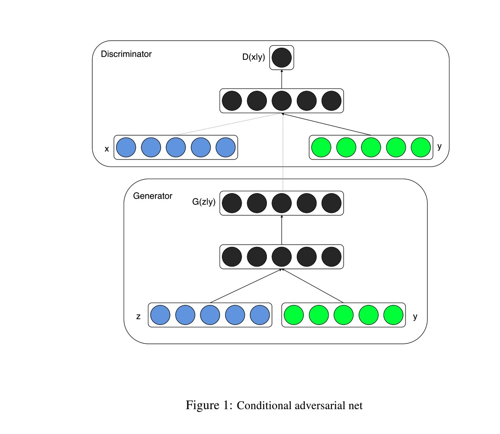
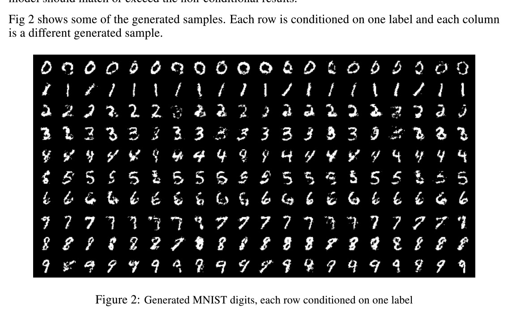

## Conditional Generative Adversarial Nets

### Abstract

------

By conditioning the model on additional information it is possible to direct the data generator process. Such conditioning could be based on class labels, on some part of data for inpainting, or even on data from different modality.

### Conditional Adversarial Nets

------

Generative adversarial nets can be extended to a conditional model if both the generator and discriminator are conditioned on some extra information $y$. $y$ could be any kind of auxiliary information, such as class labels or data from other modalities. We can perform the conditioning by feeding $y$ into the both the discriminator and generator as additional input layer.

In the generator, the prior input noise $p_z(z)$ and $y$ are combined in joint hidden representation. Both z and y are mapped into hidden layers with ReLU activation before being mapped into the second hidden layer.

In the discriminator $x$ and $y$ are presented as inputs and to a discriminaive function.

The objective function becomes:
$$
\min \limits_G \max \limits_D V(D, G) = \mathbb{E}_{x\sim p_{data}(x)}[\log{D(x|y)}] +  \mathbb{E}_{z\sim p_{z}(z)}[\log(1 - D(G(z|y)))]  \quad \quad \quad(1)
$$
