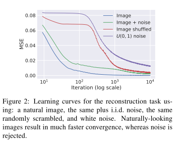

## Deep Image Prior

#### Abstract

------

- Generally, the excellent performance is imputed o the ability to learn realistic image priors from a large number of example images.
- In this paper, we show that, on the contrary, the structure of a generator network is sufficient to capture a great deal of low-level image statistics prior to any learning.
- In our scheme, the network weights serve as a parametrization of the restored image. The weights are randomly initialized and fitted to maximize their likelihood given a specific degraded image and a task-dependent observation model.
- Stated in a different way, we cast reconstruction as a *conditional* image generation problem and show that the only information required to solve it is contained in the single degraded input image and the handcrafted structure of the network used for reconstruction.
- The weights of the network are always randomly initialised, so that the only prior information is in the structure of the network itself.

### Method

------

- Deep networks are applied to image generation by learning generator/decoder networks $x = f_{\theta}(z)$ that maps a random code vector $z$ to an image $x$.
- Here we focus on the case where the noise distribution is *conditioned* on a corrupted observation $x_0$ to solve inverse problems.
- Our aim is to investigate the prior implicitly captured by the choice of a particular generator network structure, before any of its parameters are learned.
- We do so by interpreting the neural network as a *parametrization* $f_{\theta}(z)$ of an image $x \in \mathbb{R}^{3 \times H \times W}$. Here $z \in \mathbb{R}^{C' \times H' \times W'} $ is a code tensor/vector.

- To demonstrate the power of this parametrization, we consider inverse tasks, which can be expressed as energy minimization problems of the type

- $$
  x^{\star} = \min_xE(x; x_0) + R(x) 
  $$

  where $E$ is a task-dependent data term, $x_0$ the noisy/low-resolution/occluded image, and $R(x)$ a regularizer.

- The choice of regularizer, which usually captures **a generic prior** on natural images. As an example, $R(X)$ can be the Total Variation of the image.

- In our work, we replace the regularizer $R(x)$ with the implicit prior captured by the neural network, as follows:

- $$
  \theta^{\star} = {\arg\min}_{\theta} E(f_{\theta}(z); x_0)
  $$

  noise $z$ is a fixed $3D$ tensor with 32 feature maps and of the same spatial size as $x$ filled with uniform noise.

- The prior $R(x)$ is an indicator function $R(x) = 0$ for all images that can be produced from $z$ by a deep ConvNet of a certain architecture, and $R(x) = \inf$ for all other signals.

- While indeed almost any iamge can be fitted, the choice of network architecture has a major effect on how the solution space is searched by methods such as gradient descent.

- Fig.2  shows that the optimization is faster for natual images. Although the parametrization can fit unstructured noise, it does so very reluctantly. In other words, the parametrization offers high impedence to noise and low impedence to signal.

