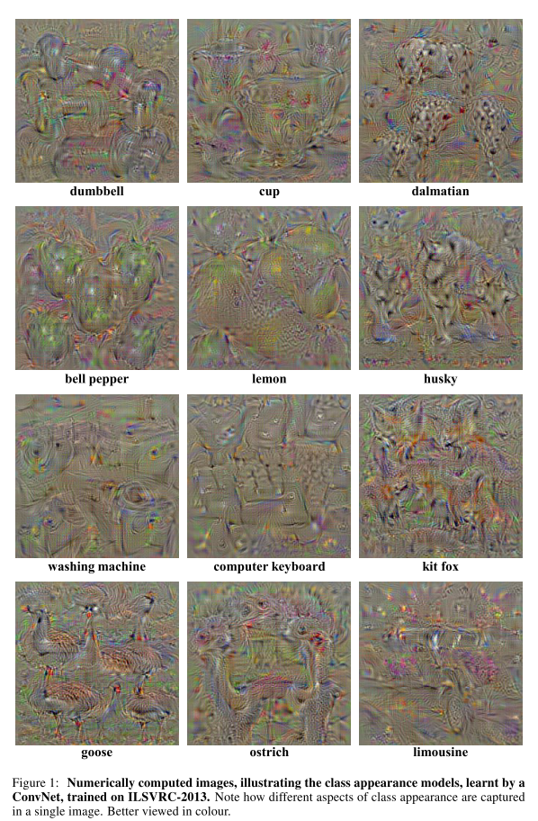
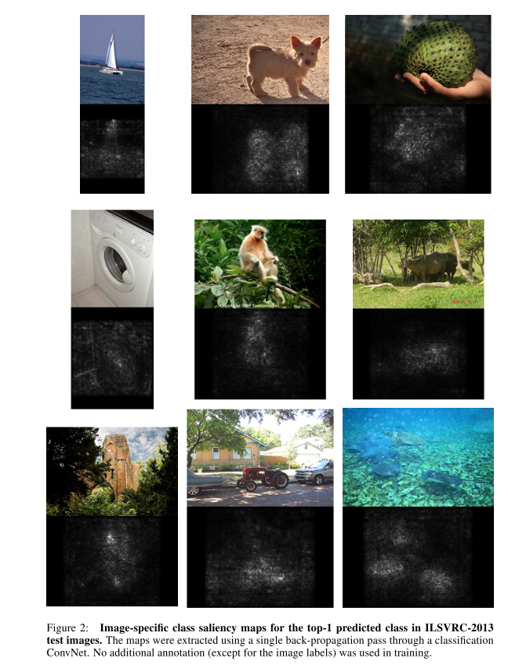
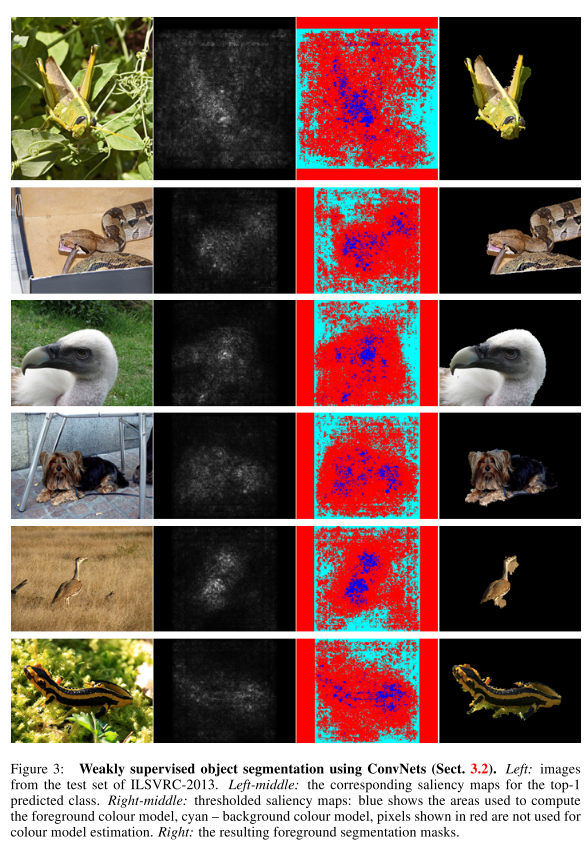
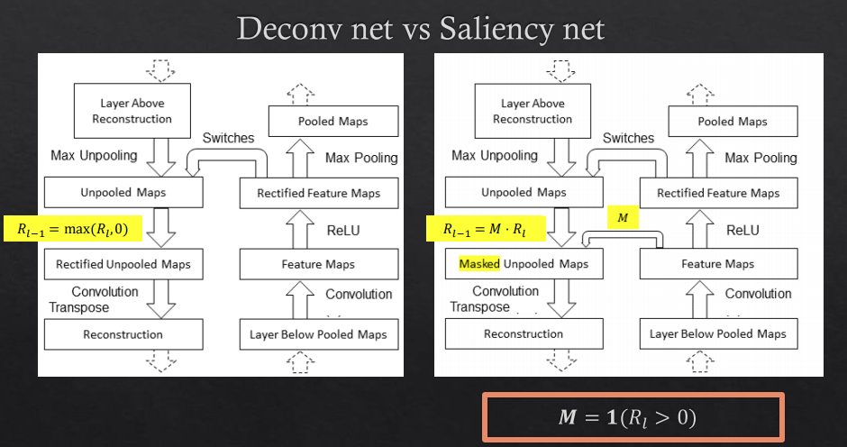

## Deep Inside Convolutional Networks: Visualising Image Classification Models and Saliency Maps

### Abstract

------

- Consider 2 visualisation techniques, based on computing the gradient of the class score with respect to the input image: the first one generates an image, which maximises the class score, thus visualising the noteion of the class, captured by ConvNet; the second computes ==a class saliency map== (which pixels matter most for the prediction), specific to a given image and class.

- Establish the connection between the gradient-based ConvNet visualisation methods and deconvolutional networks.

- ConvNet configuration: conv64-conv256-conv256-conv256-conv256-full4096-full4096-full1000

  

### Class Model Visualisation

------

- Given a learnt classification ConvNet and a class of interest, the visualisation method consists in numerically generating an image, which is representative of the class in terms of the ConvNet class scoring model.

- Definition: let $S_c(I)$ be the score of the class $c$, computed by the classification layer of the ConvNet for an image $I$. To find an $L_2$-regularised image, such that the score $S_c$ is high, where $\lambda​$ is the regularisation parameter:

- $$
  \mathop{\arg\max}_I S_c(I) - \lambda\| e \|^2_2
  $$

- A locally-optimal image $I$ can be found by the back-propagation method. T==he optimisation is performed with respect to the input image, while the weights are fixed to those found during the training stage==. We initialisation the optimisation with zero image, and then add the training set mean image to the result.

- Noteworthy is that we use the unnormalised class scores $S_c$, rather than the class posteriors. returned by the soft-max layer: $P_c = \frac{expS_c}{\sum_c expS_c}$. ==The reason is that the maximisation of the class posterior can be achieved by minimising the scores of other classes.== Therefore, we optimise $S_c$ to ensure that the optimisation concentrates only on teh class in question $c$

- We also experimented with optimising the posterior $P_c$, but the results were not visually prominent, thus conforming the intuition above.

### Image-Specific Class Saliency Visualisation

------

- Given an image $I_0$, a class $c$, and a classification ConvNet with the class socre function $S_c(I)$, we would like to rank the pixels of $I_0$ based on their influence on the score $S_c(I_0)$

- Consider a linear score model for the class $c$: $S_c(I) = w_c^TI + b_c$, where Image $I$ is represented in the vertorsied form. It's easy to see that the magnitude of elements of $w$ defines the importance of the corresponding pixels of $I$ for the class $c$.

- In deep ConvNets, the class score $S_c(I)$ is highly non-linear function of $I$. However, given an image $I_0$, we can approximate $S_c(I)$ with a linear function in the neighbourhood of $I_0$ by computing the first-order Taylor expansion:

- $$
  S_c(I) \approx w_tI + b
  $$

  where $w$ is the derivatiove of $S_C$ with respect to the image $I$ at the point (image) $I_0$: 
  $$
  w = \frac{\mathrm S_c}{\mathrm d I}|_{I_0}
  $$

- Another interpretation of computing the image-specific class saliency using the class scor derivative is that the magnitude of the derivative indicates which pixels need to be changed the least to affect the class score the most.

- The weakly supervised class saliency maps encode the location of the pbject of the given class in the given image. and thus can be used for object localisation.

### Relation to Deconvolutional Networks

------

- DeconvNet-based reconstruction of the $n$-th layer input $X_n$ is ethier equivalent or similar to computing the gradient of the visualised neuron activity $f$ with respect to $X_n$, so DeconvNet effectively corresponds to the gradient back-propagation through a ConvNet.
- **Convolutional layer.** For $X_{n+1} = X_n * K_n$, the gradient is computed as $\frac{\partial f}{\partial X_n} = \frac{\partial f}{\partial X_{n+1}} * \hat{K_n}$, where $K_n$ and $\hat{K_n}$ are the convolution kernel and its flipped version. The convolution with the flipped kernel exactly corresponds to computing the $n$-th layer reconstruction $R_n​$ in a DeconvNet
- **ReLU.** For $X_{n+1} = max(X_n, 0)$, the sub-gradient takes the form: $\frac{\partial f}{\partial X_n} = \frac{\partial f}{\partial X_{n+1}} \bold{1}(X_n>0)$, where $\bold{1}$ is the element-wise indicator function. This is slightly different from a DeconvNet RELU: $R_n = R_{n+1}\bold{1}(R_{n+1}>0)$, where the sign indicator is computed on the output reconstruction $R_{n+1}$ instead of layer input $X_n$
- **Max-pooling.** For $X_{n+1}(p) = max_{q\in \Omega(p)}X_n(q)$, where the element $p$ of the output feature map is computed by pooling over the corresponding spatial nerghborhood $\Omega(p)$ of the input. The subgradient is computed as  $\frac{\partial f}{\partial X_n} = \frac{\partial f}{\partial X_{n+1}(p)} \bold{1}(s = \mathop{\arg\max}_{q\in \Omega(p)}X_n(q))$. Here the argmax corresponds to the max-pooling "switch" in a DeconvNet
- Apart from the RELU layer, computing the approximate feature map reconstruction $R_n$ using a DeconvNet is equivalent to computing the derivative $\frac{\partial f}{\partial X_n}$ using back-propagation, which is a part of our visualization algorithms.
- Thus, a gradient-based visualisation can be seen as the generalisation of that of DeconvNet, since the gradient-based techiniques can be applied to the visualisation of activities in any layer, not just a convolutional one. 

