## Deep Residual Lerning for image Recognition

Kaiming He; Xiangyu Zhang; Shaoqing Ren; Jian Sun @ miscrosoft

### Abstract

------

- propose a residual learning freamework to ease the training of networks that are substantially deeper than those used previously.

- Reformulate the layers as learning residual functions with reference to the layer inputs, instead of learning unreferenced functions.

  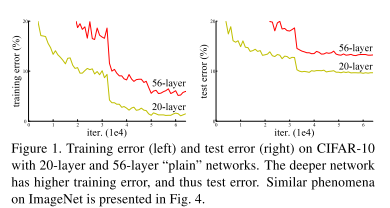

- Increase of depth of network cast problem --- vanishing/exploding gradients, which hamper convergence from the beginning.

- This problem, however, has been largely addressed by normalized initialization and intermediate normalization layers.

- As deeper networks are able to start convergeing, a *degradation* problem has been exposed -- with the network depth increasing, accuracy gets saturated and then degrades rapidly. Such degradation is not caused by overfitting, and adding more layers leads to *higher training error*

- A residual architecture -- identity mapping -- a deeper model should produce no higher training error than its shallower conterpart.

  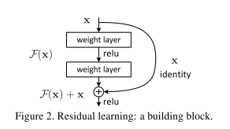

### Deep Residual Learning

------

#### Residual Learning

- Rather than expect stacked layers to approximate $\mathcal{H}(x)$, we explicitly let these layers to approximate a residual function: $\mathcal{F}(x) := \mathcal{H}(x) - x$.
- the reformulation is motivated by the degradation problem -- if the added layers can be constructed as identity mappings, a deeper model should have training error no greater than its shallower conterpart
- In reality, it is unlikely that identity mappings are optimal, but our reformulation may help to precondition the problem.
- If the optimal function is closer to an identity mapping than to a zero mapping, it should be easier for the solver to find the perturbations with reference to an identity mapping, than to learn the function as a new one.

#### Identity Mapping by Shortcuts

- consider a building block as: $y = \mathcal{F}(x, {\mathcal{W}_i}) + x​$
- The add opeartion is performed by a shorcut connection and element-wise addition. We adopt the second nonlinerity after the addition.
- The shortcut connections introduce neither extra parameter nor computation complexity.
- The dimension of $x$ and $\mathcal{F}$ must be equal. If this is not the case, we can perform a liner projection $W_s$ by the shorcut connections to match the dimensions: $y = \mathcal{F}(x, {\mathcal{W}_i}) + \mathcal{W}_sx$

#### Network architectures

**Plain Network**. (i) for the same output feature map size, the layers have the same number of filters. and (ii) if the feature map size is halved, the number of filters is doubled so as to preserve the time complexity per layer.

**Residual Network**. Based on the above plain network, we insert shortcut connections. The identity shorcuts can be directly used whtn the input and the output are of the same dimensions. When the dimensions increase, we consider 2 options: (A) the shortcut still performs identity mapping, with extra zero entries padded for the increasing dimensions. This option introduce no extra parameter; (B) the projection shortcut is used to match dimensions (by $1 \times 1 $ convolutions)

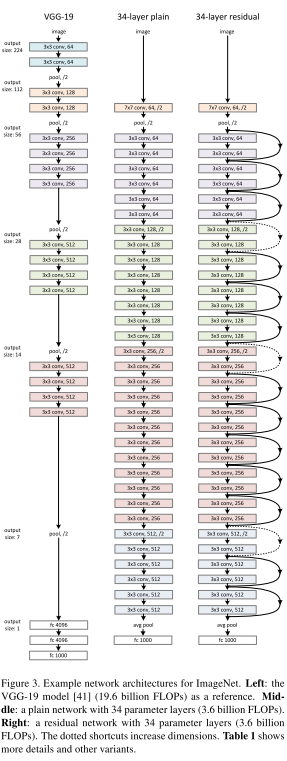

#### Implementation

- ImageNet images is resized with its shorter side randomly sampled in [256. 480] for scale augmentation. 
- A $224 \times 224$ crop is randomly sampled from an image or its horizontal flip, with the per-pixel mean subtracted.
- The standard color augmentation is used.
- Batch Normalization is adopted, right after each convolution and before activation.
- SGD with a minibatch size of 256
- Learning rate starts from 0.1 and is divided by 10 whtn the error plateaus.
- weights decay of 0.0001 and a momentum of 0.9
- Adopt the standard 10-crop testing. 
- For best results, we average the scores at multiple scales.

### Experiments & Results

------

#### ImageNet classification

**Plain Networks**

- 34-layer plain net has higher validation error than the shallower 18-layer plain net

- 43-layer plain net has higher training error throughtout the whole training procedure, even though the solution space of the 18-layer plain network is a subspace of that of the 34-layer one.

- The deep plain nets may have exponentially low convergence rates, which impact the reducing of the training error.

  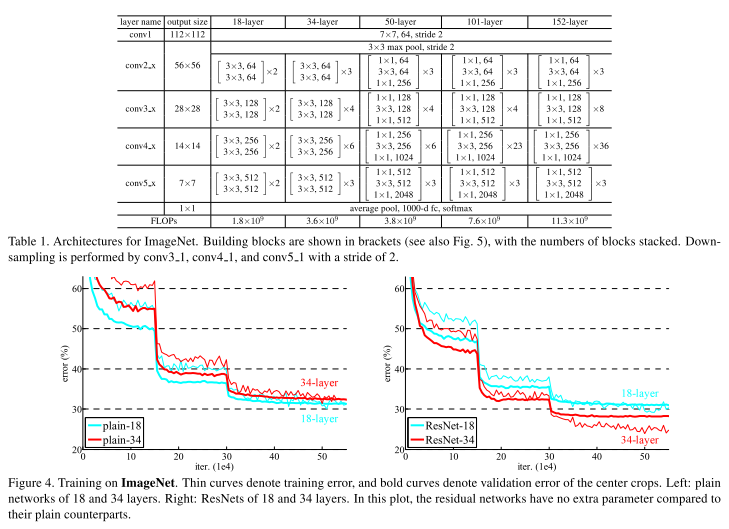

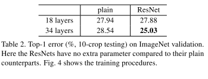

**Residual Networks**

- the 34-layer ResNet exhibits considerably lower training erro and is generalizable to the validation data. This indicates the degradation problem is well addressed in this setting and we manage to obtain accuracy gains from increased depth
- Compared to plain networks, ResNet achieve better performance.
- 18 plain/residual nets are comparable accurate, but the 18-layer ResNet converges faster. (Fig4 left vs. right)

**Identity vs. Projection Shortcuts**

- we compare the projection shorcuts and identity shorcuts with zero-padding (to solve the unmatched dimensions)

- (A) zero-padding shorcuts are used for increased dimensions (B) projection shortcuts are used for increased dimensions (C) all shorcuts are projection

- all three options are considerably better than plain counterpart

- B is slighter better than A. We argue that this is because that zero-padded dimensions in A indeed have no residual learning.

- C is ==marginally better== than B, and we attribute this to the extra paramters introduced by many projection shortcuts.

- But the small difference among A/B/C indicate that projection shorcuts are not essential for addressing the degradation problem.

  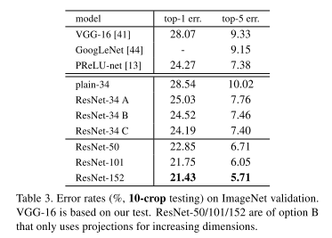 

**Deeper Bottleneck Architectures**

- Because of concerns on the training in time, we modify the building block as a *bottleneck* design.

- We use $1 \times 1$ convolutions to conduct dimension reduction.

  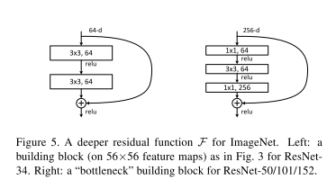

  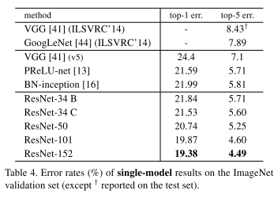

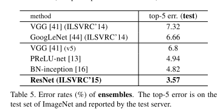

- achieved the best performance.

#### CIFAR-10 Analysis

The architectue stays similar as above. The networks inputs are $32 \times 32$ images, with the per-pixel mean subtracted. The first layer is $3 \times 3$ convolution. Then we use a stack of $6n$ layers with $3 \times 3$ convolutions on the feature maps of size {$32, 16, 8$} respectively, with $2n$ layers for each feature map size. The number of filters are {16, 32, 64} respectively.

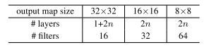

we compare $n =$ {3, 5, 7, 9}, leading to 20, 32, 44, and 56-layer networks.

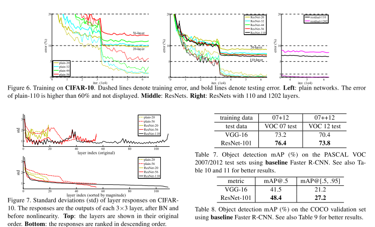

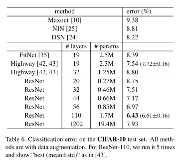

**figure 7**

- Reveals ResNets have generally smaller response than their plain counterparts, supporting our basic motivation that the residual functions might be generally closer to zero than the non-residual functions.
- We also notie that deeper REsNet has smaller magnitude of response -- when there are more layers, an individual layer of ResNet tends to modify the signal less.

**exploring over 1000 layers (figure6 right)**

athough 1202-layer network has similar training error as 100-layer network, its test performance is worse. We argure that this results from overfitting.

#### Object Detection on PASCAL and MS COCO

see table 7. and 8. for the results. ResNet framework improve the performance for both tasks.

### Network in Network Architecture

------

#### MLP convolutional layers

- Given no priors about the latent data distributions, it is desirable to use a universal function approximator for feature extraction of the local patches, as it is capable of approximating more abstract representations of the latent concepts.

  

- MLPCONV differs from maxout layer in that the convex function approximator is replaced by a universal function approximate, which has greater capability in modeling various distributions of latent cencepts.

  

#### Global Average Pooling

- in conecntional CNNs, for classification, the feature maps of the last convolutional layer are vectorized and fed into fully connected layers followed by a softmax activation. This structure treats the convolutional layers as feature extractors and the resulting feature is classified in a traditional way.
- However, FC layers are prone to overfitting, thun hampering the generalization ability of the overall network. Dropout is often used to improve generalization ability and prevents overfitting.
- In this paper, the authoers propse another strategy called global average pooling repalces the traditional FC layers.
- The idea is to generate one feature map for each corrsponding category of the classifcation tasks in the last mlpconv layer. Instead of adding fully conncected layers on the top of the feature maps, we take the average of each feature map, and the resulting vectore is fed directly into the softmax layer.

##### Advantages of GAP

- One advantage of global avarage pooling over FC layes is that it is more native to the convolution sturcture by enforcing correspondences between the featuer maps and categories. Thus the feature maps can be easily interpreted as categories confidence maps.
- Another advantage is that there is no paramter to optimize in the global average pooling thus overfitting is avoided at this layer.
- Furthermore, GAP sums out the spatial information, thus it is more robust to spatial translations of the input.

We can see MAP as a structural regularizer that explicitly enforces feature maps to be confidence maps of categories, ==which is made possible by NIN, as they makes better approximation to the confidence maps than GLMs==

### Experiments & Results

------

#### CIFAR_10

- Outperforms the state-of-the-art

  

- using dropout in between mlpconv layers in NIN boosts the performance by improving the generalization ability of the model

  

#### CIFAR_100

#### SVHN

#### MNIST

#### GLobal Average Pooling as Regularizer

==GAP is similar to FC layers in that they both perform linear transformations of the vertorized feature maps. The difference lies in the transformation matrix. For GAP, the transformation matrix is prefixed and it is non-zero only on block diagonal elements which shar the same value. FC layers can have dense transformation matrices and the values are subject to Back Propogation.==

#### Visualization of NIN

we explicitly enforce feature maps in the last mlocon layer of NIN to be confidence maps of the categories by means of global avearge pooling, which is possible only with stronger **local receptive field modelling**.

- It is expected that the largest activations are observed in the feature map corrsponding to the ground truth category of the input image, which is enforced by GAP.
- Within the feature map, it can be observed that the strongest activations paper roughly at the same region of the object in the original image.
- The visualization demonstrates the effectiveness of NIN, which is achieved via a stronger local receptive field modeling using mlpconv layers. The global average pooling then enforeces the learning of category level feature maps.

