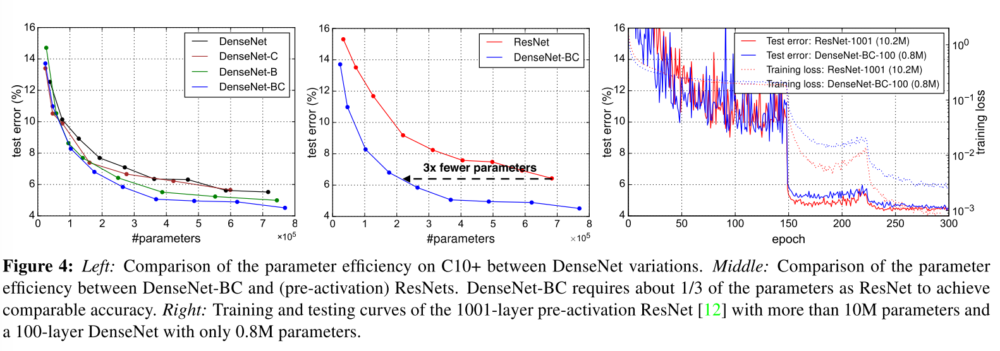

## Densely connected convolutional networks

### Abstract

------

- Introduce DenseNet, which connects each layer to every other layer in a feed-forward fashion. Whereas traditional convolutional networks with $L$ lauers have $L$ connections -- one between each layer and its subsequent layer -- our network has $\frac{L(L+1)}{2}$ direct connections.

- DenseNet has several compelling advantages: they alleviate the vanishing-gradient problem, strengthen feature propagation, encourage feature reuse, and substantially reduce the number of parameters.

  

- As CNNs become increasingly deep, a new research problem emerges: ==as information about the input or gradient passes through many layers, it can vanish and "wash out" by the time it reaches the end of the network.==
- To ensure maximum information flow between layers in the network, we connect all layers (with matching feature-map sizes) directly with each other.
- In contrast to ResNets, we combine features by concatenating them. Hence, the $l^{th}$ layer has $l$ inputs, consisting of feature-maps of all preceding convolutional blocks. Its own feature-maps are passed on to all $L - l$ subsequent layers.
- Dense connectivity requires *fewer* parameters than traditional convolutional networks, as there is no need to re-learn redundant feature-maps.
- Besides better parameter efficiency, DenseNets improve the flow of information and gradients throughtout the network, which makes them easy to train. Each layer has dirent access to the gradients from the loss function and the original input signal, leading to an implicit deep supervision.

### DenseNets

------

Consider a single image $x_0$ that is passed through a convolutional network. The network comprises $L$ layers, each of which implements a non-linear transformation $H_l(\cdot)$, where $l$ indexes the layer. $H_l(\cdot)$ can be a composite function of operations such as Batch Normalisation, ReLu, Pooling or Conv. We denote the output of the $l^th$ layer as $x_t$.

**ResNets** adds a skip-connection that bypass the non-linear transformations with an identity function: $x_l = H_l(x_{l-1}) + x_{l-1}$. An advantage of ResNets is that the gradient can flow directly through the identity function from later layers to the earlier layers. ==However, the identity function and the output of $H_l$ are combined by summation, which may impede the information flow in the network.==

**Dense connectivity**

To further improve the information flow between layers, we propose a different connectivity pattern: we introduce direct connections from any layer to all subsequent layers. Consequently, the $l^th$ layer receives the feature-maps of all preceding layers, $x_0, ..., x_{l-1}$, as input: $x_l = H_l([x_0, x_1, ... x_{l-1}])$, where [] refers the concatenation of the feature-maps produced in layers 0, ..., $l-1​$.

**Pooling layers**

The concatenation operation used above is not viable when the size of feature-maps changes. However, an essential part of convolutional networks is down-sampling layers that change the size of the feature-maps. To facialliate down-sampling in our architecture we divide the network into multiple densely connected *dense blocks*

**Growth rate**

If each function $H_l$ produces $k$ feature-maps, it follows that the $l^th$ layer has $k_0 + k \times (l-1)$ input feature-maps, where $k_0$ is the numbe of channels in the input layer.

An improtant difference between DenseNet and existing network artchitectures is that DenseNet can have very narrow layers, e.g. $k = 12$. We refre to the hyparamter $k$ as the *growth rate* of the network.

**Bottleneck layers**

Previous work stated $1\times1$ convolution can be introduced as *bottleneck* layer before each $3\times3$ convolution to reduce the number of input feature-maps, and thus to improve the computational efficiency.

**Compression.** To further improve model compactness, we can reduce the number of feature-maps at transition layers. If a dense block contains $m$ feature-maps, we let the following transition layer generate $\lfloor\theta m\rfloor$ feature maps, where $\theta$ lie within $(0, 1]$

### Experimentss & Results

------

- DenseNet-BC with $L = 190$ and $k=40$ outperforms all start-of-the-art.

- Without compression or bottleneck layers, there is a general trend that DenseNets perform better as $L$ and $k$ increase. We attribute this primarily to the corrsponding growth in model capacity. This indicates. that DenseNets can utilize the increased representational power of bigger and deeper models. It also indicates that they do not suffer from overfitting or the optimization difficulties of residual networks.

- Parameter efficiency.

  

  

  #### Feature Reuse

  

  

  