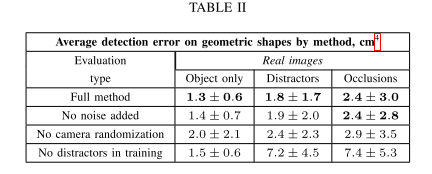

## Domain Randomization for Transferring Deep Neural Networks from Simulation to the Real World

### Abstract

------

- This paper explore *domain randomization*, a simple technique for training models on simulated images that transfer to real images by randomizing rendeing in the simulartor.
- ==With entough variability in the simulartor, the real world may appear to the model as just another variation.==
- It is possible to train a real-world object detector that is accurate to $1.5cm$ and robust to distractors and partial occlusions using only data from a simulator with non-realistic random textures.
- *System Identification*, the process of tuning the paramters of the simulation to match the behavior of the physical system, is time con-suming and error-prone. 
- Even with strong system identification, the real world has *unmodeled phisical effects* like nonrigidity, gear backlask, wear-and-tear, and fluid dynamics that are not captured by current phisic simulators. Furthermore, *low-fidelity simulated sensors* like images renderers are often unable to reproduce the richnes and noise produced by their real world counterparts. These differences, known collectively as the *reality gap,* form the barrier to using simulated real robots.
- Focus on the task of training a neural network to detect the location of an object. FInd that with a sufficient number of textures, pre-training the object detector real images is unnecessary.

### Method

------

Given some objects of interest $\{s_i\}_i$, our goal is to train an object detector $d(I_0)$ that maps a single monocular camera frame $I_0$ to the Cartesian coordinates $\{(x_i, y_i, z_i)\}$ of each object. In addition to the objects of interest, our scenes sometimes contain distractor objects that must be ignored by the network. Our approach is to train a deep neural network in simulation using domain randomization.

#### *Domain Randomization*

The purpose of domain randomization is to provide enough simulated variability at training time such that at test time the model is able to generalize to real-world data.

We randomize the following aspects of the domian for each sample used during training:

- Number and shape of the distractor objects on the table
- Position and texture of all objects on the table
- Textures of the table, floor, skybox, and robot
- Position, orientation, and field of view of the camera
- Number of lights in the scene
- Position, orientation, and specular charactreistics of the lights
- Type and amount of random noise added to images

Since authors use a single monocular camera image from an uncalibrated camera to estimate object posstions, we ifx the height of the table in simulation, effectively creating a 2D pose estimation task.

Random textures are chosen among the following:

- A random RGB value
- A gradient between 2 random RGB values
- A checker pattern between 2 random RGB values

The textures of all objects are chosen uniformly at random - the dectore does not have access to the color of the objects of interest at training time, only their size and shape.

Between 0 and 10 distractor objects are added to the table in each scee. Distractor objects on the floor or in the background are unnecessary, despite some clutter on the floor in our real images.

#### *Model architecture and training*

We parametrize our object dector with a deep convolutional neural network

### Experiments & Results

------

#### *Localization accuracy*

- our object detector are able to localize objects to within $1.5cm$ in the real world and perform well in hte presence of clutter and partial occlusions.
- Though the accuracy of our trained detectors is promising, note that they are still over-fitting the simulated training data, where error is $0.3cm$ to $0.5cm$. 

#### *Ablation Study*

To evaluate the importance of different factors of our training methodology, we assessed the sensitivity of the algorithm to the following:

- Number of training images
- Numebr of unique textures seen in training
- Use of random noise in pre-processing
- Presence of distractors in training
- Randomization of camera position in training
- Use of pre-trained weights in the detection model

**figure 4**

- sensitity to the number of training samples used for pre-trained models and models trained from scratch.
- with a large amount of training data, random weight intialization can achieve nearly the same performance in transferring to the real world as does pre-trained weights initialization.
- However, using a pre-trained model can significantly improve performance when less training data is used.

**figure 5**

##### 

- shows the sensitivity to the number of unique texturizations of the scene when trained on a fixed number of training examples.
- Performance degrades significantly when fewer than 1000 textures are used, indicating that for our experiments, using a lrage number of random textures is necessary to achieving transfer.
- Note worthy is that when 1000 random textures are used in training, the performance using 10,000 images is comparable to that using only 1000 images, ==indicating that in the low data regime, texture randomization is more important than randomization of object positions.==

**Table2**

- examines the performance of the algorithm when random noise, distractors, and camera randomization are removed in training. 
- Incorporting distractors during training appears to be critical to resilience to distractors in the real world.
- Randomizing the position of the camera also consistently provides a slgiht accuracy boost, but reasonable high accuracy is achievable without it.
- Adding noise during pretraining appears to have a negligible effect.
- In practice, we found that adding a small amount of random noise to images at training time improves convergence and makes training less susceptible to local minima.