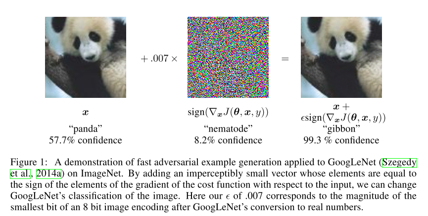
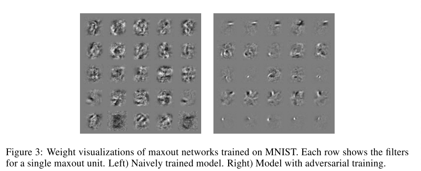
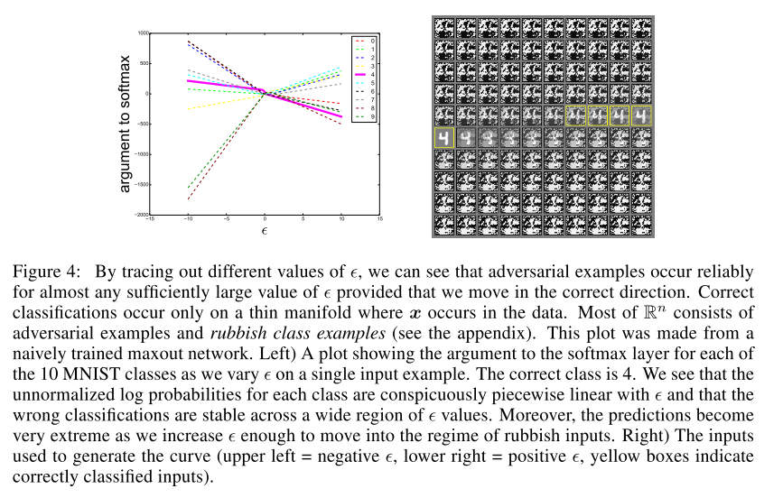

# EXPLAINING AND HARNESSING ADVERSARIAL EXAMPLES

### Motivation

------

Goodfellow等人claim说神经网络的对对抗扰动的vulunerability是由于神经网络output distribution对input的线形本质导致的，而不是overfitting。Linear behavior in high-dimenional spaces is sufficient to cause adversarial examples.

常规的正则化方法如drop out， pretraining 和 model averaging并不能很大程度上减少模型对对抗样本的vulunerability。但是换成nonlinear的模型如RBF netowrks却有效。

提出了一种快速找到对抗样本的方法。

### Linear Explanations of Adversarial Examples

------

假设有对抗样本$\hat{x} = x + \eta$, 且$\eta$比可以表示x的精度要小。只要满足$(\|\boldsymbol{\eta}\|_{\infty}<\epsilon)$ 我们希望模型给$x$和$\hat{x}$同样的预测值。考虑权重$w$和$\hat{x}$的点乘:
$$
w^{\top} \tilde{x}=w^{\top} x+w^{\top} \eta
$$

可以看出对抗扰动主要是因为$w^T\eta$造成。当$\eta=sign(w)$时该相可取最大值。如果$w$有很高的维度$n$和平均值$m$，那么对抗扰动会给模型output带来$\epsilon mn$这么多的改变。也就是说很小的input的改变会造成很大的output的改变

### Linear Perturbation of None-Linear Models

------

我们使用的CNN, LSTMS, ReLU其实都是非常线形的. 即使在使用sigmoid avtivation的情况下，模型也会被调到sigmoid的线形部分. 这样作者提出了找对抗样本的fast gradient sign method：
$$
\boldsymbol{\eta}=\epsilon \operatorname{sign}\left(\nabla_{\boldsymbol{x}} J(\boldsymbol{\theta}, \boldsymbol{x}, y)\right)
$$
也就是沿诗梯度相对于x下降最快的w来找对抗样本

### Adversarial Training vs. Weight Decay

------

考虑最简单的logistic regression：
$$
\mathbb{E}_{\boldsymbol{x}, y \sim p_{\text {data }}} \zeta\left(-y\left(\boldsymbol{w}^{\top} \boldsymbol{x}+b\right)\right)
$$
其中
$$
\zeta(z)=\log (1+\exp (z))
$$
可以得出
$$
\boldsymbol{w}^{\top} \operatorname{sign}(\boldsymbol{\nabla_{\boldsymbol{x}} J}) = \boldsymbol{w}^{\top} \operatorname{sign} (\sigma \zeta'\boldsymbol{w}^{\top} )   = \boldsymbol{w}^{\top} \operatorname{sign}(\boldsymbol{w})=\|\boldsymbol{w}\|_{1}
$$
发现和$L_1$正则化非常相像。但是最重要的区别是$L_1$是从training activations上减去的，而不是加在cost function上 ++++

因此提出了adversarial training：
$$
\tilde{J}(\boldsymbol{\theta}, \boldsymbol{x}, y)=\alpha J(\boldsymbol{\theta}, \boldsymbol{x}, y)+(1-\alpha) J\left(\boldsymbol{\theta}, \boldsymbol{x}+\epsilon \operatorname{sign}\left(\nabla_{\boldsymbol{x}} J(\boldsymbol{\theta}, \boldsymbol{x}, y)\right)\right.
$$
经过对抗训练的模型具有对于对抗样本更强的鲁棒性。且作者发现weights也与之前大不相同, 更加的localiized和具有可解释性:

### Generalization of Adversarial Examples

------

