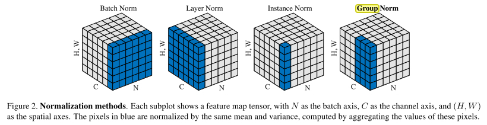
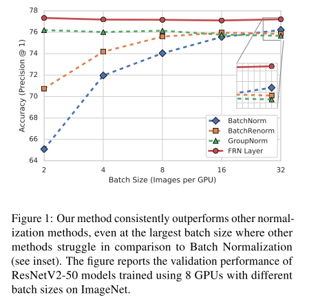
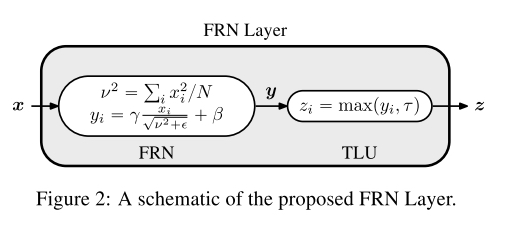
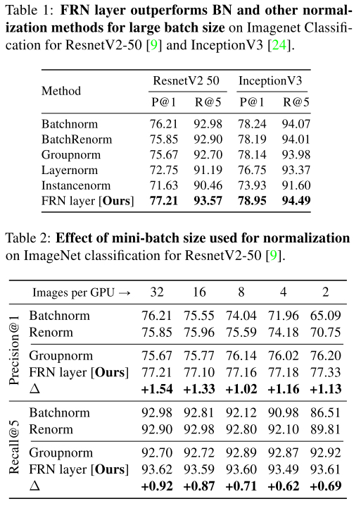
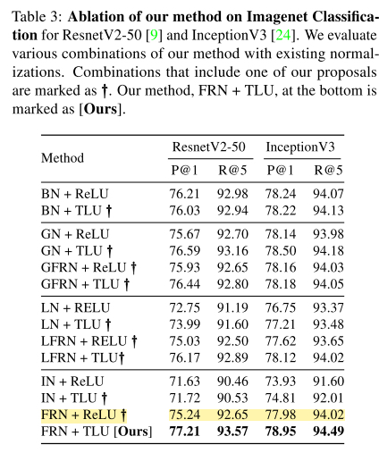
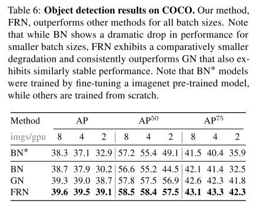

# Filter Response Normalization Layer: Eliminating Batch Dependence in the Training of Deep Neural Networks

------

### Motivation

- BN受batch size的影响很大：大minibatch可以较准确计算statistics，但是内存有限; 小minibatch更新不准确，导致准确率下降
- Group Norm可以有效的解决BN受batch size影响的问题，但是GN涉及到对当前feature map跨通道通信，这种跨通道的通信使得梯度计算变得十分复杂; 且对channel数有要求：必须有理想的group size
- Instance Norm在Style Transfer的应用中很有效，但是在分类上效果不好
- 提出FRN和TLU。FRN跟IN基本一样，只是归一化的时候不减去mean。TLU是一个可以学习的ReLU激活函数，自由移动ReLU的转折点。

### Approach

------

#### Filter Response Normalization

filter response (feature maps) $X$ 的shape为: $[B, W, H, C]$ ， 其中B是batch size， C是通道数

$\boldsymbol{x}=\boldsymbol{X}_{b,:,:, c} \in \mathbb{R}^{N}$ 表示flatten的feature map, $N= W \times H$

$\nu^{2}=\sum_{i} x_{i}^{2} / N$  为second moment

FRN的计算为：
$$
\hat{\boldsymbol{x}}=\frac{\boldsymbol{x}}{\sqrt{\nu^{2}+\epsilon}}
$$
同样也加上了一个affine的操作以用来抵消归一化:
$$
\boldsymbol{y}=\gamma \hat{\boldsymbol{x}}+\beta
$$
可以看出几点:

- FRN也可以做到抵消W的scale的效果，跟BN，GN，IN一样
- 跟IN相比，没有减去mean, 因此每个sample的每个channel的分布都有自己的mean，保持了每个channel的信号强度的信息 (IN为0， BN是over batch的0)

#### Thresholded Linear Unit

FRN的特点是保持了每个channel信号的强度，但是直接和ReLU= $max(0, x)$ 一起用的话就会出问题。因为当channel的mean非常负的时候，那这个channel相对于的卷积核的更新梯度即为0，无法学习到任何东西。

为了弥补这点，作者提出了 $TLU$：
$$
z=\max (\boldsymbol{y}, \tau) = \max (\boldsymbol{y}-\tau, 0)+\tau=\operatorname{Re} L U(\boldsymbol{y}-\tau)+\tau
$$
$\tau$ 这个参数是学习得到的

#### Parameterizing $\epsilon$

作者发现，当feature map的大小为 $1 \times 1$时 (fc)， $N=1$,  当 $\epsilon$趋于0的时候， FRN变成了一个sign函数， 梯度几乎处处为0。 因此选择合适的的 $\epsilon$ 就变得很重要

所以在这种情况时，作者把 $\epsilon$ 也变成了一个可以学习的参数

#### Mean Centering

作者在这部分提出了不做mean centering的想法

BN是首先提出这样做的方法，之后BN的改进方法中（IN， GN），并没有对mean centering这个做法进行验证，而是直接从BN那里继承过来的。

e.g, 对IN = $\hat{\boldsymbol{x}}=\frac{\boldsymbol{x}-\mu}{\sqrt{\sigma^{2}+\epsilon}}$ 来说， 当N为1时， 由于mean centering $\hat{x}$ 直接变成了0

GN可以避免IN这个弊端，但是需要跨通道的梯度传播

所以自然的就想到了保持这个mean

但是保持mean就会导致feature map有nonzero的center，使用relu就会有不好的影响，因此提出TLU

### Experiments

------

#####  提出的FRN在imagenet上表现超过之前的归一化方法且不受batch size影响

##### 比较有趣的实验是作者关于FRN和TLU做的ablation

可以看出单把ReLU换成TLU几乎都是涨点的 （感觉可以plot一下BN情况下TLU的值看看是不是在0处）

IN + ReLU表现极差，但是 FRN + ReLU 直接提了很多点，说明per-channel的强度信息是有用的，但是考虑到用的是relu，确实有可能会有很多dead卷积核, 所以表现没有超过BN。把ReLU换成TLU时直接取得了最好的结果。

##### 在检测上的实验也是涨点的

### Thoughts

------

个人觉得FRN的工作还是挺有意义的，最近读到StyleGANv2的文章，也指出了StyleGAN的blob artefact的问题是出在IN上，当IN不减mean时，这种现象就消失了。

至于IN在分类上效果不好的原因，应该主要就是每个channel都做了mean centering，因此每个channel的mean都是0，太多的信息被抹去了。BN虽然也做了mean centering的操作，但是是在整个batch的对应channel上做的，还是保持了这个batch里不同sample的相对强度，因此效果比IN好了不少。通过FRN，证明了per-channel的信号强度是很有效的信息，同时又消除了对batch size的影响。

感觉FRN用到GAN的应用上也会有一些提升。