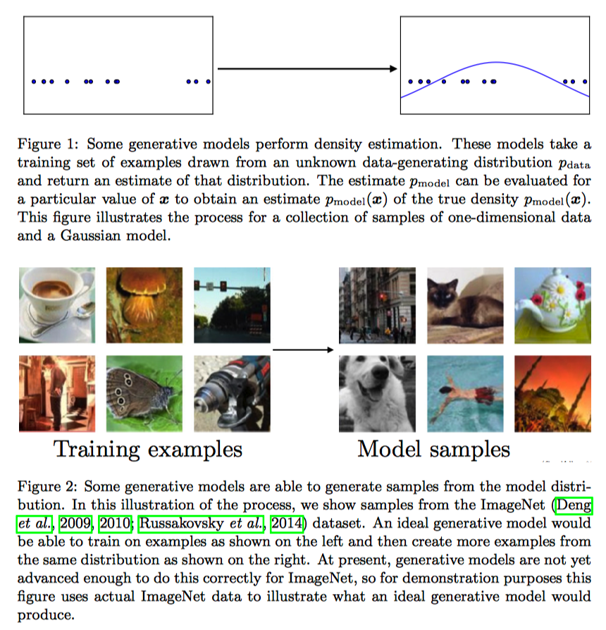
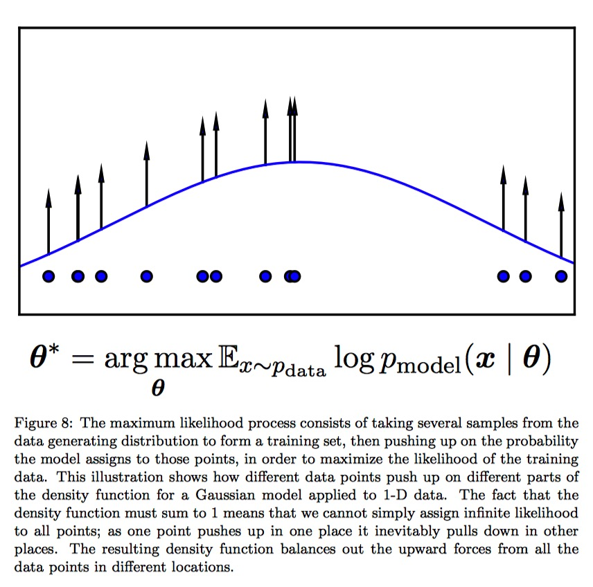
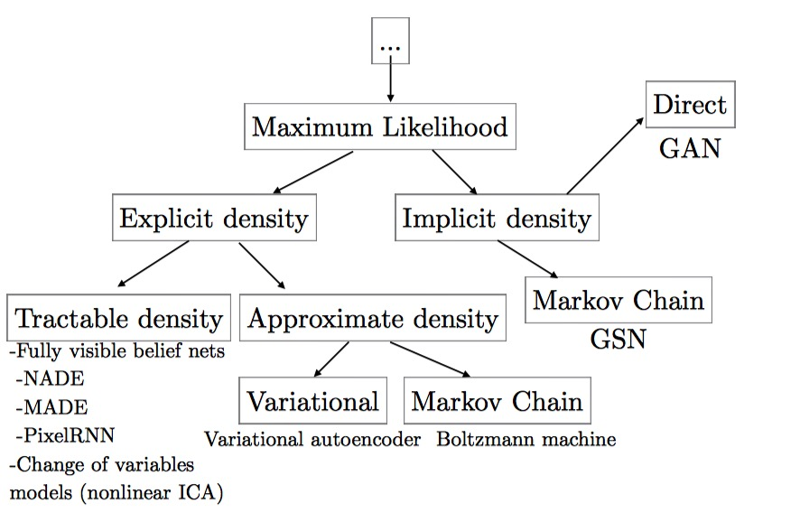
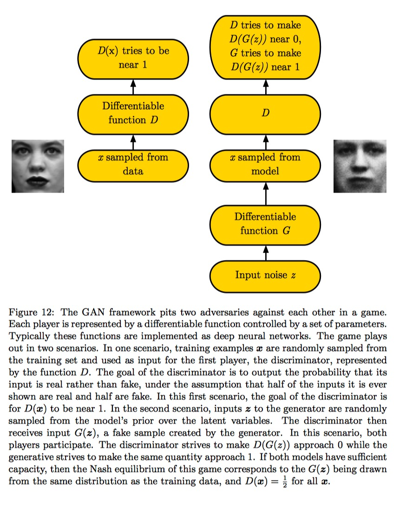
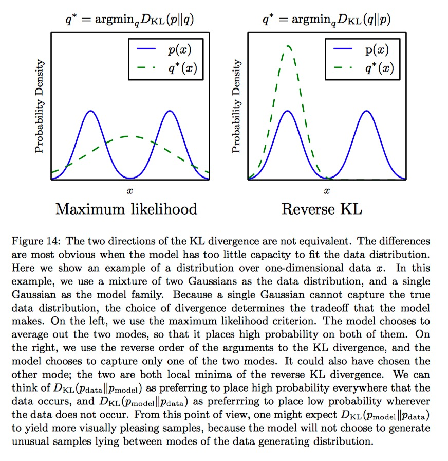
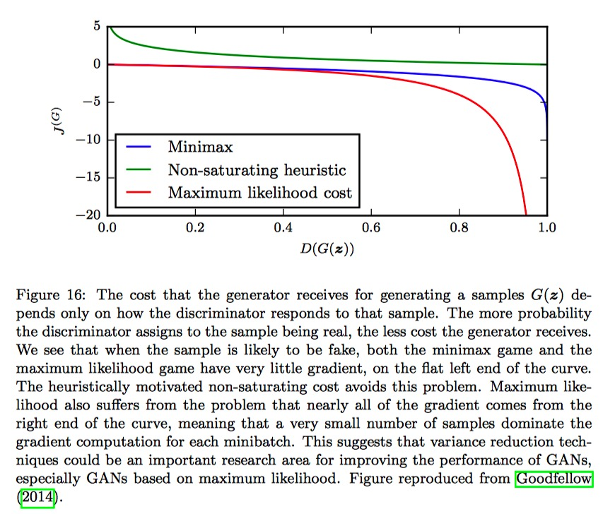

# NIPS 2016 Tutorial: GANs

------

Gnerative Models can estimate the data distribution $p_{data}$ by learning a model distribution $p_{model}$. In some cases, the model estimate $p_{model}$ explicitly. In others cases, the model is only able to generate samples from $p_{model}$. Some models can do both.

GANs foucus on primarily on sample generation, though it's possible to design GANs that can do both.

Generative models, and GANs in particular, enable machine learning to work with multi-modal outputs. 

### How do generative models work? How do GANs compare to others?

------

#### Maximum Likelihood Estimation

focus on generative models that work via the priciple of **maximum likelihood**

The basic idear of maximum likelihood is to define a model that provides an estimate of probability distribution, parameterized by parameters $\theta$. We then refre the **likelihood** as the probability that the model assigns to the training data: $\prod_{i=i}^mp_{model}(x^{(i)};\theta)$, for a dataset containing m training examples $x^{(i)}$.

The principle of maximum likelihood is choose the parameters for the model that maximize the likelihood of the training data. (Normally done in log space). The process of illustrated as follows:

Maximum likelihood estimation can also be thought as minizing the **KL divergence** between the data generating distribution and the model:
$$
\theta^* = \mathop{\arg\min}\limits_{\theta}D_{KL}(p_{data}(x)\|p_{model}(x;\theta))
$$
In parctice, we do not have access to $p_{data}$ itself, but only to a training set consisting of $m$ samples from $p_{data}$. We use these to define $\hat{p}_{data}$, an empirical distribution that places mass only on exactly those m samples, approximating $p_{data}$.

#### A taxonomy of deep generative models

##### Tractable explict models

there are two popular approaches to tractable explicit density models: *fully visible belief networks* and *nonlinear independent components analysis*

**Fully visible belief networks (FVBNs)** are modles that use the chain rule of the probability to decompose a probability distribution over an n-dimentional vector $x$ into a product of one-dimentional probability distributions:
$$
p_{model}(x) = \prod_{i=1}^np_{model}(x_i|x_1,...,x_{i-1})
$$
Drawbacks: cannot be utilized in parallel, hence require a huge amount of computation time.

##### Explict models requiring approximation

**Variational approximations** methods define a lower bound: 

A learning algorithm that maximizes $L$ is guranteed to obtain at least as high a value of the log-likelihood as it does of $L$.

### How do GANs work?

------

#### The GAN frame work

#### Cost functions

1. The discriminator's cost, $J^{(D)}$
   $$
   J^{(D)}(\theta^{(D)},\theta^{(G)}) = - \frac{1}{2}\mathbb{E}_{x \sim p_{data}}\log{D(x)} - \frac{1}{2}\mathbb{E}_z\log{(1 - D(G(z)))}
   $$
   which is a standard cross-entropy cost that is minized when training a standard binary classifier with a sigmoid output. The only difference is that the classifier is trained on two minibatches of data; one coming from the dataset, where the lable is 1, and one coming from the generator, where the label is 0

   

   By training the discriminator, we are able to estimate of the ratio:
   $$
   \frac{p_{data}(x)}{p_{model}(x)}
   $$
   at every point x. ==Estimating this ratio enables us to compute a wide variety of divergences and their gradients.== This ratio is also freely shared with the generator.

2. Minimax: the cost for generator

   the simplemest version of the game is a **zero-sum game**, in which the sum of all player's costs is always 0.
   $$
   V(\theta^{(D)},\theta^{(G)}) = -J^{(D)}(\theta^{(D)},\theta^{(G)}) \quad \quad \quad (1)
   $$
   Zero-sum games are also called **minimax** games because their solution involves minimization in an outer lopp and maximization in an inner loop.

   
   $$
   \theta^{(G)} = \mathop{\arg\min}_{\theta^{(G)}}\max_{\theta_{(D)}}V(\theta^{(D)},\theta^{(G)})
   $$
   

   ==Learning in this game resembles minizing the Jensen-Shannon divergence between the data and the model distribution,== and that the game converges to its equailibrium if both player's policies can be updated directly in function space.

   *However, in practice, the players are represented with deep neural nets and updates are made in parameter space, so these results, which depend on convexity, do not apply.* 

3. Heuristic, non-saturating game

   The cost used for generation in the minimax game (eq. (1)) is useful for theoretical analysis, but does not perform especially well in practice.

   Minimizing the cross-entropy between a target class and a classifer's predicted distribution is highly effective because the cost never saturates when the classifier has the wrong output.

   In the minimax game, the discriminator minimize a cross-entropy, the generator maxize the same cross-entropy. This is unfortunate for the generator, because when the discriminator successfully rejects generator samples with high confidence, the generator's gradient vanishes. 

   To solve the problem, one approach is to continue to use cross-entropy minimization for the generator. Instead of flipping the sign on the discriminator's cost to obtain a cost for the generator, ==we flip the target used to construct the cross-entropy cost.== The cost for the generator then becomes:

   In the minimax game, the generator minimizes the log-probability of the discriminator being current. In this game, the generator maximizes the log-probability of the discriminator being mistaken.

4. 

5. Comparison between cost function

   

6. 

   

   