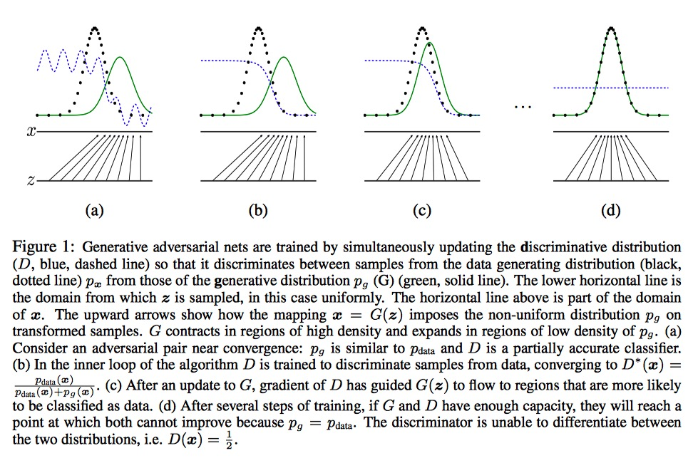
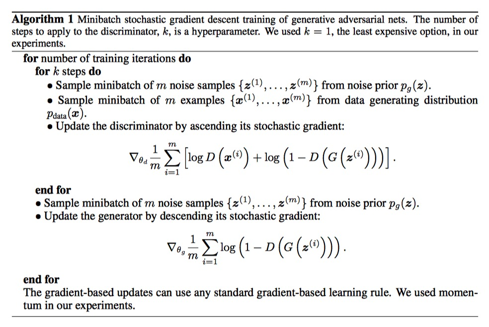
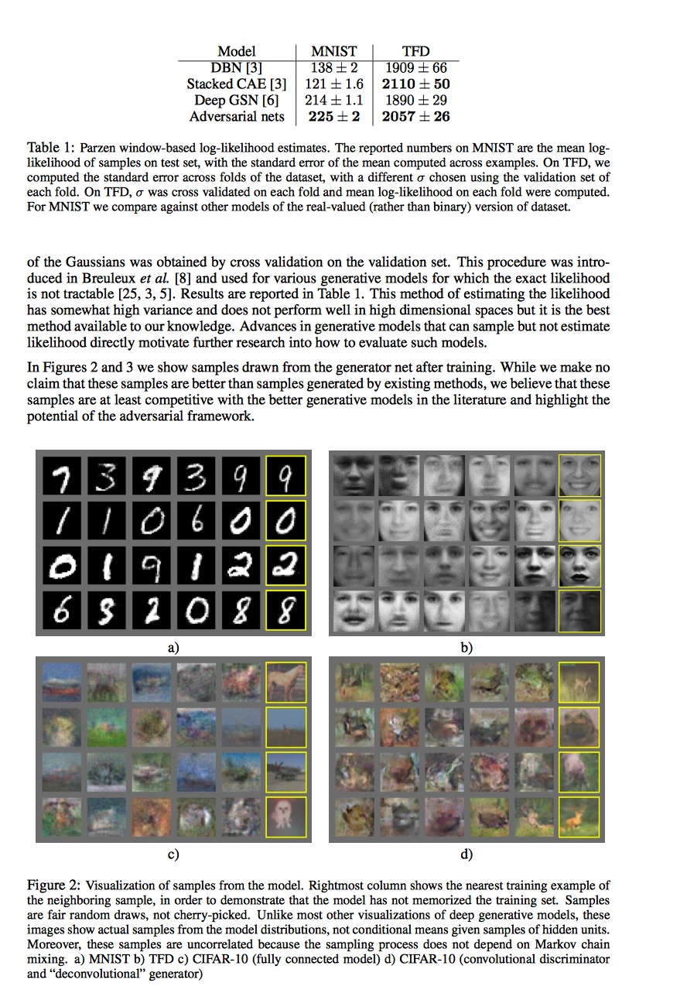

# Generative Adversarial Nets

### Abstract

------

- Estimating generative models via an adversarial process
- Simultaneously train two models: a generative model $G$ that captures the data distribution, and a discriminative model $D$ that estimates the prob. that a sample came from the training data distribution rather than $G$ model distribution.
- The training procedure for $G$ is to maximize the prob. of D making a mistake.
- This framework corresponds to a minimax two-player game.
- In the space of arbitrary functions $G$ and $D$, a unique solution exists, with $G$ recovering the training data distribution and $D$ equal to $\frac{1}{2}$ everywhere. 

### Adversarial Nets

------

In the learning the generator's distribution $p_g$ over data x:

1. we need

   - a prior on input noise variables:  $p_z(z)$
   - a mapping from noise variables to data space: $G(z;\theta_g)$, where $G$ is a differenntiable function represented by a multilayer perceptron with parameters $\theta_g$
   - a second multilayer perceptron $D(x;\theta_d)$ that output a single scalar : $D(x)$ represents the probability that **$x$** came from data rather than $p_g$
   - we train $D$ to maxmize the prob. of assigning the correct label to both training examples and samples from $G$

2. we train $D$ to maxmize the prob. of assigning the correct label to both training           examples and samples from $G$

3. we simultanenously train $G$ to minimize $\log(1 - D(G(z)))$

4. overall, $D$ and $G$ play the two-player minimax game with value function $V(G, D)$:
   $$
   \min \limits_G \max \limits_D V(D, G) = \mathbb{E}_{x\sim p_{data}(x)}[\log{D(x)}] +  \mathbb{E}_{z\sim p_{z}(z)}[\log(1 - D(G(z)))]  \quad \quad \quad(1)
   $$
   mathemetically, random variables being equal in distribution, <u>p is pdf of model here</u>:

$$
   p_G(x) = p_{data}(x)
$$

​         as illustrated in the following figure         

The algorithms is as follows. Optimizing $D$ to completion in the inner loop of training is computationally prohibitive, and on finite datasets would results in overfitting. Instead, we alternate between $k$ steps of optimizing $D$ and one step of optimizing $G$. This results in $D$ being maintained near its optimal solution, so long as $G$ changes slowly enough.

Noteworthy is that, in practice, equation 1 may not provide sufficient gradient for $G$ to learn well. Early in training, when $G$ is poor, $D$ can reject samples with high confidence because they are clearly different from the training data. In this case, $\log((1 - D(G(z))))$ saturates. Therefore, rather than training $G$ to minimize $\log(1 - D(G(z)))$ we can train $G$ to maximize $\log{D(G(z))}$. This objective function results in the same fixed point of the dynamics of $G$ and $D$ but provides much stronger gradients early in learning.

### Theoretical Results and The Optimization Problem

------

1. The optimization Problem:

   - The optimal $D$ for a given $G$ is denoted as $D_G^*$, where $G$ is fixed: 
     $$
     D_G^* = \mathop{\arg\max}_G V(G, D) \quad \quad \quad (2)
     $$

   - The optimal G minimize equation 1 when $D = D_g^*$
     $$
     G^* = \mathop{\arg\min}_GV(G, D_g^*) \quad \quad \quad (3)
     $$

   - This optimization problem has a unique solution $G^*$ and the solution satisfies  

     $p_G = p_{data}$

2. Theory

   - In this paper, a big idea is that $G$ needs not to be **invertible**. This is improtant because in practice $G$ is not invertible

   - The whole proof relies on the equation:
     $$
     \mathbb{E}_{z\sim p_{z}(z)}[\log(1 - D(G(z)))] =   \mathbb{E}_{x\sim p_{G}(x)}[\log(1 - D(x)]\quad \quad \quad(4)
     $$
     which comes from [Radon–Nikodym theorem](https://en.wikipedia.org/wiki/Radon%E2%80%93Nikodym_theorem) of measure theorem.

     This results in: 
     $$
     \lmoustache _xp_{data}(x)\log{D(x)}dx + \lmoustache_zp(z)\log{(1 - D(G(z)))dz} 
     = \lmoustache _xp_{data}(x)\log{D(x)}dx + p_G(x)\log{(1 - D(x))dx} \quad\quad (5)
     $$
     Therefore,  $V(G, D)$ becomes:
     $$
     V(G, D) = \lmoustache _xp_{data}(x)\log{D(x)}dx  + p_G(x)\log{(1 - D(x))}dx \quad\quad\quad (6)
     $$

1. Finding the best discriminator

   - *For fixed $G$, the optimal discriminator is*
     $$
     D_G^*(x) = \frac{p_{data}(x)}{p_{data}(x)+p_g(x)}
     $$
     *==Proof.==* we have equation 6, which can be abstract as:

     $f(y) = a\log(y) + b\log(1-y)$

     $f'(y) = 0 \Rightarrow y = \frac{a}{a+b} \quad\quad if \quad a+b\neq0  $

     $f''(y) = -\frac{a}{y^2}-\frac{b}{(1-y)^2}  \Rightarrow f''(\frac{a}{a+b}) = -\frac{(a+b)^3}{ab}$

     when $a ,b \in (0, 1)$, $ f''(\frac{a}{a+b}) < 0$, so $y = \frac{a}{a+b}$ is a maximum for $V(G,D)$

   - The training objective for $D$ can be interpreted as maximizing the log-likelihood for estimating the conditional prob. $P(Y = y |x)$, where Y indicates whether $x$ comes from $p_data$ (with $y = 1$) or from $p_g$ (with $y=0$). Equation 1 can be reformulated as:
     $$
     \begin{align}
     C(G) &= \max \limits_{D} V(G, D) \\
     &= \mathbb{E}_{x\sim p_{data}(x)}[\log{D_G^*(x)}] +  \mathbb{E}_{z\sim p_{z}(z)}[\log(1 - D_G^*(G(z)))]  \\
     &= \mathbb{E}_{x\sim p_{data}(x)}[\log{D_G^*(x)}] +  \mathbb{E}_{x\sim p_{g}(x)}[\log(1 - D_G^*(x))]  \\
     &= \mathbb{E}_{x\sim p_{data}(x)}[\log{ \frac{p_{data}(x)}{p_{data}(x)+p_g(x)}}] +  \mathbb{E}_{x\sim p_{g}(x)}[\log(\frac{p_{data}(x)}{p_{g}(x)+p_g(x)})] 
     
     \end{align}
     $$
     

2. Finding the best generator

   - The goal of $GAN$ is for $p_G = p_{data}$, which means $D_G^* = \frac{p_{data}(x)}{p_{data}(x)+p_g(x)} = \frac{1}{2}$

     This means the discriminator is completely confused, outputing $\frac{1}{2}$ for samples come from both $G$ and real data.

   - *The global minimum of the virtual training criterion C(G) is achieved if and only if $p_g = p_{data}$. At that point, C(G) achieves the value $-\log4$*

     ==*Proof*==. 

     for $p_g = p_{data}$, we find $C(G) = -\log4$

     plug $D_g^*$ into $C(G)$, we have $C(G) = \max\limits_D V(G, D_G^*)$:
     $$
     \begin{align}
     C(G) &= \lmoustache _xp_{data}(x)\log{ \frac{p_{data}(x)}{p_{data}(x)+p_g(x)}}  + p_G(x)\log{ \frac{p_{g}(x)}{p_{data}(x)+p_g(x)}}dx \\
     &= -\log4 + \lmoustache _xp_{data}(x)\log{ \frac{p_{data}(x)}{\frac{p_{data}(x)+p_g(x)}{2}}}  + p_G(x)\log{ \frac{p_{g}(x)}{\frac{p_{data}(x)+p_g(x)}{2}}}dx \\
     &= -\log4 + KL(p_{data} \|\frac{p_{data}(x)+p_g(x)}{2}) +  KL(p_{g}  \|\frac{p_{data}(x)+p_g(x)}{2})  \\
     \end{align}
     $$
     where KL is the [Kullback–Leibler divergence](https://en.wikipedia.org/wiki/Kullback%E2%80%93Leibler_divergence), which is always non-negtive. Hence $\log4$ is the global minimum of $C(G)$, which can be equally written as:
     $$
     C(G) = -\log4 + 2 \cdot JSD(p_{data} \| p_g)
     $$
     where JSD is the [Jensen–Shannon divergence

3. Convergence of Algorithm 1

   *if G and D have enough ==capacity==, and at each step of Algorithm 1, the discriminator is allowed to reach its optimun given G, and $p_g$ is updated so as to improve the criterion C(G), then $p_g$ converges to $. p_{data}$*. Proof. See paper.

###  Experiments

------

1. adversarial nets are trained on MNIST, TFD, and CIFAR-10

   

### Disadvantages

1. There is no explicit representation of $p_g(x)$
2. <u>$D$ must be synchronized well with G during training (in particular, G must not be trained too much without updating D, in order to aviod that G collapses too many values of z to the same value of x to have enough diversity to model $p_{data}$)</u>

