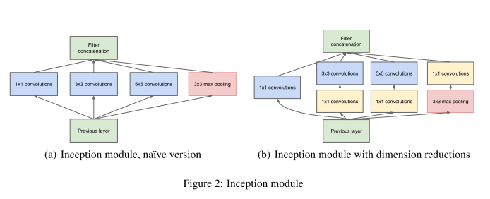
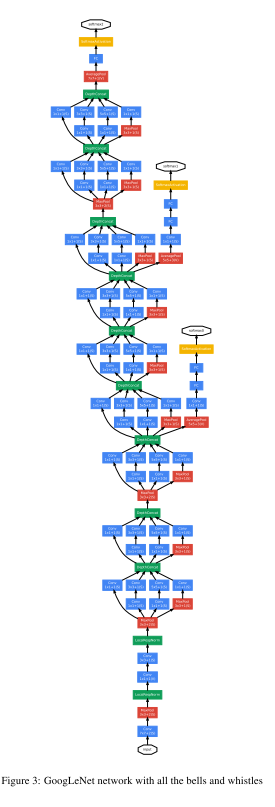
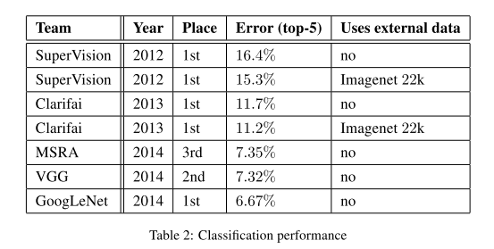
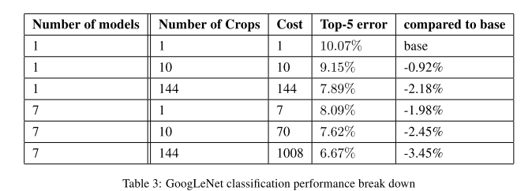

## Going Deeper with convolutions -- googlenet

### Abstract

------

- Propose a deep conv. architecture called inception, whose architectural decisions are based on **Hebbian principle** and the intuition of **multi-scale** processing
- One particular incarnation is called GoogLeNet, a 22 layers deep network.
- 'Inception' derives from paper [Network in Network](https://arxiv.org/abs/1312.4400) and [we need to go deeper](https://knowyourmeme.com/memes/we-need-to-go-deeper)
- the word 'deep' means 1) a new level of organization called 'Inception module' and 2) network depth
- $1 \times 1$ convolutions in Network in Network are heavily used in GooLeNet, for dual purpose but mainly as dimension reduction modules to remote computational bottlenecks

### Motivations

------

- Rude increasing the size of the network --- both depth and the units in each layer -- means a larger number of parameters, which makes the enlarged network more prone to overfitting, and leads to dramatically increased used of computational resources.
- The fundamental way of sovling both issues would be by ultimately moving from fully connecteed to sparsely connected architectures, even inside the convolutions --- an architecture that makes use of the extra sparsity, even at filter level but exploits our current hardwar by utlizing computations on dense matrics. 

### Model Details

------

#### Architecture

- the main idea of Inception architecture is based on finding out how an optimal local sparse structure in a convolutional vision network can be approximated nd covered by readily available dense components.
- Inception module: use of $1 \times 1$ convolutions to reduce dimension
- 
- GoogLeNet
- 

#### Training details

- Asynchronous stochastic gradient descent with 0.9 momentum, fixed learning rate schedule (decreasing the leraning rate by 4% every 8 epochs)

#### Results

### 

### Conclusions:

------

the optimal sparse structure by readily avaiable dense building blocks is a viable method for improving neural networks for CV.