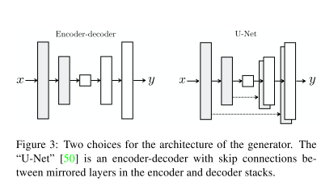

## Image-to-Image Translation with conditional adversarial networks

------

### Abstact

------

- investigate conditional adversarial networsk as a general-purpose solution to image-to-image translation problems.
- GANs learn a loss that tries to classify if the output image is real or fake, while simultaneously training a generative model to minimize this loss. Blurry images will not be tolerated sine they look obviously fake.
- Image-to-image translation problems are often formulated as per-pixel classification or regression. These formulations treat the output space as "unstructured" in the sense that each output pixel is considered conditionally independent from all others given the input image.
- Conditional GANs instead learn a *structure loss*. Structured loss penalize the joint configuration of the output.

### Method

------

GANs are generative models that learns a mapping from random noise vector $z$ to output image $y, G: z \rightarrow y$. In contrast, conditional GANs learn a mapping from observed image $x$ and random noise vector $z$ ot $y, G:{x, z} \rightarrow y$.

#### Objectives

- Objective of cGANs

- 
  $$
  \mathcal{L}_{cGAN} = \mathbb{E}_{x,y}[logD(x,y)] + \mathbb{E}_{x, z}[log(1 -D(x, G(x,z)))]
  $$

- Unconditional GANs:

- $$
  \mathcal{L}_{GAN} = \mathbb{E}_{x,y}[logD(y)] + \mathbb{E}_{x, z}[log(1 -D( G(x,z)))]
  $$

- It's beneficial to mix the GAN objective with a more traditional loss, such as L2, where the discriminator's job remains unchanged, but the generator is tasked to not only fool the discriminator but also to be near the ground truth output in an L2 sense.

- We use L1 distance rather than L2 as L1 encourages less blurring:

- $$
  \mathcal{L}_{L1} = \mathbb{E}_{x,y,z}[\|y - G(x,z)\|_1]
  $$

- The final objective becomes:

- $$
  G^* = \arg\min_G\max_D \mathcal{L}_{cGAN}(G, D) + \lambda\mathcal{L}_{L1}(G)
  $$

- ==Without $z$, the net could still learn a mapping from $x$ to $y$, but would produce deterministic outputs, and therefore fail to match any distribution other than a delta function.==

- Simply apply a Gaussian noise $z$ is not effective, as the generator will ignore this noise.

- We provide noise in the form of dropout, applied on several layers of our generator at both training and test time.

- Designing conditional GANs taht produce highly stochastic output, and thereby capture the full entropy of the contional distributions they model, is an important question left open by the present work.

#### PatchGAN

- It's well known that the L2 loss and L1 produces blurry results. Although these losses fail to encourage high-frequence crispness, in many cases they nonetheless accurately capture the low frequencies.
- We do not need an entirely new framework to enforce correctness at the low frequencies, L1 will already do.
- This motivates restricting the GAN discriminator to only model high-frequency structure, relying on an L1 term to force low-frequency correctness.
- We design *PatchGAN* that only penalize structure at the scale of patches, where the discriminator tries to classify if each $N \times N$ patch in an image is real or fake.

### Experiments

------

#### Evaluation Metrics

- Firstly, we run 'real' vs. "fake" perceptual studies on Amazon Mechanical Turk (AMT)
- second, we measure whether or not our synthesized cityspaces are realistic enough that off-the-shelf recognization system can recognize the objects in them -- **FCN-score**

#### Analysis of Objective function

- figure 4 shows the qualitative effects of losses variations
- we quantify these observations using the FCN-score
- We also test the effect of removing contioning from the discriminator (labeled as GAN). In this case, the loss does not penalize mismatch between the input and output; it only cares that the output looks realistic.
- a striking effect of conditional GANs is taht they produce sharp images, hallucinationg spatial structure even where it does not exist in the input label map. -- more colorful (fig.7.)

#### Analysis of Generator Architecture

- figure 5 and table 2 are the results.
- The encoder-decoder is unable to learn generate realistic images in our experiments.

#### From PixelGAns to PatchGANs to ImageGANs

- figure 6 shows qualitative results and table 3 quantifies the effects using the FCN-score.
- The pixelGAN has no effect on spatial sharpness but does increase the colorfulness of the results (quantified in figure 7)
- Using a $16 \times 16$ PatchGAN is sufficient to promote sharp outputs, and achieves good $FCN-scores$, but also leads to tiling artefacts. 
- The $70 \times 70$ PatchGAN alleviates these artifacts and achieves slightly better scores. 
- Scaling beyond this, the full $286 \times 286$ ImageGAN does not apper to improve the visual quality of the results, and in fact gets a considerablely low FCN score.
- **Fully-convolutional translation** An advantage of the PatchGA is that a fixed-size patch dsicriminator can be applied to arbitrarily large images.

#### Colorfulness

#### Perceptual Validation

- AMT experiments
- 