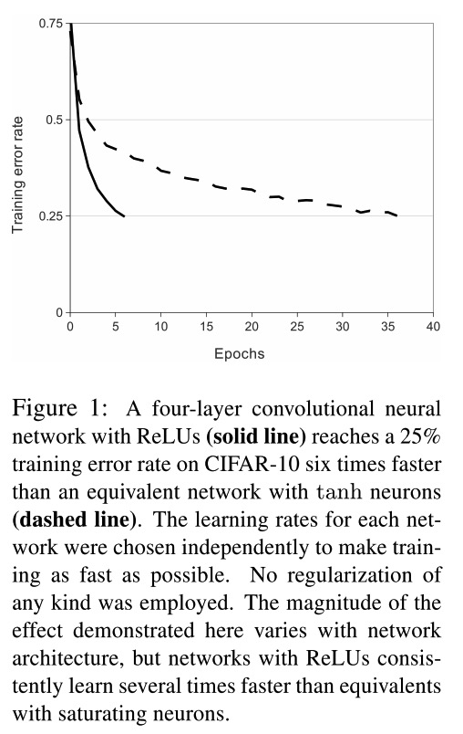
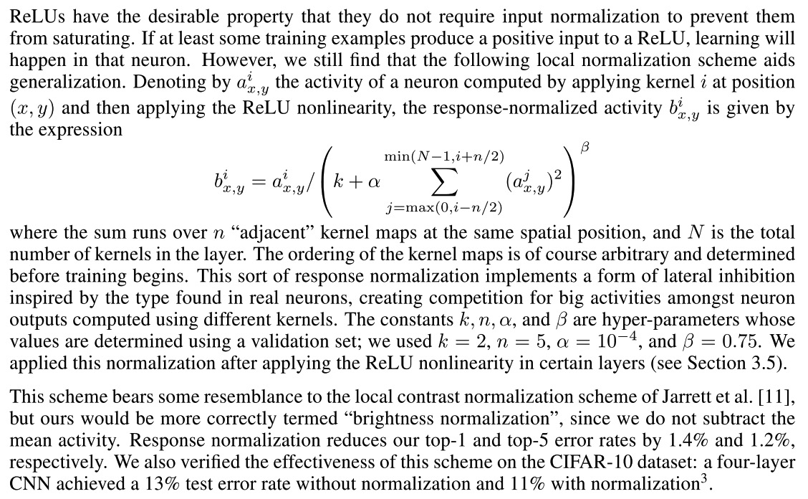

## ImageNet Classification with Deep Convolutional Neural Networks

### Abstract

------

The authors proposed a large, deep convolutional network that can classify ImageNet images in a high accuracy. (2012)

### Architecture and Detials

------

1. #### Architecture

   Input size: $224 \times 224 \times 3$

   1st conv layer: kernel size of (11, 11), with 96 filters and a stride of 4

   followed by maxpooling

   2nd conv layer: kernel size of 5, filters 256, followed by maxpooling.

   3rd conv layer: kernel size 3, filters 384.

   4th conv layer: kernel size 3, filters 384.

   5th conv layer: kernel size 3, filters 256, followed by maxpooling.

   6th fully connected layer: 4096 neutrons, followed by dropout

   7th fully connected layer: 4096 neutrons, followed by dropout

   8th fully connected layer: 1000 neutrons, softmax activate

   #### 

2. #### ReLU Nonlinearity

   sigmoid and tanh activations are saturating nonlinearities so the training time of using them are much slower than using the non-saturating nonlinearities such as ReLU

   

3. #### Local Response Normalization

   

4. #### Overlapping Pooling

   A pooling layer can be thought of as consisting of a grid of pooling units spaced $s$ pixels apart, each summarizing a neighborhood of size $z \times z$ centered at the location of the pooling unit. If we set $s = z$, we obtain traidition local pooling as commonly employed in CNNs. If we set $s < z$, we obtain overlapping pooling. Throughout their work, they used $s = 2$ and $z = 3$. 

5. #### Data augmentation

   (1) extract 224 patches from 256 images and their horizontal reflection

   (2) altering the intensities of the RGB channels in training images.

6. #### Training Details

   (1) batch size of 128

   (2) use of drop out

   (3) momentum of 0.9 and weight decay of 0.0005

   (4) learning rate was intialized at 0.01 and reduced 3 times prior to termination, which is devided by 10 at each reduction.

### Results

------

