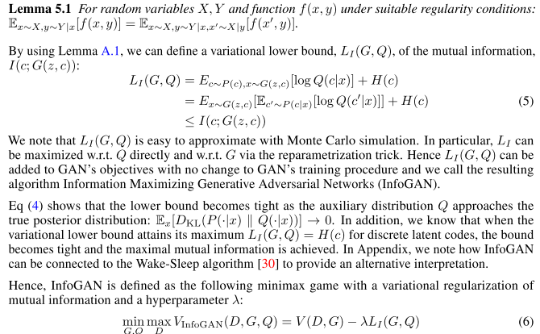
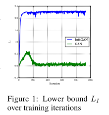
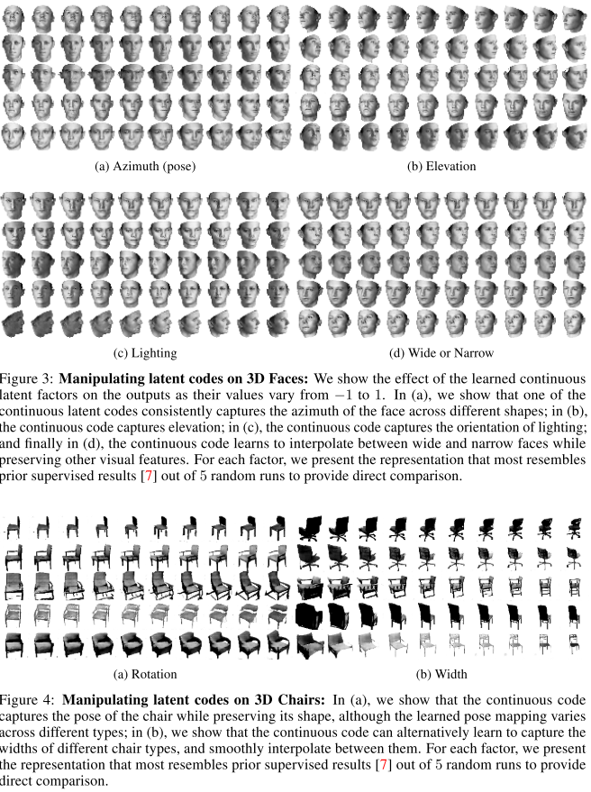
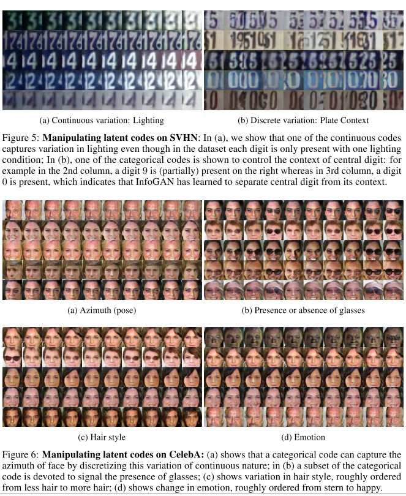

## InfoGAN: Interpretable Representation Learning by Information Maximizing Generative Adversarial Nets

### Abstract

------

- Descibe infoGAN, an information-theoretic extension to the Generator Adversarial Network that is able to learn ==disentangled representations== in a completely unsupervised manner.
- InfoGAN is a generative adversarial network that also maximizes the mutual information between a small subset of the latent variables (GAN's ) and the observation.
- Derive a lower bound of the ==mutual information objective== that can be optimized efficiently.

### Generative Adversarial Networks

------

- The goal is to learn a generator distribution $P_G(x)$ that matches the real data distribution $P_data(x)$.

- Instead of trying to explicitly assign probability to every $x$ in the data distribution, GANs learns a generator network $G$ that generates samples from the generator distribution $P_G$ by transforming a noise variable $z$ ~ $ P_{noise}(z)$ into a sample $G(z)$.

- This generator is trained by playing againist an adversarial discriminator network $D$ that aims to distinguish between samples from the true real data distribution $p_data$ and the generator's distribution $P_G$.

- So for a given generator, tge optimal discriminator is $D(x) = P_{data}(x) / (P_{data}(x) + P_G(x))$.

- More formally, the minimax game is given by the following expression:

- $$
  min_{G}max_{D}V(D, G) = \mathbb{E}_{x \sim P_{data}}[logD(x)] + \mathbb{E}_{z \sim noise}[log(1 - D(G(z)))]
  $$

### Mutial Information for Inducing Latent Codes

------

- The GAN information uses a simple factored continuous input noise vector $z$, while imposing no restrictions on the manner in which the generator may use this noise. As a result, it is possible that the noise will be used in a ==highly entangled way==, causing the individual dimensions of $z$ to not correspond to semantic features of data.

- In this work, rather than using a single unstructured noise vector, we propose to decompose the input noise vector into 2 parts: (i) $z$, which is treated as source of incompressible noise; (ii) $c$, which we will call the latent code and will target the salient structured semantic features of the data distribution.

- We denote a set of structured latent variables by $c_1, c_2, c_3, ..., c_L$. In its simplest form, we may assume a ==factored distribution==, given by $P(c_1, c_2, ..., c_L) = \prod_{i=1}^L P(c_i)$.

- We provide the generator network with both the incompressible noise $z$ and the latent code $c$, so the form of the generator becomes $G(z, c)$. 

- However, in standard GAN, the generator is free to ignore the additional latent code $c$ by finding a solution satisfying $P_G(x|c) = P_G(c)$.

- To cope with this problem, we propose an ==information-theoretic== regulaization: there should be high mutual information between latent codes $c$ and generator distribution $G(z,c)$. Thus I(c; G(z, c)) should be high.

- Mutual information between X and Y, $I(X; Y)$, measures the 'amount of information' learned from knowledge of random variable $Y$ about the other random variable $X$. THe mutual information can be expressed as the difference of two entropy terms:

- $$
  I(X; Y) = H(X) - H(X|Y) = H(Y) - H(Y|X)
  $$

  $I(X; Y)$ is the reduction of uncertainty in $X$ when $Y$ is observed. If X and Y are independent, then $I(X; Y) = 0$; by contrast, if $X$ and $Y$ are related by a deterministic, invertible function, then maximal mutual information is attained.

- Formulate a cost: given any $x \sim P_G(x)$, we want $P_G(c|x)$ to have a small entropy. In other words, the information in the latent code $c$ should be lost in the generation process:

- $$
  \mathop{min}_G \mathop{max}_D V_I(D, G) = V(D, G) - \lambda I(c; G(z, c))
  $$

### Variational Mutial Information Maximization

------

- In practice, the mutual information term is hard to maximise directly as it requires access to the posterior $P(c|x)$. Fortunately we can obtain a lower bound of it by defining an auxiliary distribution $Q(c|x)$ to approximate $P(c|x)$:

- $$
  I(c; G(z, c)) = H(c) - H(c|G(z,c)) \\
  = \mathbb{E}_{x \sim G(z,c)}[\mathbb{E}_{c' \sim P(c|x)}[logP(c'|x)]] + H(c) \\
  = \mathbb{E}_{x \sim G(z,c)}[D_{KL}(P(\cdot|x)\| Q(\cdot|x)) + \mathbb{E}_{c' \sim P(c|x)}[logQ(c'|x)]] + H(c) \\
  \geq \mathbb{E}_{x \sim G(z,c)[\mathbb{E}_{c' \sim P(c|x)}[logQ(c'|x)]]} + H(c) \\
  $$

  Known as *Variational Information Maximazation*

- So far, the need for computing the posterior P(c|x) explicitly via this lower bound but still need to be able to sample from the posterior in the inner expectation.

- Next use a simple lemma, that removes the need to sample from the posterior.

### Implementation

------

- In practice, we parametrize the auxiliary distribution $Q$ as a neural network. In most experiments, Q and D share all convolutional layers and there is one final fully connected layer to output parameters for the conditional distribution $Q(c|x)$.
- For categorical latent code $c_i$, we use the natural choice of softmax nonlinearity to  represent $Q(c_i|x)$. 
- For continuous latent code $c_j$, there are more options depending on what is the true posterior $P(c_j|x)$.
- In our experiments, we found that simplying treating $Q(c_j|x)$ as a factored Gaussian is sufficient.

### Experiments & Results

------

#### Mutual Information Maximization

- train infoGAN on MNIST, with a uniform categorical distribution on latent codes $c \sim Cat(L=10, p=0.1).$

- Compared to regular GAN, infoGAN can maxmize the lower bound of $L_1(G, Q)$, which means the bound is tight and maximal mutual information is achieved.

   

#### DIsentangled Representation

- To disentangle digit shape from styles on MNIST, we model the latent codes with one categorical code, $c_1 \sim Cat(K=10, p=0.1)$, which can model discontinuous variation in data, and 2 continuous codes that can capture variations that are continuous in nature: $c_2, c_3 \sim Unif(-1, 1)$.
- Fig.2. shows $c_1$ captures drastic change in shape. Changing categorical code $c_1$ swtiches the digits type most of the time. 
- Continuous codes $c_2, c_3$ capture continuous variations in style: $c_2$ models rotation of digits and $c_3$ controls width.
- Noteworthy is that the generator does not simply stretch or rotate the digits but instead adjust other details like thickness or stroke style to make sure the resulting images are natural looking.
- InfoGAn on faces dataset can learn variation unsupervisedly.

