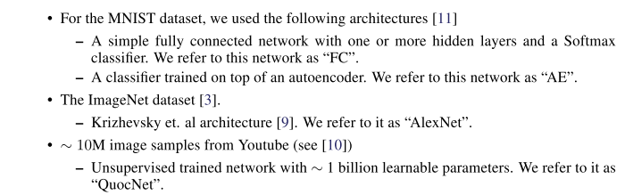
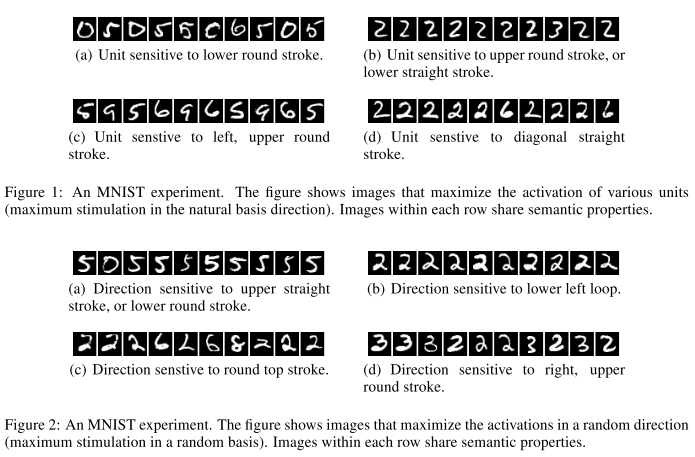
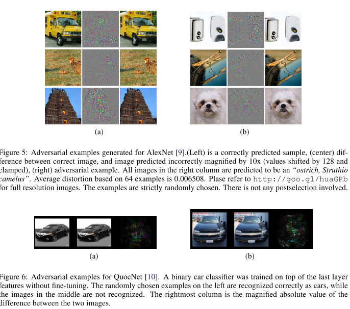
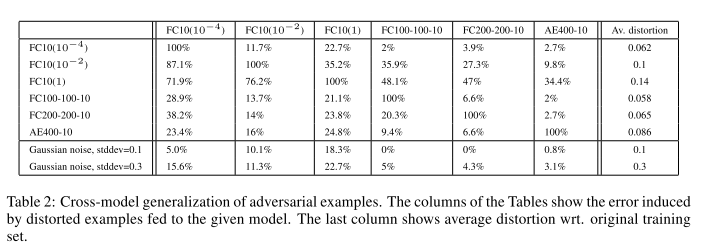

## Intriguing properties of neural networks

### Abstract

------

- Find 2 counter-intuitive properties of deep neural networks

- The first property is concerned with the semantic meaning of individual units. Previous works analyzed the semantic meaning of various units by finding the set of inputs that maximally activate a given unit, which makes the implicit assupmtion that the units of the last feature layer form a distinguished basis which is particularly useful for extracting semantic information. ==Instead, authors show that random projections of $\phi(x)$ are semantically indistinguishable from the corrdinates of $\phi(x)$, which seems that it is the entire space of he activations, rather than the individual units, that contains the bulk of the semantic information.== 

- Similar conlcusion about property 1 was reached for work representations, where the various directions in the vector space representing the words are shown to give rise to a suprisingly rich semantic encoding of relations and analogies. At the same time, the vector representations are stable up to a rotation of the space, so the individual units of the vector representations are unlikely to contain semantic information.

- The second property is concerende with the stability of neural networks with respect to small perturbations to their inputs. Applying ab *inperceptible* non-random perturbation to a test image. it is possible to arbitrarily change the network's prediction. These perturbations are found by optimizing the input to maximize the prediction error. We term the so perturbed examples "adversarial examples".

  

### Property 1

------

- We denote by $x \in \mathbb{R}^m$ an input image, and $\phi(x)$ activation values of some layer. 

- We perform a number of experiments on a fea different networks and three datasets:

- 

- Previous works interpret an activation of a hidden unit as a meaningful feature. They look for input images which maximize the activation value of this single feature, which are obtained form:

- $$
  x' = \mathop{\arg\max}_{x\in \mathcal{I}}(\phi(x), e_i)
  $$

  where $\mathcal{I}$ is a held-out set of images from the data distribution that the network was not trained on, and $e_i$ is the natural basis vector associated with the $i$th hidden unit.

- Our experiments show that any random direction $v \in \mathbb{R}^n$ gives rist to similarly interpretable semantic properties. More formally, we find that images $x'$ are semantically related to each other, for many $x'​$ such that:

- $$
  x' = \mathop{\arg\max}_{x\in \mathcal{i}}(\phi(x), v)
  $$

  which suggests that the natural basis is not better than a random basis for inspecting the properties of $\phi(x)$

- Fig.1. shows images that maximize the activations in the natural basis, and Fig.2. shows images that maximize the activation in random directions. In both cases, the resulting images share many high-level similarities.

- AlexNet results reach the same conclusion: both the single unit and the combination of units are semantically meaningful.

- Although such analysis gives insight on the capacity of $\phi$ to generate invariance on a particular subset of the input distribution, it does not explain the behavior on the rest of its domain, we shall see in the next section tha $\phi$ has counterintuitive property in the neighbourhood of almost every point form data distribution.

 

### Blind Spots in Neural Networks

------

- So far, unit level inspection methods had relatively little utility beyond confirming certain intuitions regarding the complexity of the representations learned by a deep neural network.

- Global, network level inspection methods can be useful in the context of explaining classification decisions and can be used to, for instance, indentify the parts of the input which led to a correct classification of a given visual input instance.

- ==Our results show that, for deep neural networks, the smoothness assumption that underlies many kernel methods does not hold. Specifically, we show that by using a simple optimization procedure, we are able to find adverarial exmaples, which are obtained by imperceptibly mall perturbations to a correctly classified input image, so that it is no longer classified correctly.==

- We denote by $f: \mathbb{R}^m \rightarrow {1, ..., k}$ a classifier mapping image pixel value vectors to a discrete label set. We also assume that $f$ has an associated continuous loss function denoted by loss：$\mathbb{R} \times {1, .., k} \rightarrow \mathbb{R}^+$. For a given $x \in \mathbb{R}^m$ image and target label $l \in {1, ..., k}$, we aim to solve the following box-constrained optimiztion problem:

  - minimize $\|r\|_2$ subject to 
    - $f(x+r) = l$
    - $x + r \in [0, 1]^m$

  the minimizer $r$ might not be unique, but we denote one such $x + r$ for an arbitarily chosen minimizer by $D(x, l)$. Informally, $x+r$ is the closest image to x classifed as $l$ by $f$.

- We find an approximation of $D(x, l)$ by performing line-search to find the minumul $c>0$ for which minimizer  $r$ of the following problem satisfies $f(x+r)=l$

  - minimize $c|r| + \mathop{loss}_f(x+r, l)$ subject to $ x+ r \in [0, 1]^m$

- Adversarial examples are somewaht universal and not just the results of overfitting to a particular model or to the specific selection of the training set.
- Back-Feeding adversarial examples to training might improve generalization of the resultsing models.
- table 2 shows the error on the distorted training sets. Adversarial examples tend to stay hard even for models trained with different hyper parameters. Although the autoencdoer based version seems mosst resilient to adversarial examples, it is not fully immune either.

