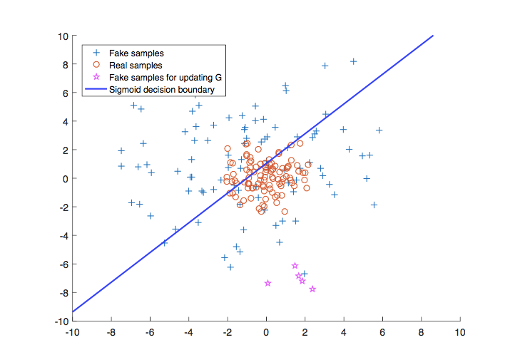
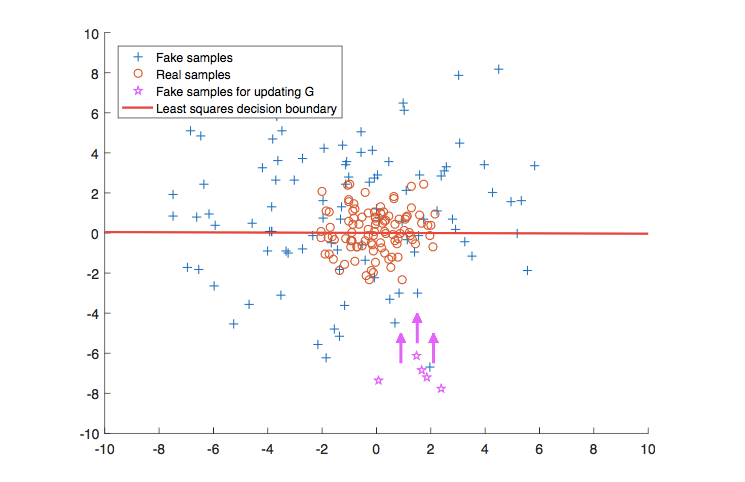
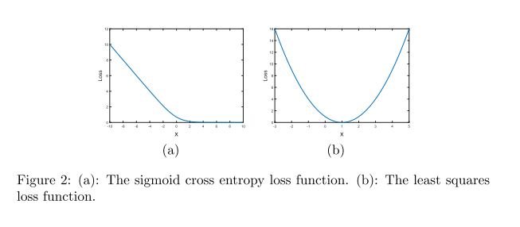
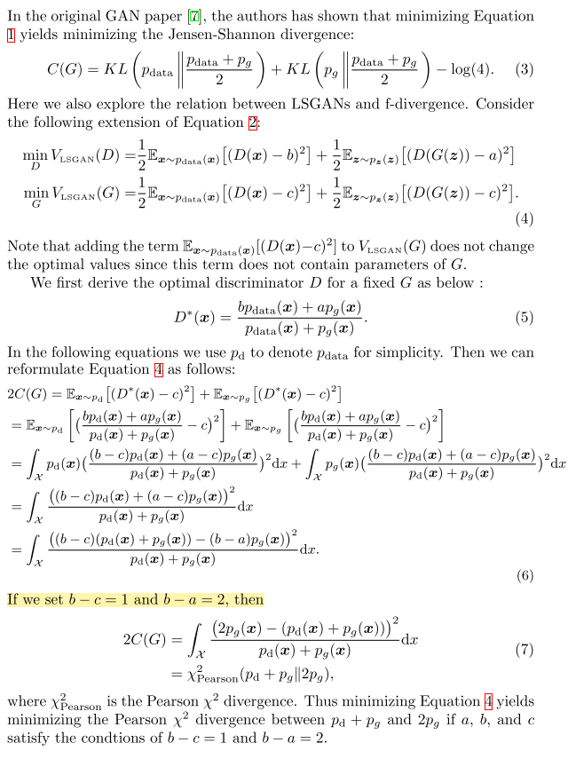
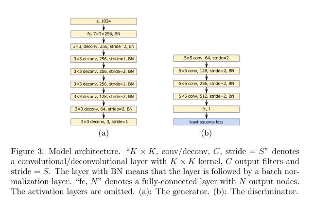

## Least Squares Generative Adversarial Networks

### Abstract

------

- Regular GAN's loss function may lead to the vanishing gradients problem during training process.
- the sigmoid cross entropy loss function lead to the problem of vanishing gradients when updating the generator using the fake samples that are on the correct side of the decision boundary, but are still far from the real data.
- 
- We adopt the least squares loss function for the discriminator, where minimizing the objective function of LSGAN yields minimizing the Pearson $\mathcal{X}^2$ divergence
- 
- least squares loss function is able to move the fake samples toward the decision boundary, because least squares loss function penalizes samples that lie in a long way on the correct side of the decision boundary.
- 
- Two advantages of LSGAN: 1) higher quality 2) more stable training process

### Method

------

#### GANs

- the target of $G$ is to learn a distribtion $p_g$ over data $x$.

- $D$ is a classifier $D(x; \theta_d)$ that aims to recognize whether an image is from training data or from $G$.

- $$
  \min_G\max_DV_{GAN}(D, G) = \mathbb{E}_{x \sim p_{data}(x)}[logD(x)] + \mathbb{E}_{z \sim p_{z}(z)}[log(1 - D(G(z))] 
  $$

#### Least Squares GANs

- When updating the generator of regular GANs, the loss function will cause the problem of vanishing gradients for the samples that are on the correct side of the dicisin boundary, but are still far from the real data.

- Suppose we use $a-b$ coding scheme for the discriminator, where $a$ and $b$ are the labels for fake and real data. The objective for LSGANs cna be defined:

- $$
  \min_DV_{LSGAN}(D) = \frac{1}{2}\mathbb{E}_{x \sim p_{data}}[(D(x) - b)^2] +  \frac{1}{2}\mathbb{E}_{x \sim p_{z}}[(D(G(z)) - a)^2] \\
  \min_GV_{LSGAN}(G) = \frac{1}{2}\mathbb{E}_{x \sim p_{z}}[(D(G(z)) - c)^2]
  $$

  where $c$ denotes the value that G wants to D to believe for fake data.

- AS a result, the penalization will make the generator to generate samples toward the decision boundary. On the other hand, the dicision boundary should go across the manifold of real data for a sucessful GANs training.

#### Relation to f-divergence

#### Model architectures

