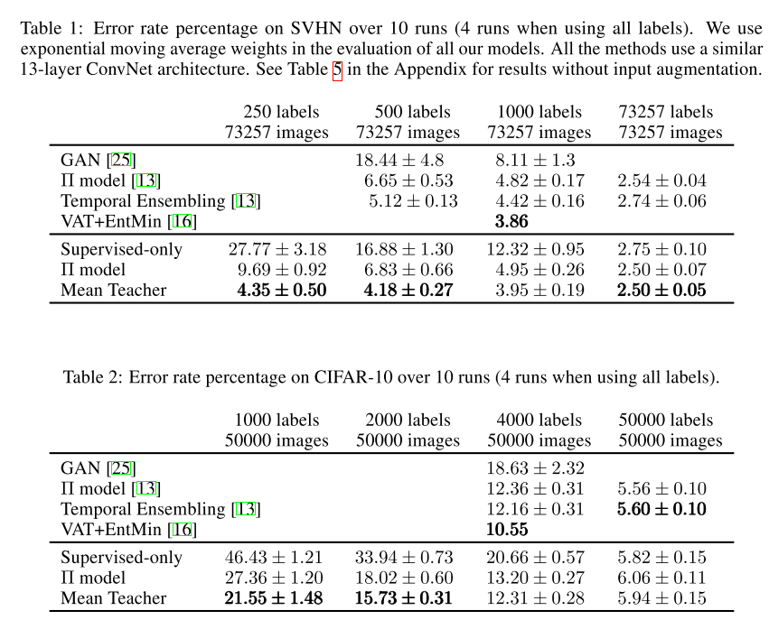
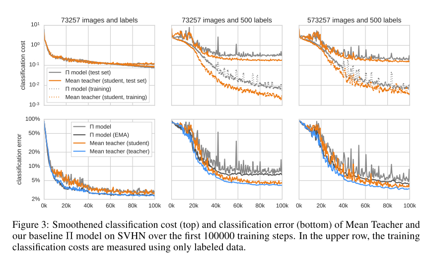

# Mean teachers are better role models: Weight-averaged consistency targets improve semi-supervised deep learning results

### Motivations

------

1. Temporal Ensembling在每个epoch更新一次Z，这使得这个方法在大数据集上非常笨拙。因为EMA每个epoch才更新一次，那么需要很长的训练时间很多的epoch才能学到一个好的running mean
2. 因此作者提出了mean teacher。相比于TE中对Z做衰减指数平均，作者提出对student的weights做指数衰减平均
3. 在TE中，同一个模型既是学生也是老师，学生通过在老师提供的标签上的和自己预测出的标签上的unsuoervised loss进行学习。然而老师给出的标签可能不准确， 因此如果unsupervised loss的权重过大，模型过多的关注inconsisenty过少的关注misclassification，那么模型可能就没办法学习到更多的信息去做更准确的分类。
4. 解决以上问题有两个方法：（1）选择更好的data perturbation的方法：VAT;  (2) 选择更好的老师，而不是复制学生模型
5. 本文关注第二种解决方法. 老师是连续几个学生的weight的EMA：几个trainig step的weight平均下来的model比最后一个step的model表现要好 +++ reference。 所以现在模型的EMA可以在每个step更新。

### Methodology

------

$$
J(\theta)=\mathbb{E}_{x, \eta^{\prime}, \eta}\left[\left\|f\left(x, \theta^{\prime}, \eta^{\prime}\right)-f(x, \theta, \eta)\right\|^{2}\right]
$$

每个training step都更新$\theta_t’$:
$$
\theta_{t}^{\prime}=\alpha \theta_{t-1}^{\prime}+(1-\alpha) \theta_{t}
$$

### Experiments

------

比TE要提升了很多

可以看出，相比于灰色的线，橘色的线(本文)更平滑，这是因为取weight的平均可以提供更准确的prediction target

作者还做了一些ablation study

