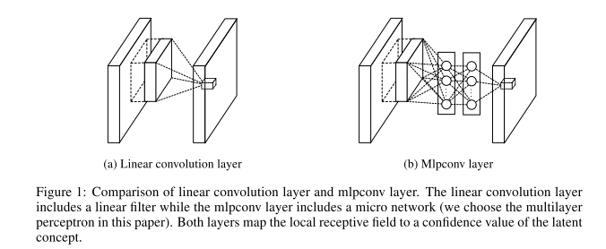
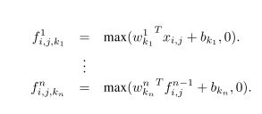
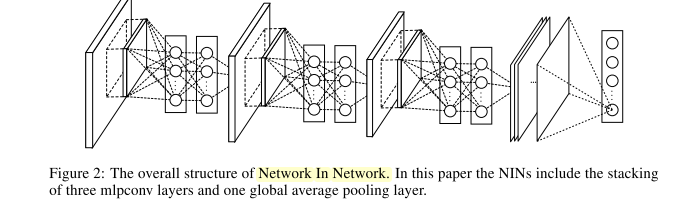
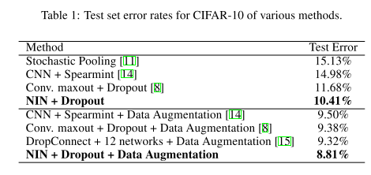
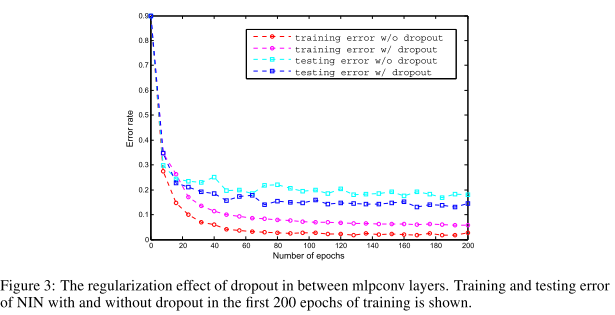
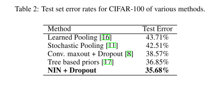
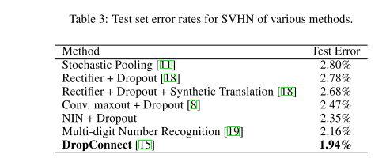
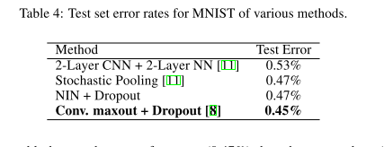
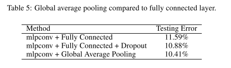
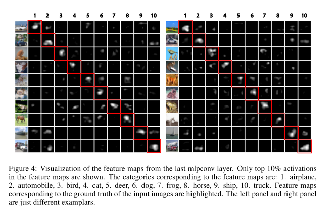

## Network in Network

### Abstract

------

- propose a novel deep network structure caled "Network In Network" (NIN) to enhance model discriminability for local patches within the receptive field

- Build micro neural networks with more complex structures to abstract the data within the receptive field.

- ==With enhanced local modeling via the micro network, we are able to utilize global average pooling over feature maps in the classification layers, which is easier to interpret and less prone to overfitting than tranditional fully connected layers.==

  

- The convolution filter in CNN is a generalizaed linear model (GLM) for the underlying data patch, where inner product is conducted and the underlying receptive field followed by a nonlinear activation function at every local portion of the input.

- The level of abstraction is low with GLM, where abstraction means the feature is invariant to the variants of the same concept.

- GLM can achieve a good extent of abstraction when the samples of the latent concept are linearly separable, i.e. the variants of the concept all live on one side of the seperation plane defined by the GLM. Thus conventional CNN implicitly makes the assumption that the latent concepts are linearly separable.

- In NIN, the GLM is replaced with a 'micro network', which is a general nonliner function approximator. In this work, we consider MLP as the instantiation of the micro network.

- Instead of adopting the traditional fully connected layers for classification in CNN, we directly output the spatial average of the feature maps from the last mlpconv layer as the confidence of categories via global average pooling layer, and then the resulting vector is fed into the softmax layer. In traditional CNN, it is difficult to interpret how the category level information from the objective cost layer is passed back to the previous convolution layer due to the fully conncected layers which act as a black bos in between. ==In contrast, global average pooling is more meaningful and interpretable as it enforces coreespondance between feature maps and categories,== which is made possible by a stronger local modeling using the micro network.

- Furthermore, the fully connected layers are prone to overfitting and heavily depend on dropout regularization, while global average pooling is itself a structural regularizer, which natively prevents overfitting for the overall structure.

  

### CNNs

------

- CNN consist of alternatively stacked conv. layers and spatial pooling layers. The conv layers then generate feature maps by linear convolutional filters followed by nonlinear activation functions.
- The linear convolution is sufficient for abstraction when the instrances of the latent concepts are linearly separable. However, representations that achieve abstraction are generally highly non-linear functions of the input data. Thus, conventional CNN might be compensated by utilizing over-complete set of linear filters that can be learned to detect different variations of a same concept. Howeverm having too many filters for a single concept imposes extra burden on the next layer.
- In recent work, maxout is used to reduce the number of feature maps by maximum pooling over affine feature maps.
- However, maxout network imposs the prior that instances of a latent concept lie within a convex set in the input space, which does not necessarily hold.
- It would be necessary to empoly a more general function approximator when the distributions of the latent concepts are more complex.

### Network in Network Architecture

------

#### MLP convolutional layers

- Given no priors about the latent data distributions, it is desirable to use a universal function approximator for feature extraction of the local patches, as it is capable of approximating more abstract representations of the latent concepts.

  

- MLPCONV differs from maxout layer in that the convex function approximator is replaced by a universal function approximate, which has greater capability in modeling various distributions of latent cencepts.

  

#### Global Average Pooling

- in conecntional CNNs, for classification, the feature maps of the last convolutional layer are vectorized and fed into fully connected layers followed by a softmax activation. This structure treats the convolutional layers as feature extractors and the resulting feature is classified in a traditional way.
- However, FC layers are prone to overfitting, thun hampering the generalization ability of the overall network. Dropout is often used to improve generalization ability and prevents overfitting.
- In this paper, the authoers propse another strategy called global average pooling repalces the traditional FC layers.
- The idea is to generate one feature map for each corrsponding category of the classifcation tasks in the last mlpconv layer. Instead of adding fully conncected layers on the top of the feature maps, we take the average of each feature map, and the resulting vectore is fed directly into the softmax layer.

##### Advantages of GAP

- One advantage of global avarage pooling over FC layes is that it is more native to the convolution sturcture by enforcing correspondences between the featuer maps and categories. Thus the feature maps can be easily interpreted as categories confidence maps.
- Another advantage is that there is no paramter to optimize in the global average pooling thus overfitting is avoided at this layer.
- Furthermore, GAP sums out the spatial information, thus it is more robust to spatial translations of the input.

We can see MAP as a structural regularizer that explicitly enforces feature maps to be confidence maps of categories, ==which is made possible by NIN, as they makes better approximation to the confidence maps than GLMs==

### Experiments & Results

------

#### CIFAR_10

- Outperforms the state-of-the-art

  

- using dropout in between mlpconv layers in NIN boosts the performance by improving the generalization ability of the model

  

#### CIFAR_100

#### SVHN

#### MNIST

#### GLobal Average Pooling as Regularizer

==GAP is similar to FC layers in that they both perform linear transformations of the vertorized feature maps. The difference lies in the transformation matrix. For GAP, the transformation matrix is prefixed and it is non-zero only on block diagonal elements which shar the same value. FC layers can have dense transformation matrices and the values are subject to Back Propogation.==

#### Visualization of NIN

we explicitly enforce feature maps in the last mlocon layer of NIN to be confidence maps of the categories by means of global avearge pooling, which is possible only with stronger **local receptive field modelling**.

- It is expected that the largest activations are observed in the feature map corrsponding to the ground truth category of the input image, which is enforced by GAP.
- Within the feature map, it can be observed that the strongest activations paper roughly at the same region of the object in the original image.
- The visualization demonstrates the effectiveness of NIN, which is achieved via a stronger local receptive field modeling using mlpconv layers. The global average pooling then enforeces the learning of category level feature maps.

