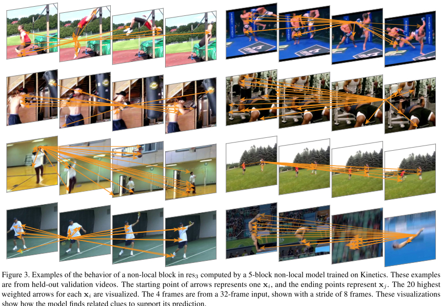

# Non-Local Neural Networks

### Motivation

------

CNN通过堆叠卷积层可以捕捉到局部特征信息。本文提出NL Block，用来捕捉空间，时间或者时空间上的全局特征信息

NL Block可以通过直接计算两个位置的关系来捕捉long-range dependency

### Formulation

------

$$
\mathbf{y}_{i}=\frac{1}{\mathcal{C}(\mathbf{x})} \sum_{\forall j} f\left(\mathbf{x}_{i}, \mathbf{x}_{j}\right) g\left(\mathbf{x}_{j}\right)
$$

non-local operation和fc不同之处在于，fc通过学习到的权重来捕捉全局信息，而non-local operation的全局信息是input data的一个函数。

$g$是一个一元函数，可以由1x1卷积来计算

文章中提出了几种计算$f(x_i, x_j)$的方法：

Gaussian:
$$
f\left(\mathbf{x}_{i}, \mathbf{x}_{j}\right)=e^{\mathbf{x}_{i}^{T} \mathbf{x}_{j}}
$$
Embedded Gaussian:
$$
f\left(\mathbf{x}_{i}, \mathbf{x}_{j}\right)=e^{\theta\left(\mathbf{x}_{i}\right)^{T} \phi\left(\mathbf{x}_{j}\right)}
$$
Dot Product:
$$
f\left(\mathbf{x}_{i}, \mathbf{x}_{j}\right)=\theta\left(\mathbf{x}_{i}\right)^{T} \phi\left(\mathbf{x}_{j}\right)
$$
Concatenation:
$$
f\left(\mathbf{x}_{i}, \mathbf{x}_{j}\right)=\operatorname{ReLU}\left(\mathbf{w}_{f}^{T}\left[\theta\left(\mathbf{x}_{i}\right), \phi\left(\mathbf{x}_{j}\right)\right]\right)
$$
矩阵操作如下图

值得注意的是，Gauissan方法通过softmax来计算e的基底

Non-local Block可以表示为:
$$
\mathbf{z}_{i}=W_{z} \mathbf{y}_{i}+\mathbf{x}_{i}
$$

### Experiments

------

