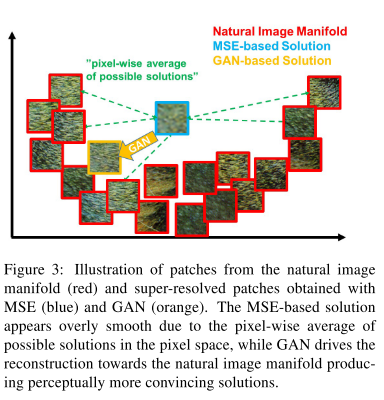
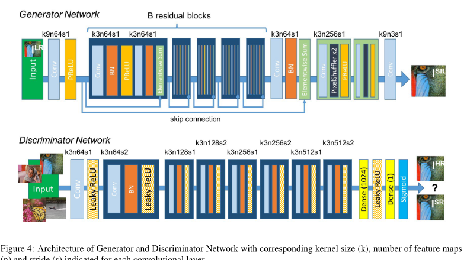
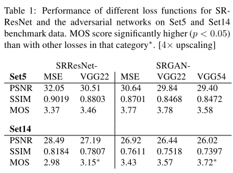
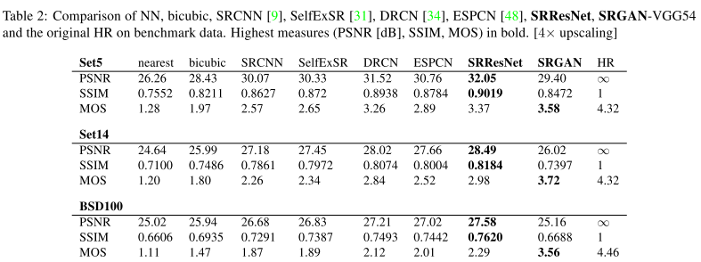
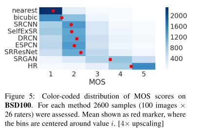

## Photo-Realistic Single Image Super-Resolution Using a Generative Adversarial Network

### Abstract

------

- Propose Super Resolutiuon GAN (SRGAN), where we propose a perceptural loss function which consists of an advesarial loss and a content loss.
- Define a novel perceptual loss using high-level feature maps of the VGG network.
- Pixel-wise loss functions such as MSE struggle to handle the uncertainty inherent in recovering lost high-frequence details such as texture: minimizing MSE encourages finding pixel-wise averages of plausible solutions which are typically overly-smooth and thus have poor perceptual quality.
- Fig.2 illustrates that multiple potential solutions with high texture details are averaged to create a smooth reconstruction.
- 

### Method

------

- 
- In SISR the aim is to estimate a high-resolution, super-resolved image $I^{SR}$ from a low-resolution input image $I^{LR}$. In training, $I^{LR}$ is obtained by applying a Gaussian filter to $I^{HR}$ followed by a downsampling operation with downsampling factor $r$.

#### Adversarial Loss

- We train a generator network as a feed-forward CNN $G_{\theta_G}$, parameterized by $\theta_G$:

- $$
  \hat{\theta}_G = \arg\min_{\theta_G}\frac{1}{N}\sum^N_{n=1}l^{SR}(G_{\theta_G}(I^{LR}_n), I_n^{LR})
  $$

- We define a discriminator network $D_{\theta_D}$ which we optimize in an alternating manner along with $G_{\theta_{G}}$ to solve the adversarial min-max problem:

- $$
  \min_{\theta_G}\max_{\theta_D} \mathbb{E}_{I^{HR} \sim p_{train}(I^{HR})}[logD_{\theta_D}(I^{HR})] + \mathbb{E}_{I^{LR} \sim p_G(I^{LR})}[log(1 - D_{\theta_D}(G_{\theta_G}(I^{LR})))]
  $$

#### Perceptual Loss

- the pixel-wise **MSE loss** is defined as:

- $$
  l_{MSE}^{SR} = \frac{1}{r^2WH} \sum^{rW}_{x=1} \sum^{rH}_{y=1} (I_{x,y}^{HR} - G_{\theta_G}(I^{LR})_{x,y})^2
  $$

  While optimizing this MSE loss achieve high PSNR, solutions of MSE optmization problems often lack high-frequence content which results in perceptually unsatisfying solutions with overly smooth textures.

- We define the **VGG loss** based on the ReLU activations layers of the pre-trained VGG network. With $\phi_{i, j}$ we indicate the feature map obtained by the j-th convolution before the i-th maxpooling layer within the VGG19 network. We then define the VGG loss as the euclidean distance btween the feature representations of a reconstructed image $G_{\theta_G}(I^{LR})$ and the reference image $I^{HR}$:

- $$
  l^{SR}_{VGG/i,j} = \frac{1}{W_{i,j}H_{i,j}} \sum^{W_{i,j}}_{x=1} \sum^{H_{i,j}}_{y=1} (\phi_{i,j}(I^{HR})_{x,y} - \phi_{i,j}(G_{\theta_G}(I^{LR}))_{x,y})^2
  $$

### Experiments & Results

------

- Mean opinion score (MOS) testing: we asked raters to assign an integral score from 1 (bad quality) to 5 (excellent quality) to the super-resolved images. (table1 table2)
- different loss combination
- 

