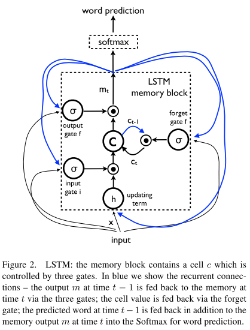
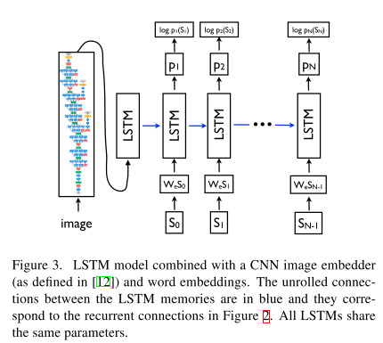
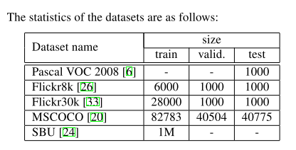
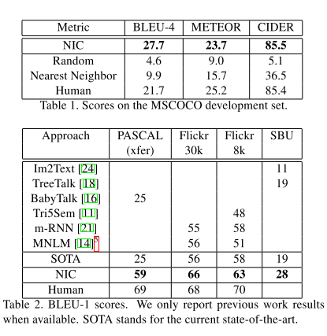
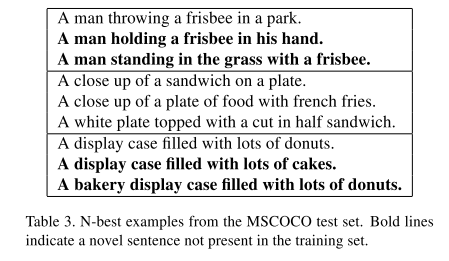
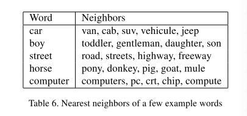
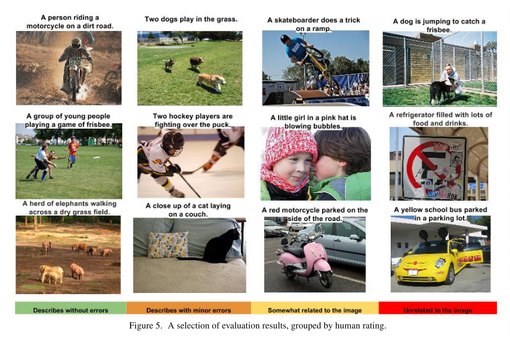

## Show and Tell: A Neural Image Caption Generator

### Abstract

------

- Present a generative model based on a deep recurrent architecture.
- The model is trained to maximize the likelihood of the target description sentence given the training image.
- the model taks an image $I$ as input, and is trained to maximize the likelihood $p(S|I)$ of producing a target sequence of words $S = {S_1, S_2, ...}$ where each word $S_t$ comes from a ==given dictionary==, that describes the image adequately.
- In machine translation, am "encoder" RNN reads the source sentence and transforms it into a rich fixed-length vector representation, which in turn in used as the initial hidden state of a "decoder" RNN that generates the target sentence.
- we replace the encoder RNN by a CNN, where a rich representation of the input image can be produced as a fixed length vector.
- For CNN, a pre-trained model on ImageNet classification could be used.

### Model

------

- In this paper, we propose a neural and probabilistic framework to generate descriptions from images.

- Directly maxize the probability of the corret description given the image:

- $$
  \theta^* = \arg\max \sum_{(I, S)}logp(S|I; \theta)
  $$

  where $\theta$ are the parameters of the model, $I$ is an image, and $S$ is the corret transcription. 

- Since $S$ represents any sentence, its length is unbounded. Thus, it is common to apply the chain rule to model the joint probability over $S_0, ..., S_N$, where N is the length of this particular example as:

- $$
  logP(S|I) = \sum_{t=0}^Nlogp(S_t|I, S_0, ..., S_{t-1})
  $$

- It is natural to model $p(S_t|I, S_0, ..., S_{t-1})$ with a Recurrent Neural Network (RNN), where the variable number of words we condition upon up to $t-1$ is expressed by a fixed length hidden state or memory $h_t$. This memory is updated after seeing a new input $x_t$ by using a non-linear function $f$:

- $$
  h_{t+1} = f(h_t, x_t)
  $$

- For $f$ we use a Long-Short Term Memory (LSTM) net.

#### LSTM-based Sentence Generator

- LSTM can allievate the problem of gradient vanishing or exploding problem in RNNs

- the core of LSTM model is a memory cell $c$ encoding knowledfe at every time step of what inputs have been observed up to this step.

- the behavior of the cell is controlled by gates -- layers which are applied multiplicatively and thus can either keep a value from the gated layer if the gate is 1 or zero this value if the gate is 0. In particular, three gates are being used which control whether to forget the current cell value (forget gate $f$), if it should read its input (input gate $i$) and whether to output the new cell value (output gate $o$).

- $$
  i_t = \sigma(W_{ix}x_t + W_{im}m_{t-1}) \\
  f_t = \sigma(W_{fx}x_t + W_{fm}m_{t-1})\\
  o_t = \sigma(W_{ox}x_t + W_{om}m_{t-1})\\
  c_t = f_t \odot c_{t-1} + i_t \odot h(W_{cx}x_t+W_{cm}m_{t-1}) \\
  m_t = o_t \odot c_t
  p_{t+1} = Softmax(m_t)
  $$

  

- the LSTM model is trained to predict each word of the sentence after it has seen the image as well as all preceding words as defined by $p(S_t|I, S_0, .. S_{t-1})$

- 

- thus it is instructive to think of the LSTM in unrolled form:

- $$
  x_{-1} = CNN(I) \\
  x_t = W_eS_t, t \in {0, ..., N-1} \\
  p_{t+1} = LSTM(x_t), t \in {0, ..., N-1}
  $$

  where we represent each word as a one-hot vector $S_t$ of dimension equal to the size of the dictionary

- Our loss is the sum of the negative log likelihood of the correct work at each step as follows"

- $$
  L(I, S) = -\sum_{t=1}^Nlogp_t(S_t)
  $$

  the above loss is minimized w.r.t all the parameters of the LSTm, the top layer of the image embedder CNN and word embeddings $W_e$

#### Inference

- There are multiple approaches that can be used to generate a sentence given an image, with NIC.
- The first one is **Sampling** where we just sample the first word according to $p_1$, then provide the corresponding embedding as input and sample $p_2$, continuing like this until we sample the special end-of-sentence token or some maximum length
- The second one is **BeamSearch**: iteratively consider the set of the $k$ best sentences up to time $t$ as candidates to generate sentences of size $t+1$, and keep only the resulting best $k$ of them. This better approximates $S = \arg\max_{S'}p(S'|I)$
- We use beamsearch with a beam size 20.

### Experiments & Results

------

#### Metrics

- Amazon Mechanical Turk
- BLEU score
- Perplexity: geometric mean of the inverse probability for each predicted word.

#### Datasets

#### Results

- Human score as reference (table 2)

#### Transfer Learning, Data Size and Label Quality

- want to study whether we could transfer a model to a diiferent dataset, and how much the mismatch in domain would be compensated with higher quality labels or more training data.
- Filckr30K and Filckr8K: adding more data help
- MSCOCO is bigger but has different captioning style, hence performance drops

#### Generation Diversity

- Table 3 shows some samples when returning the N-best list from our beam search decoder instead of the best hypothesis.
- Diversity is shown.
- 

#### Analysis of Embeddings

- we use word embddings vectors, which has the advantage of being independent of teh size of the dictionary.
- learned representations have captured some semantic from the statistics of the language
- 

