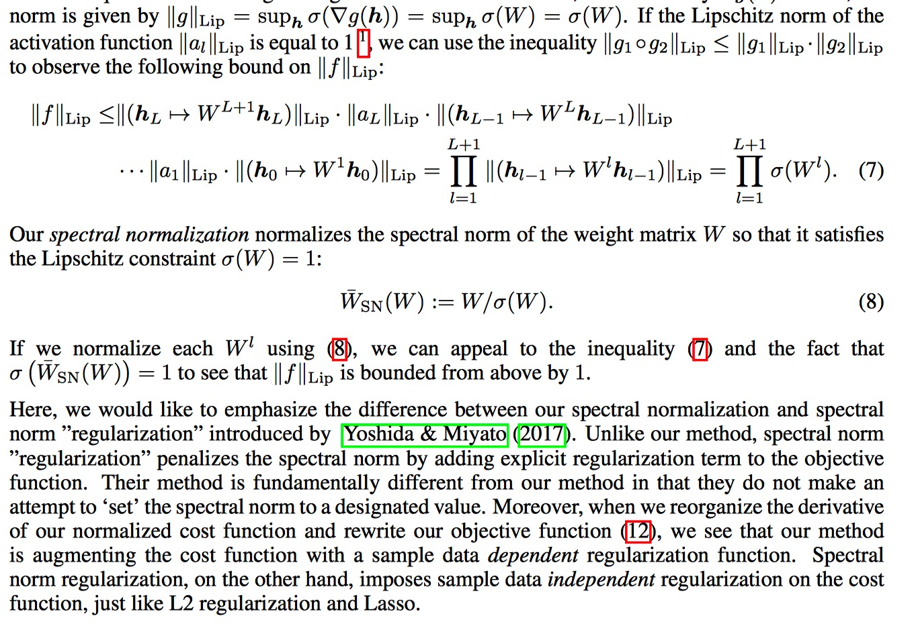
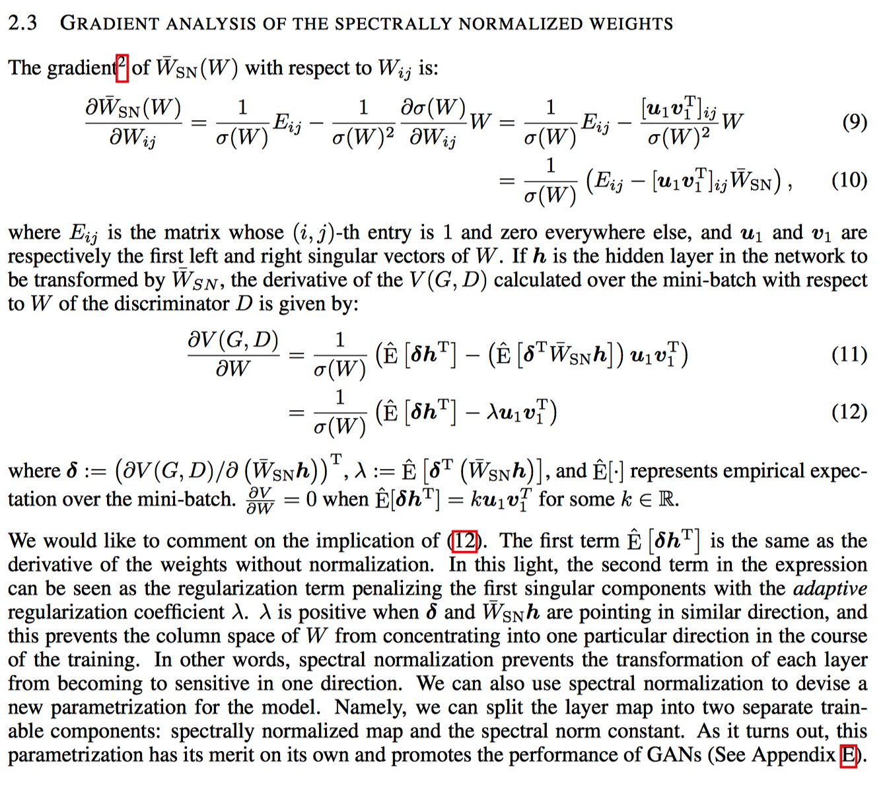

## Spectral Normalization for GANS

### Abstract

------

- Proposed a novel weight normalization technique called spectral normalization to stabilize the training of the discriminator.
- - Lipschitz constant is the only hyper-parameter to be tuned, and the algorithm does not require intensive tuning of the only hyper-parameter for satisfactory performance
  - Implementation is simple and the additional computational cost is small
- In a nutshell, GANs are a framework to produce a model distribution that mimics a given target distribution, and it consists of a generator that produces the model distribution and a discriminator that distinguishes the model distribution from the target.
- A persisting challenge in the training of GANs is the performance control of the discriminator. In high dimensional spaces, the density ratio estimation by the discriminator is often inaccurate and unstable during the training, and the generator networks fail to learn the multimodal structure of the target distribution. Even worse, when the support of the model distribution and the support of the target distribution are disjoint, there exists a discriminator that can perfectly distinguish the model distribution from the target.

### Method

------

Consider a simple discriminator made of a neural network of the following form, with the input $x$:
$$
f(x, \theta) = W^{L+1}a_L(W^{L}(a_{L-1}(W^{L-1}(...a_1(W^1x)...))) \quad\quad (1)
$$
Where $\theta := ({W^1, ..., W^L, W^{L+1}})$ is the learning parameters set, $W^l \in \R^{d_{l} \times d_{l-1}}$  , $W^{L+1} \in \R^{1 \times d_{L}}$ , and $a_l$ is an element-wise non-linear activation function. (The bias term is omitted). The final output of the discriminator is given by
$$
D(x, \theta) = \Alpha(f(x, \theta)) \quad\quad\quad (2)
$$
where $\Alpha$ is an activation function corresponding to the divergence of distrance measure of the user's choice. The standard formulation of GAns is given by:
$$
\min_G\max_DV(G,D)  \quad\quad\quad (3)
$$
A problem is that the function space from which the discriminators are selected crucially affects the performance of GANs. Several works advocate the improtance of Lipschitz continuity in assuring the boundedness of statistics. 

In this work, they aim to search for the discriminator $D$ from the set of $K$-Lipschitiz continuous functions:
$$
\mathop{\arg\max}_{\|f\|_{Lip \leq} K} \quad\quad (5)
$$
where they mean by $\|f\|_{Lip}$ the smallest value $M$ such that $\|f(x) - f(x')\|/\|x - x'\| \leq M$ for any $x, x'$, with the norm being the $\mathcal{l}_2$ norm.

While input based regularizations allow for relatively easy formulations based on samples, they also suffer from the fact that, they cannot impose regularization on the space outside of the supports of the generator and the data disctributions without introduing somewhat heuristic means. 

#### Spectral Normalization

our spectral norm controls the Lipschitz constant of the discriminator function $f$ by literally constraining the spectral norm of each layer $g$ : $h_{in} \mapsto h_{out}$.

Lipschitz norm $\|g\|_{Lip}$ is equal to $sup_h\sigma(\nabla{g(h)})$, where $\sigma(A)$ is the spectral norm of the matrix A ($L_2$ matrix norm of A):
$$
\sigma(A) := \max_{h:h\neq0} \frac{\|Ah\|_2}{\|h\|_2} = \max_{\|h\|_2 \leq1}\|Ah\|_2
$$
which is equivalent to ==the largest singular value of A==. 

Therefore, for a linear layer $g(h) = Wh$, the norm is given by $\|g\|_{Lip} = sup_h\sigma(\nabla{g(h)}) = sup_h\sigma(W) = \sigma(W)$. 

#### Fast Approximation of the spectral Norm

Instead of naively apply singular value decomposition to compute the $\sigma{W}$ at each round of the algorithm, we use ==the power iteration method== to estimate it.

