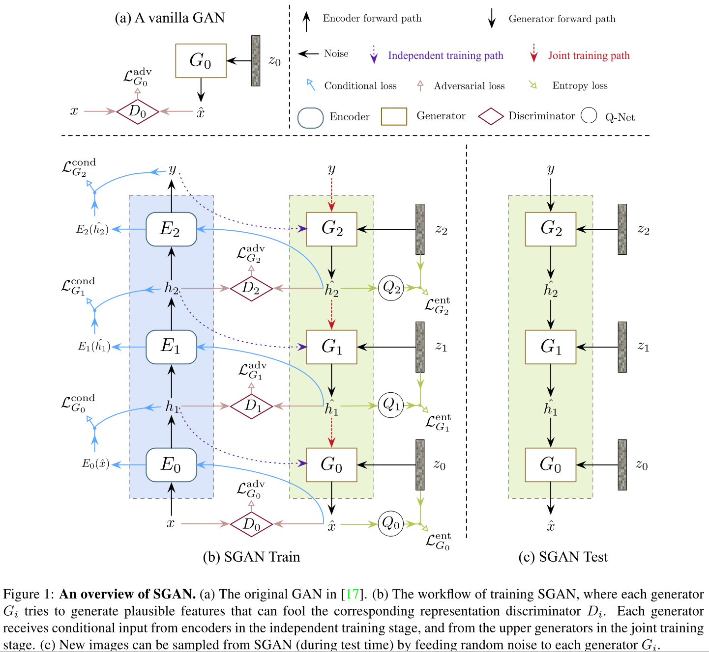
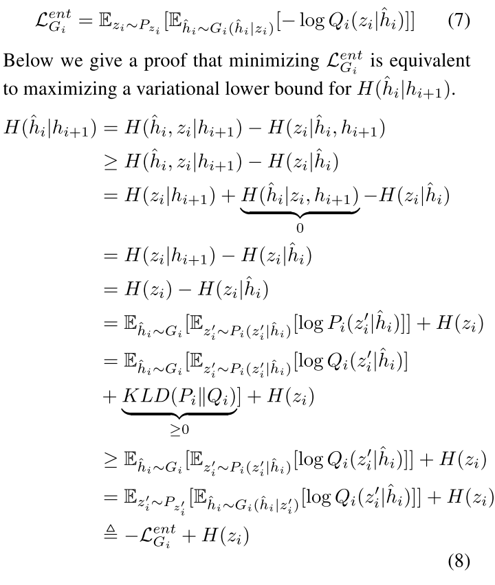
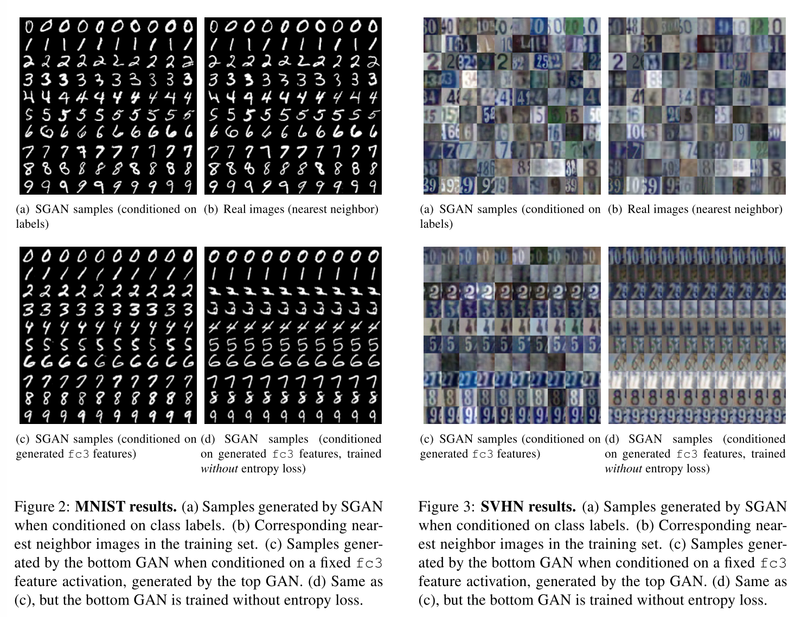
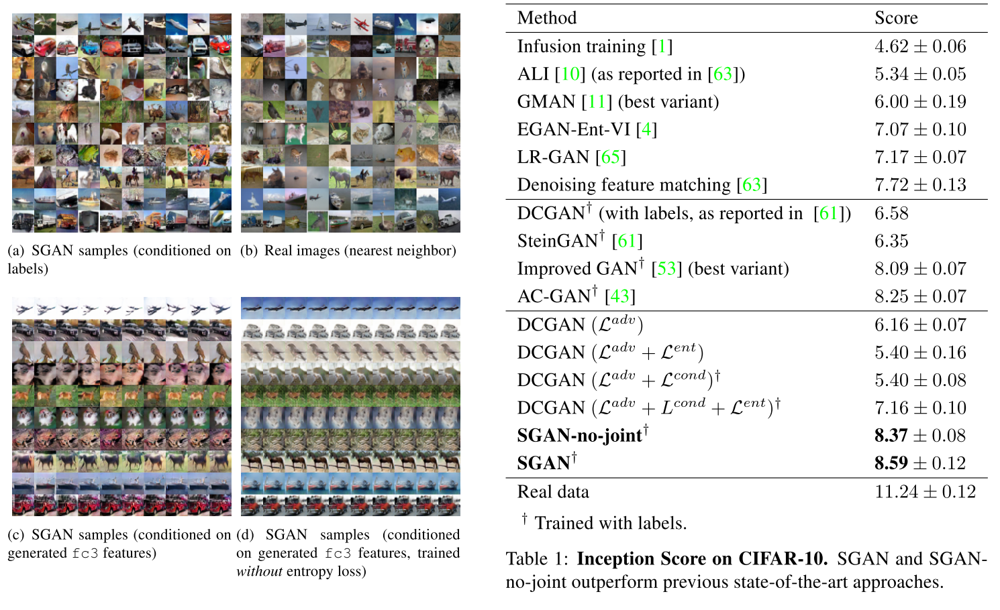
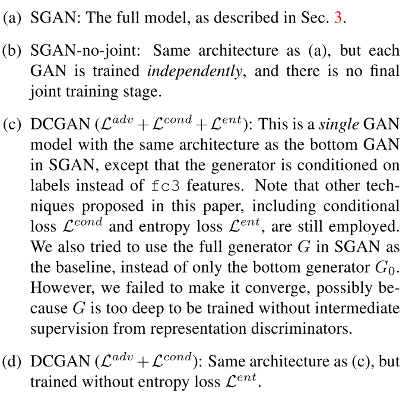
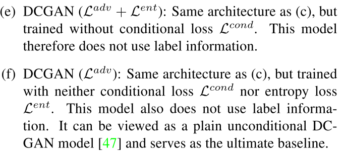
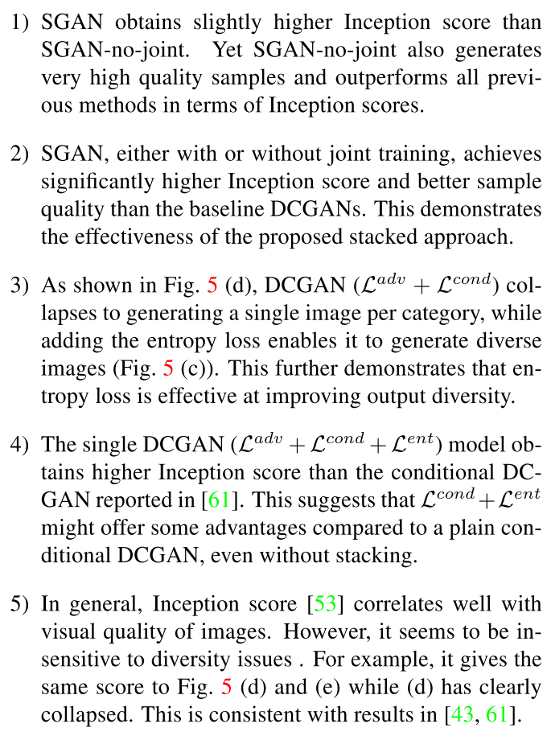
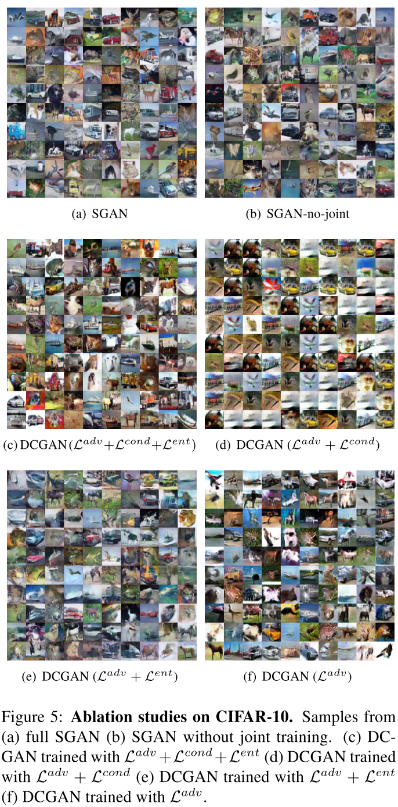

## STACKED GEnerative Adversarial Networks

### Abstract

------

- We propose *Stacked Generative Adversarial Networks (SGAN),* which is trained to invert the hierarchical representations of a bottom-up discriminative network, consisting of a top-down stack of GANs, each learned to generate lower-level representations conditioned on higher-level representations. A representation discriminator is introduced at each feature hierarchy to encourage the representation manifold of the generator to aligh with that of the ==bottom-up discriminative network== (an extra pre-trained encoder network), leveraging the powerful discriminative representations to guide the generative model.
- In addition, we introduce a conditional loss that encourages the use of conditional information from the layer above, and a novel entropy loss that maximizes a variational lower bound on the conditional entropy of generator outputs.
- SGAN decomposes variations into multiple levels and gradually resolves uncertrainties in the top-down generative process.
- LAPGAN focuses on generating *multi-resolution* imasges from corase to fine while our SGAN aims at modeling *multi-lev el representations* from abstract to specific.

#### Method

------

#### Generative Adversarial Network

- The original GAN is trained using a two-player min-max game: a discriminator D trained to distinguish generated images from real images, and a generator $G$ trained to fool $D$. The discriminator loss $\mathcal{L}_D$ and the generator loss $\mathcal{L}_G$ is defined as:

- $$
  \mathcal{L}_D = \mathbb{E}_{x \sim P_{data}}[-logD(x)] + \mathbb{E}_{z \sim P_z}[-log(1 - D(G(z)))] \\
  \mathcal{L}_G = \mathbb{E}_{z \sim P_z}[-log(D(G(z)))]
  $$

- In practivce, D and G are usually updated alternateely. The training process matches the generated images distribution $P_G(x)$ with the real image distribution $P_data(x)$ in the training set.

#### Stacked Generative Adversarial Networks

**Pre-trained Encoder.**

- A bottom-up (image to representations) DNN pre-trained for classification.
- Define a stak of bottom-up deterministic non-linear mappings: $h_{i+1} = E_i(h_i)$, where $i \in {0, 1, ..., N-1}$, $E_i$ consists of a sequence of neural layers, $N$ is the number of hierarchies, $h_i(i \neq 0, N)$ are intermediate representations, $h_N = y$ is the classification result, and $h_0 = x is the input image.$
- the way of grouping layers together into $E_i$ is determined by us.
- the number of stacks $N$ is less than the number of layers in $E​$ and is also determined by us.

**Stacked Generators**

- Provided with a pre-trained encoder $E$, our goal is to train a top-down generator $G$ that inverts $E$.

- Each $G_i$ takes in a higher-level feature and a noise vector as inputs, and outputs the lower-level feature $\hat{h}_i$.

- Each generator receives conditional input from encoders in the independent training stage, and from the upper generators in the joint training stage.

- We first train each GAN independently and then train them jointly in an end-to-end manner.

- Intuitively, the total variations of images could be decomposed into multiple levels, with higher-level semantic semantics. This model allows using different noise variables to represent different level of variations.

- Each generator is trained with a linear combination of three loss terms: adversarial loss, conditional loss, and entropy loss:

- $$
  \mathcal{L_{G_i}} = \lambda_1\mathcal{L_{G_i}^{adv}} + \lambda_2\mathcal{L_{G_i}^{cond}} + \lambda_3\mathcal{L_{G_i}^{ent}}
  $$

- Each generator $G_i$, we introduce a *representation discriminator* $D_i$ that distinguishes generated representations $\hat{h}_i$, from real representations $h_i$. The loss function for $D_i$ is:

- $$
  \mathcal{L}_{D_i} = \mathbb{E}_{h_i \sim P_{data, E}}[-logD_i(h_i)] + \mathbb{E}_{z_i \sim P_{z_i}, h_{i+1} \sim P_{data, E}}[-log(1 - D_i(G_i(h_{i+1}, z_i)))]
  $$

  For $G_i$:
  $$
  \mathcal{L}_{G_i}^adv = \mathbb{E}_{h_{i+1} \sim P_{data, E}, z_i \sim P_{z_i}} [-log(D_i(G_i(h_{i+1}, z_i)))
  $$

- To sample images, all $G_i$s are stacked together in a top-down manner. The SGAN is capable of modeling the data distribution conditioned on the class label: $p_G(\hat{x}|y) = p_G(\hat{h}_0|\hat{h}_N) = p_G(\hat{h}_0, \hat{h}_1, \hat{h}_{N-1}|\hat{h}_N)  = \prod_{0 \leq i \leq N-1} p_G(\hat{h}_i|\hat{h}_{i + 1})$, where $ p_G(\hat{h}_i|\hat{h}_{i + 1})$ is modeled by a generator.
- SGAN factorizes the total entropy of the image distribution $H(x)$ into multiple conditional entropy terms: $H(x) = H(h_0, h_1, ..., h_N) = \sum_{i=0}^{N-1} H(h_i|h_{i+1}) + H(y)$, thereby decomposing one difficult task into multiple easier tasks.

**Conditional Loss**

- At each stack, a generator $G_i$ is trained to capture the distribution of lower-level representations $\hat{h}_i$, conditioned on higher-level representations $h_{i+1}$.

- However, the generator might choose to ignore $h_{i+1}$ and generate plausible $\hat{h}_i$ from scratch.

- To avoid this, we adopt a conditional loss, where we feed the generated lower-level representations $\hat{h}_i = G_i(h_{i+1}, z_i)$ back to the encoder $E$, and compute the recovered higher-level representations. Formally:

- $$
  \mathcal{L}_{G_i}^{cond} = \mathbb{E}_{h_{i+1} \sim P_{data, E}, z_o \sim P_{z_i}}[f(E_i(G_i(h_{i+1}, z_i), h_{i+1})]
  $$

**Entropy Loss**

- Simply adding the conditional loss $\mathcal{L}_{G_i}^{cond}$ leads to another issue: the generator $G_i$ learns to ignore the noise $z_i$, and compute $\hat{h_i}$ deterministically from $h_{i+1}$. 
- To tackle this problem, we would like to encourage the generated representation $\hat{h}_i$ to be sufficiently diverse when conditioned on $h_{i+1}$, i.e. the conditional entropy $H(\hat{h}_i | h_{i+1})$ should be as high as possible.
- Since directly maximizing the conditional entropy is intractable, we propose to maximize intead a *variational lower bound* on the conditional entropy, where we train an auxiliary distribution $Q_i(z_i | \hat{h}_i)$ to approximate the true posterior $P_i(z_i | \hat{h}_i)$, and augment the training loss with entropy loss term.

### Experiments & Results

**MNIST, SVHN**

- each row corresponds to samples conditioned on a given digit class label.
- Effect of Entropy loss.  Fig.2.c shows samples generated by bottom GAN when conditioned on a fixed feature generated by the top GAN. The samples have sufficient low-level variations, which reassure that bottom GAN learns to generate images without ignoring the noise $z_0$.  Fig.2. d shows samples without entropy loss, where we observe that the bottom GAN ignores the noise and instead deterministically generates images from top features.
- An advantage of SGAN compared with a vanilla GAN is its interpretability: it decomposes the total variations of an image into different levels.
- $y$ Represents the high-level digits label, $z_1$ captures the mid-level coarse pose, $z_0$ represents the low-level spatial details.
- 

**CIFAR10**

- We sample 50, 000 images and compute Inception Score

**More Ablation Studies**

- Comparison of the use of different loss.

  

  

- Conclusion:

  

  