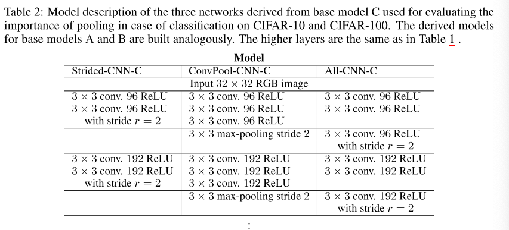

## Striving for Simplicity: The All Convolutional Net

------

### Abstract

------

- Most modern CNNs used for  object recognition are built using the same principles: alternating convolution and max-pooling layers followed by a small number of fully conencted layers.
- We find that max-pooling can simply be replaced by a convolutional layer with increased stride without loss in accuracy on several image recognition benchmarks.
- We propose a new architecture that consists solely of convolutional layers and yields compettive or state of the art performance on several object recognition datasets.
- To analyze the network, we introduce 'guided deconvolution' approach, which can be applied to a broader range of network structures than existing approaches.

### Model Description - The All convolution Network

------

- We replace the pooling layers, which are present in parctically all modern CNNs used for object recognition, with standard convolutional layers with stride 2.

- Let $f$ denote a feature map produced by some layer of a CNN. It can be described as a 3-dimensional array of size $W \times H \times N$ where $W$ and $H$ are the width and the height and $N$ is the number of channels.

- Then $p$-norm subsampling with pooling size $k$ (or half-length $k/2$) and stride $r$ applied to the feature map $f$ is a 3-dimensional array $s(f)$ with the following entries:

- $$
  s_{i,j,u}(f) = \{ \sum_{h = - \lfloor k/2 \rfloor}^{\lfloor k/2 \rfloor} \sum_{w = - \lfloor k/2 \rfloor}^{\lfloor k/2 \rfloor}|f_{g(g, w, i, j, u)}|^p \}^{1/p}
  $$

  where $g(h, w, i, j, u) = (r \cdot i +h, r\cdot j+w, u)$ is the function mapping from positions in $s$ to positions in $f$ respecting the stride, $p$ is the order of the $p$-norm (when $p \rightarrow \infty$). ==If $r > k$, pooling regions do not overlap;== however, current CNN architectures typically include the overlapping pooling with $k=3$ and $r=2$. 

- Standard definition of a convolutional layer $c$ applided to feature map $f$ is given as:

- $$
  c_{i,j,o}(f) = \sigma \{ \sum_{h = - \lfloor k/2 \rfloor}^{\lfloor k/2 \rfloor} \sum_{w = - \lfloor k/2 \rfloor}^{\lfloor k/2 \rfloor} \sum_{u=1}^N \theta_{h, w, u, o}f{g(h, w, i, j, u)} \}
  $$

  Where $\theta$ are the convolutional weights, $\sigma(\cdot)$ is the activation function, typically a ReLU.

- The pooling layer can be seen as performing a feature-wise convolution in which the activation function is replaced by the p-norm.

- We assume that in general, there exist 3 possible explanations why pooling can help in CNNs:

  1. the p-norm makes the representation in a CNN more invariant;
  2. the spatial dimensionality reduction performed by pooling makes covering larger parts of the input in higher layers possible;
  3. the feature-wise nature of the pooling operation could make optimization easier.

- We can remove pooling layers without abandon the spatial dimensionality reduction by 2 means:

  1. remove each pooling layer and increase the stride of the convolutional layer that precede it accordingtly
  2. replace the pooling layer by a normal convolution with stride larger than one.

- the second one can also be seen as learning a pooling opration rather than fixing it. which has previously been considered using different parameterizations in the literature.

### Experiments & Results

------

#### Experimental Setup

- use 3 different base network, which is described in table.1
- for all th base networks, we consider use a 1-by-1 convolution at the top to produce 1- outputs of which we then compute an average over all positions and a softmax to produce class-probabilities.
- For each of the base models, we have 3 variants:
  1. a model in which max-pooling is removed and the stride of the convolution layers preceding the max-pool layers is increased by 1 --- ''strided-CNN''
  2. a model in which max-pooling is replaced by a convolution layer -- "All-CNN"
  3. A model in which a dense convolution is placed before each max-pooling layer -- "ConvPool-CNN"

#### CIFAR-10

table 3++

- simplest model (model A) already performs remarkably well
- Simply removing the max-pooling layer and just increasing the stride of the previous layer results in diminished performance in all settings.
- When pooling is replaced by an additional convolution layer with stride 2, performance stabilize the even improves on the base model.
- $\rightarrow$ while pooling can help to regularize CNNs, and generally does not hurt performance, it is not strictly necessary to achieve state-of-the-art results.

### Deconvolution

------

- Propose a method to visualize based on deconvolution  -- *guided back propagation*
- Gabor filters (edge detection and color blobs) only appear in the 3rd layer

