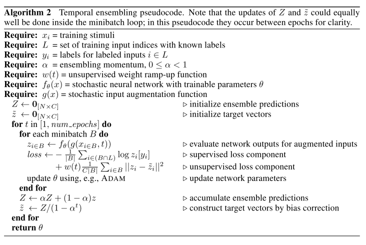

# Temporal Ensembling for Semi-Supervised Learning

### Motivation

------

1. 解决semi-supervised learning的问题，把没有标签的数据也融入到学习中
2. 提出了$\Pi \text { -model }$和Temporal Ensembling，两种self-ensemble的模型
3. Self-ensemble是指同一个模型在不同regularization和input augmentation的情况下，在训练过程的不同时刻对unkown label的样本（augmented）提供一致的预测。实际上和蒸馏有些类似，老师和学生是同一个模型.
4. Ensemble通常可以产生更好的效果.Dropout等同于训练一个NN的时候同时训练很多个sub-NN, 因此提供ensemble的效果. 这片文章的想法是在训练过程的层面形成ensemble: 邻近的几个epoch模型具有不同的参数（因此是不同的模型）， 对一个样本的预测应该是一致的。同时还因为droput的原因，相当于训练了很多sub-networks。

### $\Pi \text { -model }$

------

​	同一个input stimuli输入网络两次，在不同的dropout和augmentation情况下，确保输出的标签一致

Loss function由两部分组成

	1. 正常的cross entropy loss只用来计算有标签的样本
 	2. 额外的监督信号(consistent regularisation)，mse loss between $z_i$ and $\hat{z}_i$
 	3. 第二个loss被一个有关训练时间的参数scale： $w(t)$, 随高斯函数上升。因此训练开始时主要是正常的CE loss. 作者称保证$w(t)$的增速足够缓慢是非常重要的一个因素.

### Temporal Ensembling

------

$\Pi \text{-model}$的问题是，用来计算第二个loss的目标$z_i$是在每个iteration中单独产生的, 因此可能会有noise。并且，在同一个iteration中，一个网络要前传两次得到$z_i$和$\hat{z}_i$

因此作者提出了temporal ensembling，通过计算$z_i$在邻近epoch的指数衰减平均来减小noise的影响，并且这样每次只用前传一次。
$$
Z_{i} \leftarrow \alpha Z_{i}+(1-\alpha) z_{i}
$$

###  Experiments Results

------

可以看出在label缺少的情况下和label齐全的情况下，两种方法均有所提升

作者也同时做了noisy label的实验

在temporal ensembling的情况下，模型对noisy label的容忍度也得到了很大的提升。作者称这是因为unsupervised loss使得模型学到的mapping function在所有样本点的附近都是平坦的。即使ce loss使得mapping function在有wrong label的样本处有一个值，但是第二个loss会平滑这个mapping function