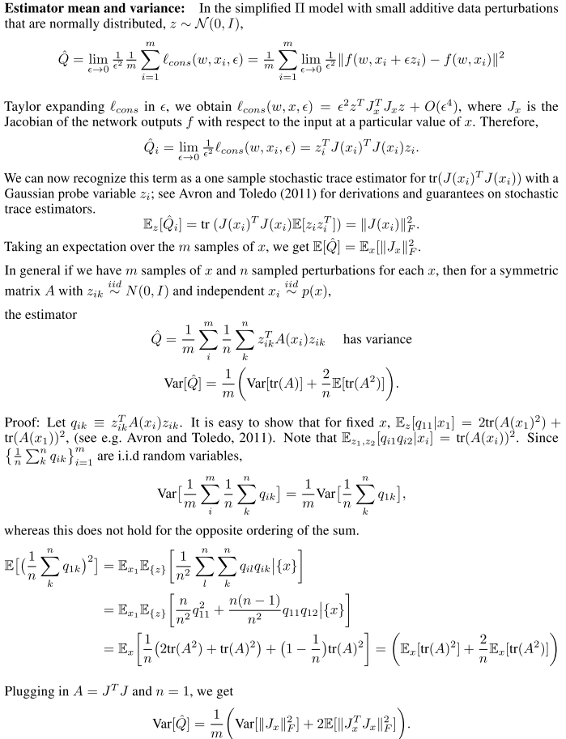
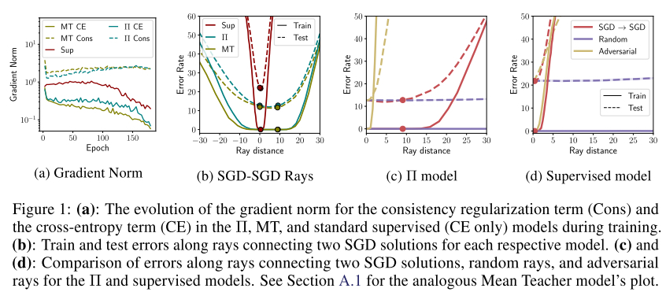
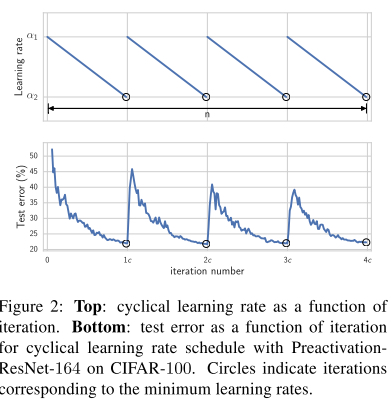

# THERE ARE MANY CONSISTENT EXPLANATIONS OF UNLABELED DATA: WHY YOU SHOULD AVERAGE

### Motivation

------

1. 在半监督学习中，Consistency Regularization取得了很好的结果
2. 这篇文章在于分析，理解和提升consistency loss
3. 前提需要理解[stochastic weight averaging （SWA）](https://arxiv.org/abs/1803.05407)， 简单来说就是通过cyclic learning rate取几个epoch的model把weight给average得到一个有更好generalization性能的模型

### Consistency Regularization

------

在半监督学习中，有label的数据$\mathcal{D}_L = \left\{\left(x_{i}^{L}, y_{i}^{L}\right)\right\}_{i=1}^{N_{L}}$ 和无label的数据$\mathcal{D}_{U}=\left\{x_{i}^{U}\right\}_{i=1}^{N_{U}}$

给定两个根据$x$ perturbed的输入$x'$和$x''$ 和加入扰动的权重$w_f'$和$w_g'$

consistency loss惩罚学生预测的标签和老师给出的标签
$$
\ell_{\mathrm{cons}}^{\mathrm{MSE}}\left(w_{f}, x\right)=\left\|f\left(x^{\prime} ; w_{f}^{\prime}\right)-g\left(x^{\prime \prime}, w_{g}^{\prime}\right)\right\|^{2} \text { or } \ell_{\mathrm{cons}}^{\mathrm{KL}}\left(w_{f}, x\right)=\operatorname{KL}\left(f\left(x^{\prime} ; w_{f}^{\prime}\right) \| g\left(x^{\prime \prime}, w_{g}^{\prime}\right)\right)
$$
总loss为
$$
L\left(w_{f}\right)=\underbrace{\sum_{(x, y) \in \mathcal{D}_{L}} \ell_{\mathrm{CE}}\left(w_{f}, x, y\right)}_{L_{\mathrm{CE}}} \underbrace{\sum_{x \in \mathcal{D}_{L} \cup \mathcal{D}_{U}} \ell_{\text {cons }}\left(w_{f}, x\right)}_{L_{\text {cons }}}
$$

### Consistency Loss惩罚Local Sharpness

------

考虑一个简单的情况（$\Pi \text{-model}$）， $x^{\prime}=x+\epsilon z, z \sim \mathcal{N}(0, I)$ 其中$\epsilon \ll 1$
$$
\ell_{\text {cons}}(w, x, \epsilon)=\|f(w, x+\epsilon z)-f(w, x)\|^{2}
$$
考虑estimator $\hat{Q} = \lim _{\epsilon \rightarrow 0} \frac{1}{\epsilon^{2}} \frac{1}{m} \sum_{i=1}^{m} \ell_{\operatorname{cons}}\left(w, x_{i}, \epsilon\right)$
$$
\mathbb{E}[\hat{Q}]=\mathbb{E}_{x}\left[\left\|J_{x}\right\|_{F}^{2}\right] \quad \text { and } \quad \operatorname{Var}[\hat{Q}]=\frac{1}{m}\left(\operatorname{Var}\left[\left\|J_{x}\right\|_{F}^{2}\right]+2 \mathbb{E}\left[\left\|J_{x}^{T} J_{x}\right\|_{F}^{2}\right]\right)
$$
证明如下:

可以看出, consistency loss 实际上隐式的在惩罚网络的output到input的Jacobian norm. 而网络的jacobian norm与模型的generalization有关。

接着考虑关于w的扰动，那么consistency loss就在隐式的惩罚output到weight的jacobian norm.+

+++

### Solutions Along SGD Trajectories

------

作者首先分析了两个loss的gradient norm， 发现$L_{cons}$在训练末尾时更新的步伐仍然很大, 说明SGD持续在寻找很多可行的solution

接着作者分析了各个模型在epoch170和epoch180之前weights的距离，发现semi-supervised模型的weght的距离远大于supervised 模型，且error surface相比于监督模型更广更平滑。这个观察可以由上个部分的证明来辅佐说明，consistency loss使模型的输出表面更平滑，有更好的泛化能力。

### Ensemble & Weight Averaging

------

上述分析表明，consistenly loss提供更diverse的training solution，因此把他们ensemble起来可以提供更准确的预测结果。

采用cyclic learning rate，并在lr最低时取student网络的权重来计算ensemble

### Experiments

------

SWA可以带来不小的提升