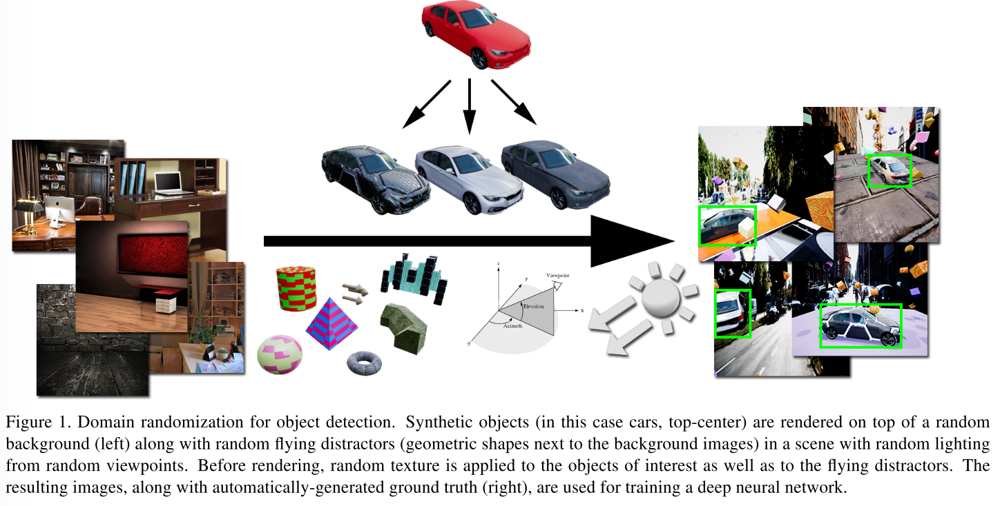
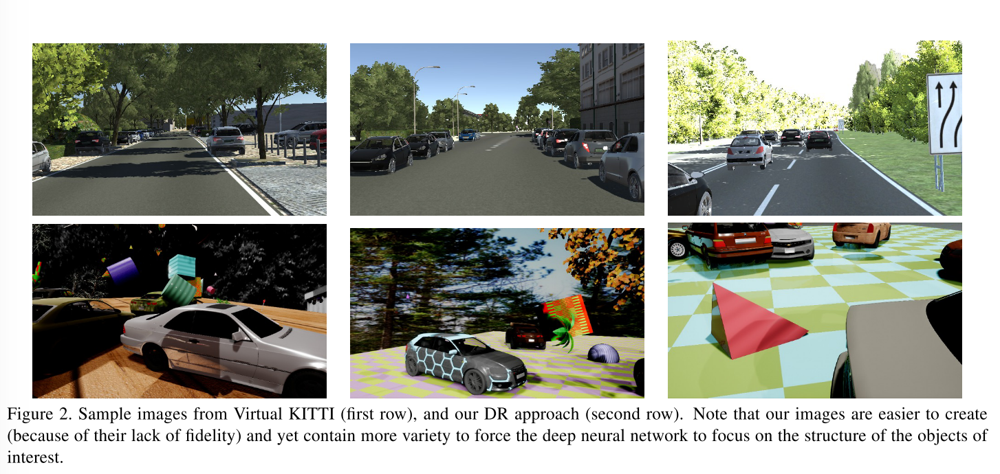
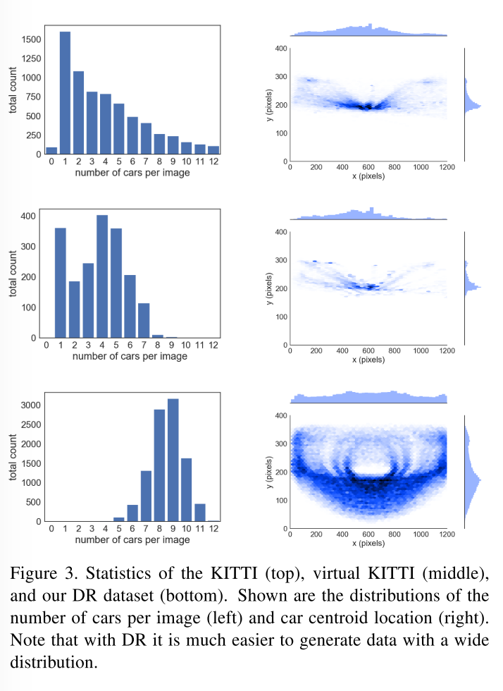
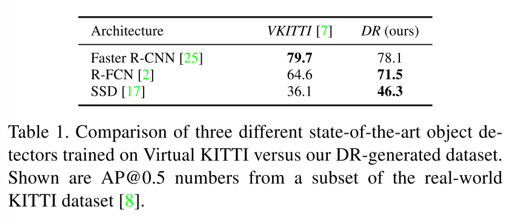
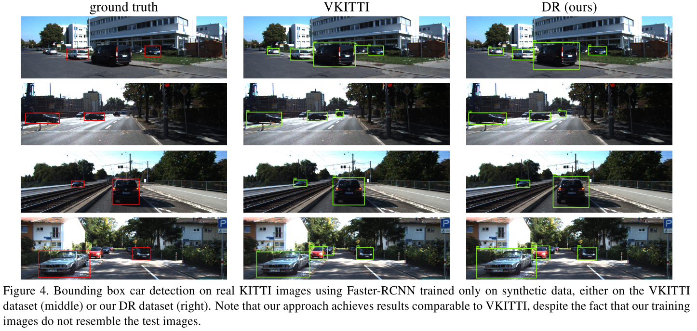
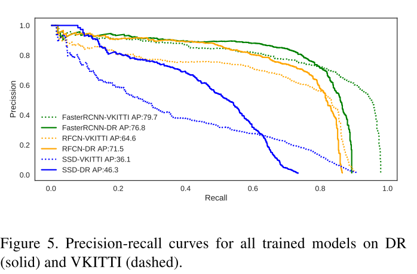
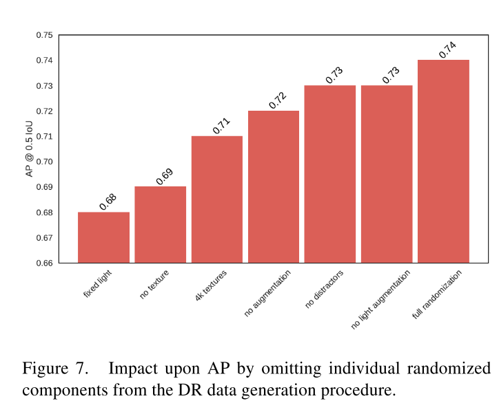

## Training Deep Networks with Synthetic Data: Bridging the Reality Gap by Domain Randomization

### Abstract

------

- To handle the variability in real-world data, the system relies upon the techinique of domain randomisation, in which the parameters of the simulator - such as lighting, pose, object textures, etc. - are randomized in non-realistic ways to force the neural network to learn the essential features of the object of interest.
- Explore the importance of these parameters, showing that it is possible to produce a network with compelling performance using only non-artistically-generated synthetic data.
- With additional fine-tuning on real data, the network yields better performance than using real data alone.
- *Domain Randomization* is a inexpensive approach that itentionally abandons photorealisticm by randomly perturbing the environment in non-photorealistic ways (e.g., by adding random textures) to force the network to learn to focus on the essential features of the image.
- The work contributes:
  - Extension of DR to non-trivial tasks such as detection of real objects in front of complex backgrounds;
  - Introduction of a new DR component, namely, *flying distractors*, which improves detection/estimation accuracy;
  - Investigation of the parameters of DR to evaluate their importance of these tasks;

### Domain Randomization

------

- Begin with 3D models of objects of interest. A random number of these objects are placed in a 3D scene at random positions and orientations.
- To better enable the network to learn to ignore objects in the scene that are not of interest, a random number of geometric shapes are added to the scenem which we call *flying distractors.*
- Random textures are then applied to both the objects of interest and the flying distractors.
- A random number of lights of different types are inserted at random number of lights of different types are inserted at random locations, and ==the scene is rendered from a random camera viewpoint==
- More specifically, images are generated by randomly varying the following aspects of the scene:
  - number and types of objects, selected from a set of 36 downloaded 3D models of generic sedan and hatch-back cars;
  - number, types, colors, and scales of distractors, selected from a set of 3D models
  - texture on the object of interest, and background photograph, both taken form the Flickr 8K dataset;
  - location of the virtual camera with respect to the scene;
  - angle of the camera with respect to the scene;
  - number of locations of points lights, in addition to a planar light for ambient illumination;
  - visibility of the ground plane;
- Note that all of these variations, while empowering the network to achieve more complex behavior, ar nevertheless extremely easy to implement, requiring very little additional work beyond previous approaches to DR.

### Evaluation

------

#### Object Detection

- compare **Faster R-CNN**, **R-FCN**. **SSD**.
- generated 100K images containing no more than 14 cars each. As described in the previous section, each car instance was randomly picked from a set of 36 models, and a random texture from 8K choices was applied. For comparison, we used the CKITTI dataset composed of 2.5K images generated by the Unity 3D game engine.
- During training, we applied the following data augmentations: random brightness, random contrast, and random Gaussian noise. We also introduce more classic augmentations to our training process, such as random flips, random resizing, box jitter, and random crop.
- Table 1 compares the performance of three architectures when trained on VKITTI versus our DR dataset.
- 
- Fig 4 shows sample results from the best detector on the KITTI test set, after being trained on either our DR or VKITTI datasets. Notice that even our network has never seen a real image, it is able to successfully detect most of the cars. This surprising results illustrates the power of such a simple technique as DR for bridging the reality gap.
- 
- Precision-recall curves for the three architectures trained ob both DR and VKITTI are shown in Fig.5. From these plots observe that DR actually consistently achieves higher precision than CKITTI for most values of recall for all architectures, which helps to explain the apparent inconsistency in Table. 1.
- On the other hand, for high values of recall, DR consistently achieves lower precision than VKITTI. This is likely due to a mismatch between the distribution of our DR-based data and real KITTI data.
- 

#### Ablation Study

- To study the effects of individual DR parameters.
- Fig. 7 shows the results of omitting individual random components of the DR approach, showing the effect of these on detection performance, compared with the baseline ('full randomization')
- **Lights variation.** When lights were randomizaed but the brightness and contrast were turned off, the AP dropped barely; however, the AP dropped dramastically when the dector was trained on a fixed light, thus showing the importance of using random lights.
- **Texture.** When no random textures were applied to the object of interest, the AP fell to 69.0. When half of the avaiable textures were used ('4K' textures), The AP also fell.
- **Data augmentation.** This includes randomizaed contrast, brightness, crop, flip, resizing, and additive Gaussian noise. The AP fell when augmentation was turnned off.
- **Flying distractors.** These force the network to learn to ignore nearby patterns and to deal with partial occlusion of the object of interest. Without them, the performance decreased by 1.1%

### Conclusion

------

- Demonstrated that domain randomization is an effective technique to bridge the reality gap.