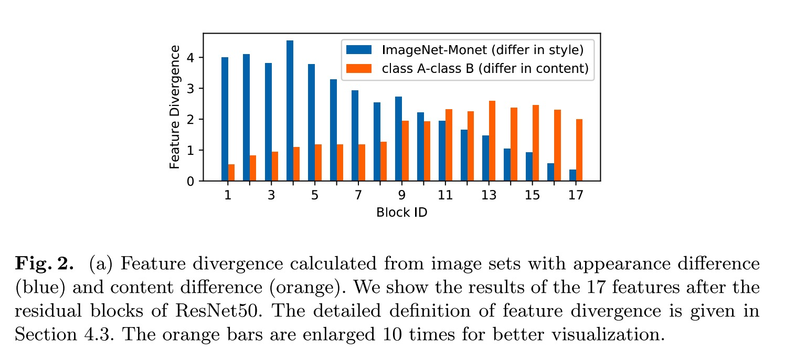
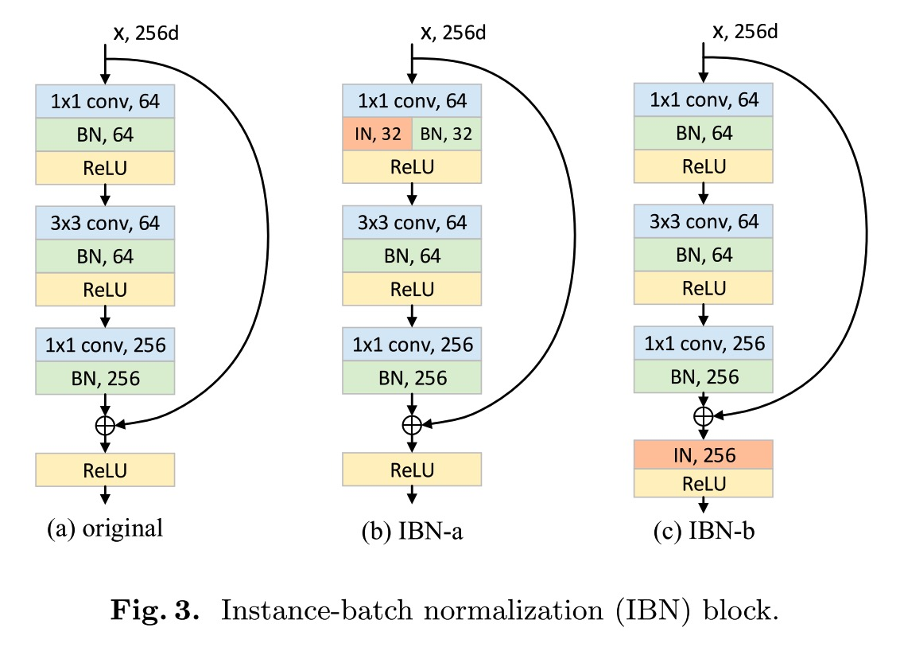
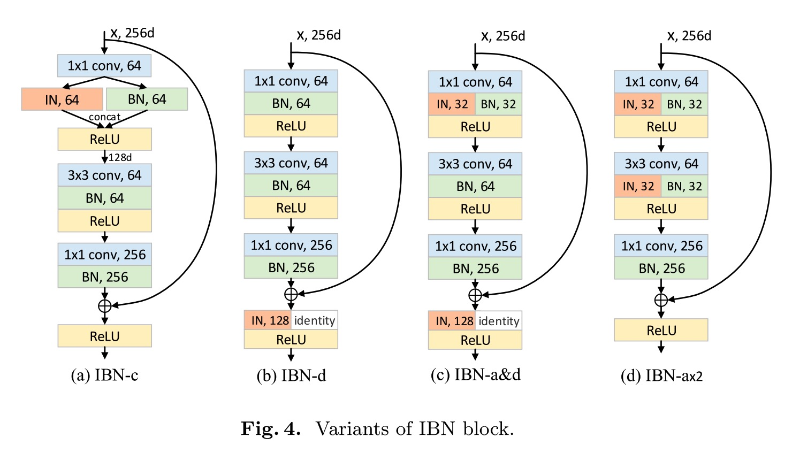
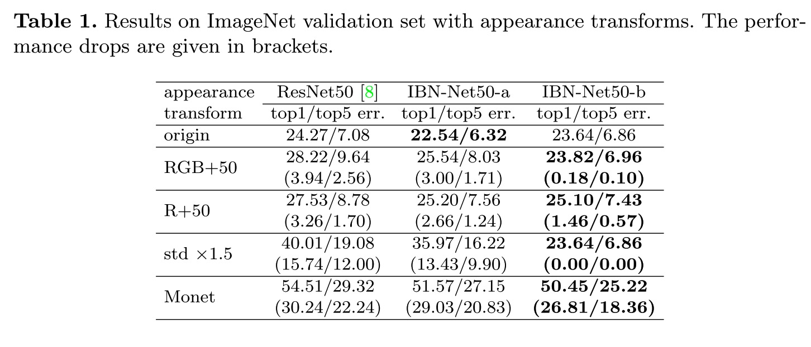
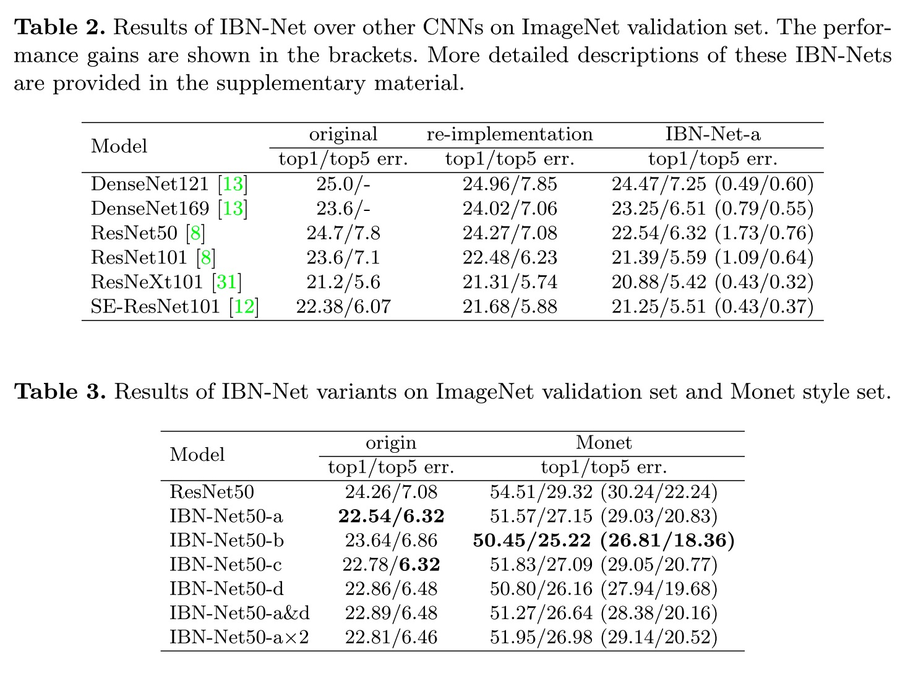
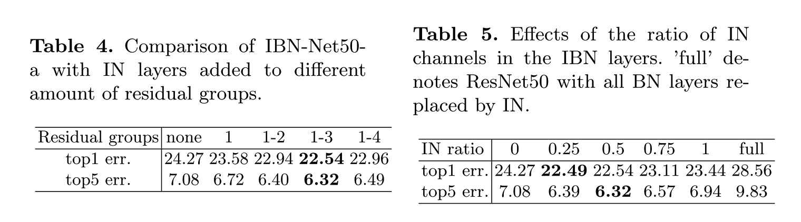
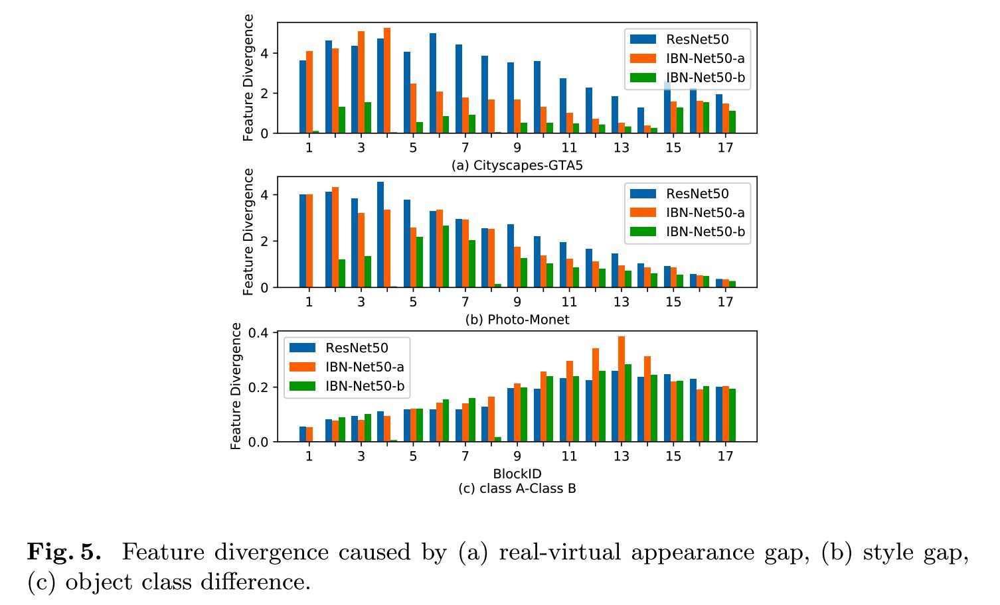

## Two at Once: Enhancing Learning and Generalization Capacities via IBN-Net

### Abstract

------

- IN learns features that are invarient to appearance changes, such as colors, syles, and virtuality/reality, while BN is essential for preserving content related information.
- IBN-Net can be applied to many advanced deep architectures, such as DenseNet, ResNet, etc., without increasing computational cost.
- IBN-Net presents amazing domain generalization
- Follows 2 rules: 1) to reduce feature variance caused by appearance in shallow layers while not interfering the content discrimination in deep layers, we only add IN layers to the shallow half of the CNNs. 2) to also preserves image content information in shallow layers, we replace the original BN layers to IN for a half of features and BN for the other half.

### Method

------

**Batch normlization** enables larger learning rate and faster convergence by reducing the internal covariate shift during training CNNs. It uses the mean and variance of a mini-batch to normalize each feature channels during training, while in inference phase, BN uses the global statistics to normalize features.

**Instance normlization** uses the statistics of an individual sample instead of mini-batch to normalize features, which has been mainly used in the style transfer field. IN allows to filter out instance-spectic contrast as style transformations. *IN drops useful content information presented in the hidden features, impeding modeling capacity.*

In a word, BN preserves discriminaton between individual samples, but also makes CNNs vulnerable to appearance transforms. Instance normalization eliminates individual contrast, but diminishes useful information at the same time.

Networks:

for BN based CNNs, the feature divergence caused by appearance variance mainly liews in shallow half of the CNN, while the feature discrimination for content is high in deep layers, but also exists in shallow layers. Therefore, introdution of INs follws two rules: 1) in order to not diminish the content discrimination in deep features, we do not add INs in the last part of CNNs, 2) in order to also preserve content information in shallow layers, we keep part of the batch normalized features.

### Results

------

