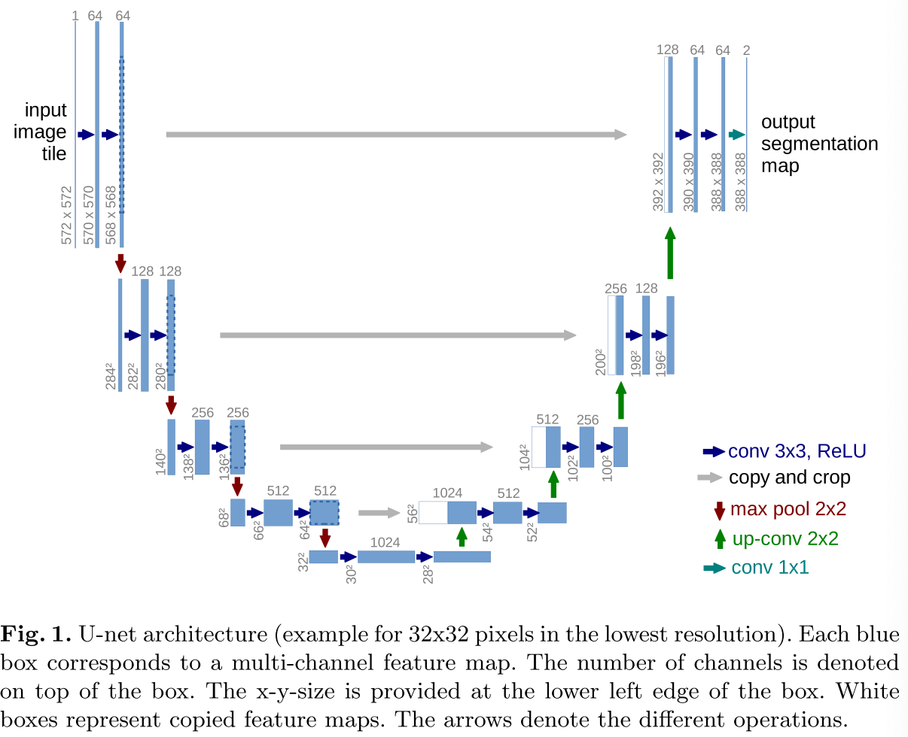
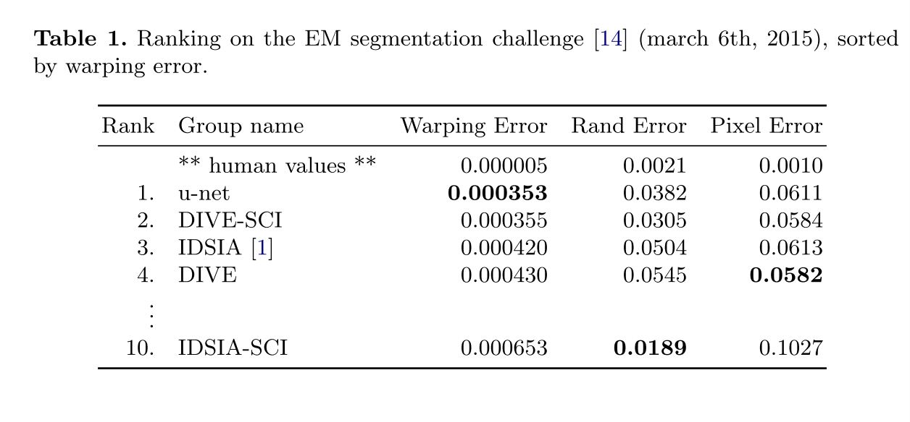
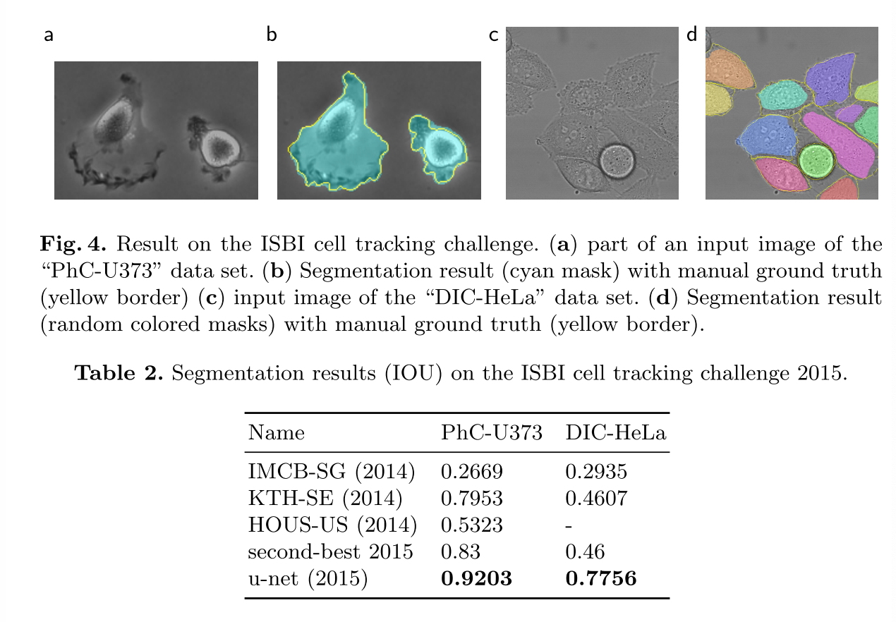

## U-Net: Convolutional Networks for Biomedical Image Segmentation

------

### Abstract

------

- In this paper, we present a network and training strategy that relies on the strong use of data augmentation to use the available annotated samples more efficiently.
- The architecture consists of a contracting patch to capture context and a symmetric expanding patch that enables precise localization.
- The work is based on [fully convolutional network](https://people.eecs.berkeley.edu/~jonlong/long_shelhamer_fcn.pdf). The main idea is to supplement a usual contracting network successive layers, where pooling operators are replaced by upsampling operations.
- In order to localize, high resolution features from the contracting path are combined with the upsampled output. A successive convolution layer can then learn to assemble a more precise output based on this information.
- One important modifation in our architecture is taht in the upsampling part, we have aslo a large number of feature channels, which allow the network to propagate context information to higher resolution layers. As a consequence, the expansive path is more or less symmetric to the contracting path, and yields a u-shaped architecture.
- One challenge in many cell segmentation tasks is the separation of touching obkects for the same class. We propose the use of a weighted loss, where the separating background labels between touching cells obtain a large weight in the loss function.

### Network Architecture

------

- The network consists of a contracting path and an expansive patch.
- We concatenate the cropped feature maps of the contracting patch and feature maps in the expansive path when upsampling. The cropping is necessary due to the loss of broder pixels in every convolution. 
- At final layer, a $1\times1$ convolution is used to map each 64-component feature vector to the desired number of ckasses.

### Training

------

- To minimize the overhead and maje maximum use of teh GPU memory, we favor large input tiles over a large batch size and hence reduce the batch to a single image. Accordingly we use a high momentum (0.99) such that a large number of previously seen training samples determine the update in the current optimization step.

- The energy function is computed by a pixel-wise softmax over the final feature map combined with the cross entropy loss function. The softmax is defined as $p_k(x) = exp(a_k(x)/(\sum_{k'=1}^K)exp(a_{k'}(x)))$ where $a_k(x)$ denotes the activation in feature channel $k$ at the pixel position $x \in \Omega$ with $\Omega \subset \mathbb{Z}^2$. $K$ is the number of classes and $p_k(x)$ is the approximated maximum-function. The cross entropy then penalizes at each position the deviation of $p_{l(x)}(x)$ from 1 using:

- $$
  E = \sum_{x \in \Omega} w(x)log(p_{l(x)}(x))
  $$

  where $l : \Omega \rightarrow {1, ..., K}$ is the true label of each pixel and $w: \Omega \rightarrow \mathbb{R}$ is ==a weight map that we introduced to give some pixels more importance in the training==.

- THe weight map is pre-computed for each ground truth segmentation to compensate the different frequency of pixels from a certain class in the training data set, and to force the network to learn the small seperation broders that we introduce between touching cells.

- THe seperation border is computed using morphological operations. The weight map is them computed as:

- $$
  w(x) = w_c(x) + w_0 \cdot exp(- \frac{(d_1(x) + d_2(x))^2}{2\sigma^2})
  $$

  where $w_c: \Omega \rightarrow \mathbb{R}$ is the weight map to balance the class frequencies, $d_!: \Omega \rightarrow \mathbb{R}$ denotes the distance to the broder of the nearest cell and $d_2: \Omega \rightarrow \mathbb{R}$ is the distance to the broder of the second nearest cell.

### Experiments & Results

------

- demonstrate the application of the unet to three different segmentation tasks.

  

  