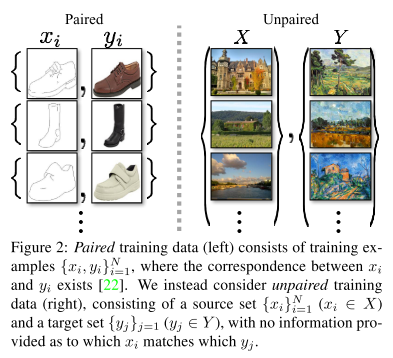
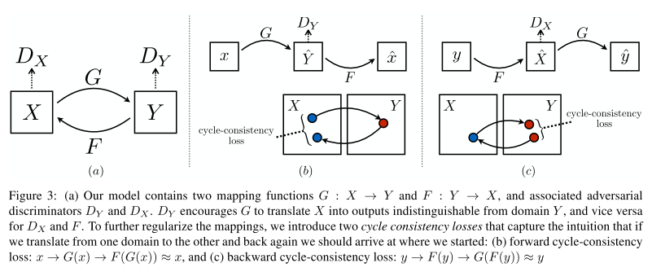
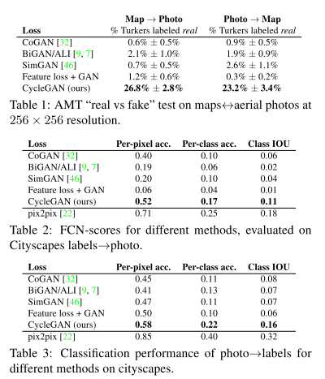
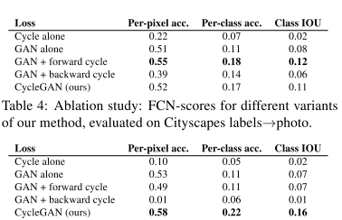
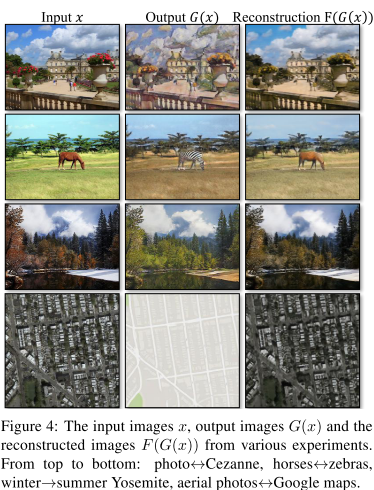
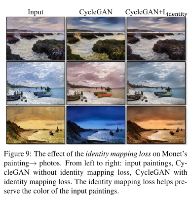
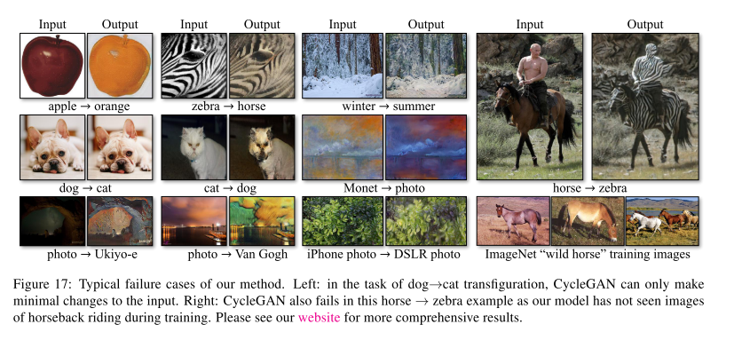

## Unpaired Image-to-Image Translation using Cycle-Consistent Adversarial Networks

### Abstract

------

- Image-to-Image translation aim to learn the mapping between the input image and an output image using a trianing set of aligned image pairs.
- However, for many tasks, paired training data will not be available.
- We present an approach for learning to translate an image from a source domain $X$ to a target domain $Y$ in the absence of paried examples.
- Out goal is to learn a mapping $G: X \rightarrow Y$ such that the distribution of images from $G(X)$ is indistinguishable from the distribution $Y$ using an adversarial loss.
- Because this mapping is highly under-constrained, we couple it with an inverse mapping F: $Y \rightarrow X$ and introduce a cycle consistency loss to enforce $F(G(X)) \approx X$
- Although we lack supervision in the form of paried examples, we can exploit supervision at the level of sets: we are given one set of images in domain $X$ and a different set in domain $Y$. We may train a mapping $G: X \rightarrow Y$ such that the output $\hat{y} = G(x), x \in X$ is distinguishable from images $y \in Y$ by an adversary trained to classify $\hat{y}$ apart from $y$. In theory, this objective can induce an output distribution over $\hat{y}$ that matches the empirical distribution $p_{data}(y)$. The optimal G thereby translates the domain $X$ to a domain $\hat{Y}$ distributed identically to Y.
- However, such a translation does not gurantee that an individual input $x$ and output $y$ are paired up in a meaningful way. Moreoever, we have found it difficult to optimize the adversarial objective in isolation: standard procedures often lead to the well known problem of mode collapse, where all input images map to the same output image and the optimization fails to make progress.
- Therefore, we exploit the property that translation should be "cycle consistent". Mathmeticaly, if we have a translator $G: X \rightarrow Y$ and another translator $F: Y \rightarrow X$, then $G$ and $F$ should be inverses of each other, and both mappings should be bidirections.
- We apply this structural assumption by training both mapping $G$ and $F$ simultanesously, and adding a *cycle consistency loss* that encourages $F(G(x)) \approx x$ and $G(F(x)) \approx y$

### Formulation

------

Our goal is to learn mapping functions between 2 domains $X$ and $Y$ given training examples ${x_i}^N_{i=1}$ where $x_i \in X$ and ${y_j}^M_{j=1}$ wjere $y_j \in Y$

We denote data distribution as $x \sim p_{data}(x)$ and $y \sim p_{data}(y)$

Our model include 2 mappings $G: X \rightarrow Y$ and $F: Y \rightarrow X$.

In addition, we introduce 2 adversarial discriminators $D_X$ and $D_Y$, where $D_X$ aims to distinguish between images {x} and translated images {F(y)}; in the same way, $D_Y$ aims to discriminator between {y} and {G(x)}.

Our objective contains 2 types of terms: *adversarial losses* for mathing the distribution of generated images to the data distribution in the target domain; and *cycle consistency losses* to prevent the learned mappings $G$ and $F$ from contradicting each other.

#### Adversarial Loss

- For mapping function $G: X \rightarrow Y$ and its discriminator $D_Y$, the objective is:

- $$
  \mathcal{L}_{GAN}(G, D_Y, X, Y) = \mathbb{E}_{y \sim p_{data}(y)}[logD_Y(y)] + \mathbb{E}_{x \sim p_{data}(x)}[log(1 - D_Y(G(x)))]
  $$

  where G tries to generate images $G(x)$ that look similar to images from domain $Y$, while $D_Y$ aims to distinguish between translated samples $G(x)$ and real samples $y$.

- G aims to minimize and D aims to maximize $\min_G\max_{D_Y}\mathcal{L}_{GAN}(G, D_Y, X, Y)​$

- For mapping $F$: $\min_F\max_{D_X}\mathcal{L}_{GAN}(F, D_X, Y, X)$

#### Cycle Consistency Loss

- A network with large enough capacity can map the same set of input imags to any random permutation of images in the target domain, where any of the learned mappings can induce an output distribution that matches the target distribution.

- To further reduce the space of possible mapping functions, we argure that the learned mapping functions should be cycle-consistent: $x \rightarrow G(x) \rightarrow F(G(x)) \approx x$

- we incentivize this behavior using a *cycle consistency loss*

- $$
  \mathcal{L}_{cyc}(G, F) = \mathbb{E}_{x \sim p_{data}(x)}[\|F(G(x)) - x\|_1] + \mathbb{E}_{y \sim p_{data}(y)}[\|G(F(x)) - y\|_1]
  $$

#### Full Objective

the full objective is:
$$
\mathcal{L}(G, F, D_X, D_Y) = \mathcal{L}_{GAN}(G, D_Y, X, Y) + \mathcal{L}(F, D_X, Y, X) + \lambda\mathcal{L}_{cyc}
$$
we aim to solve:
$$
G^*, F^* = \arg\min_{G, F}\max{D_X, D_Y}\mathcal{L}(G, F, D_X, D_Y)
$$
Note that our model can be viewed as training 2 "auto-encoders": we train one autoencoder $F \circ G: X \rightarrow X$ jointly with another $G \circ F: Y \rightarrow Y$.

### Implementation

------

#### Network architecture

- Generator is neural style transfer model
- PatchGAN discriminator $70 \times 70$

#### Training Deails

We adopt 2 strategies for improved training of GANs

- replace the nagative log likelihood by lease-squares loss -- Least Square GANs, which is more stable and generates higher quality result
- update the discriminator using a history of generated images rather than the ones produced by the latest generators. We keep an image buffer that sotres 50 previously created images.

### Results

------

#### Metrics

- AMT
- FCN socre
- Sementic segmentation metrics: to evaluate the performance of photo to labels, we use the standard metrics from the Cityspaces benchmark, including per-pixel accuracy, per-class accuracy and mean class Intersection-Over-Union (Class IOU)

#### Comparison agiainst baselines

- our model outperforms baselines
- Pix2Pix can be viewed as upper bound.

#### Analysis of Loss Function

- Cycle forward means cycle consistency loss for one direction: $\mathbb{E}_{x \sim p_{data}(x)}[\|F(G(x)) - x\|_1]$
- Cycle backward: $\mathbb{E}_{y \sim p_{data}(y)}[\|G(F(x)) - y\|_1]$
- Find that it often incurs training instability and causes mode collapse, especially for the direction of the mapping that was removed. 

#### Image Reconstruction Quality

- the reconstructe images were often close to original inputs. fig4

#### Additional Results on paried datasets

- the image quality is close to those generted by pix2pix while our method learns the mapping without paired supervision.

### 

### Limitation

------

