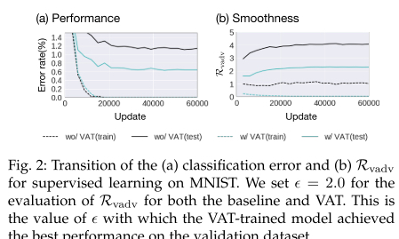
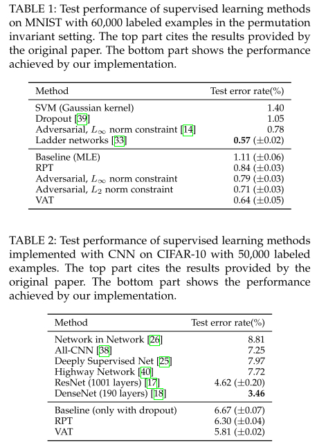
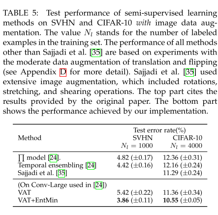

# Virtual Adversarial Training:A Regularization Method for Supervised and Semi-Supervised Learning

### Motivation

------

本文提出了Local Distributional Smoothness （LDS）的概念，可以被用来当作一种正则化，使模型输入的分布变得更加平滑，对半监督学习很有利.

We define LDS as the negative of the sensitivity of the model distribution p(y|x, θ) with respect to the perturbation of x, measured in the sense of KL divergence.

相比于goodfellow 2015年提出的adversarial training, VAT不需要label的信息就可以训练，因此可以用到半监督学习中。

### VAT

------

$$
\Delta_{\mathrm{KL}}\left(r, x^{(n)}, \theta\right) \equiv \mathrm{KL}\left[p\left(y | x^{(n)}, \theta\right) \| p\left(y | x^{(n)}+r, \theta\right)\right]
$$

$$
r_{\mathrm{v}-\mathrm{adv}}^{(n)} \equiv \arg \max _{r}\left\{\Delta_{\mathrm{KL}}\left(r, x^{(n)}, \theta\right) ;\|r\|_{2} \leq \epsilon\right\}
$$

其中$r$是virtual adversarial perturbation。是模型对与一个样本点，在KL散度上最为sensitive的方向. 也就使说，在这个方向上的扰动可以最大程度的破坏$p(y|x)$的平滑度

LDS被定义为:
$$
\operatorname{LDS}\left(x^{(n)}, \theta\right) \equiv-\Delta_{\mathrm{KL}}\left(r_{\mathrm{v}-\mathrm{adv}}^{(n)}, x^{(n)}, \theta\right)
$$
也就是说LDS希望模型给$x$和$x+r$尽量一致的值。这样对模型最sensitive的方向的penalty，可以使得分布变得更平滑，且比一般的augmentation更有效。LDS可以使所有input的附近更平滑.
$$
\frac{1}{N} \sum_{n=1}^{N} \log p\left(y^{(n)} | x^{(n)}, \theta\right)+\lambda \frac{1}{N} \sum_{n=1}^{N} \operatorname{LDS}\left(x^{(n)}, \theta\right)
$$

### Fast Approximation Method for $r_{adv}$ and the Deticative of the Objective Function

------

由$r=0$可得$LDS = 0$， 对LDS进行二阶泰勒展开:
$$
\Delta_{\mathrm{KL}}(r, x, \theta) \cong \frac{1}{2} r^{T} H(x, \theta) r
$$
其中$H$是Hessian Matrix: 
$$
\left.H(x, \theta) \equiv \nabla \nabla_{r} \Delta_{\mathrm{KL}}(r, x, \theta)\right|_{r=0}
$$
$r_{adv}$则可以由H的最主要特征向量$u(x, \hat{\theta})$和特征值$\epsilon$得出:
$$
\begin{aligned} r_{\mathrm{vadv}} & \approx \underset{r}{\arg \max }\left\{r^{T} H(x, \hat{\theta}) r ;\|r\|_{2} \leq \epsilon\right\} \\ &=\epsilon \overline{u(x, \hat{\theta})} \end{aligned}
$$
但是特征向量的求解的时间复杂度为$O(I^3)$， 作者通过幂迭代法和有限差分法来解决这个问题：

设dd是一个随机抽样的单位矢量。 只要dd不与主特征向量uu垂直，则迭代计算：
$$
d \leftarrow \overline{H d}
$$
此时d是收敛到主特征向量u的，对$Hd$有限差分:
$$
\begin{aligned} H d & \approx \frac{\left.\nabla_{r} D(r, x, \hat{\theta})\right|_{r=\xi d}-\left.\nabla_{r} D(r, x, \hat{\theta})\right|_{ r = 0 }}{\xi} \\ &=\frac{\left.\nabla_{r} D(r, x, \hat{\theta})\right|_{ r = \xi d }}{\xi} \end{aligned}
$$

$$
d \leftarrow \overline{\left.\nabla_{r} D(r, x, \hat{\theta})\right|_{{ r = \xi d }}
$$

$$
d \leftarrow \overline{\left.\nabla_{r} D(r, x, \hat{\theta}) \right|_{r = \xi d } }
$$

当迭代次数为1时就有比较好的结果

### VAT vs. Random Perturbation Training (RPT)

------

RPT可以看作不做幂迭代的VAT. 根据定义，RPT各向同性的在各个样本点平滑学习到的分布。

VAT则是有目的的在adversarial的方向上平滑，更具确定性

此外VAT只关注在虚拟对抗方向上的一组近段点，而RPT要求模型给各向同性的临近点相同的label。 从光谱的角度来看，VAT只惩罚H最大的光谱值（最大值），而RPT惩罚特征值的和. 因此，只要真实的输出分布在输入数据点周围各向同性平滑，VAT就倾向于更有效地改善泛化性能

### Experiments

------

##### Supervised learning on MNIST and CIFAR-10

可以看出，除了ladder network， VAT比其他方法表现的都要好。同时VAT提供更平滑的训练过程

##### Semi-Supervised Learning on MNIST, SVHN, CIFAR-10

和近期的方法比较

Visialization of VAT Pertuations

