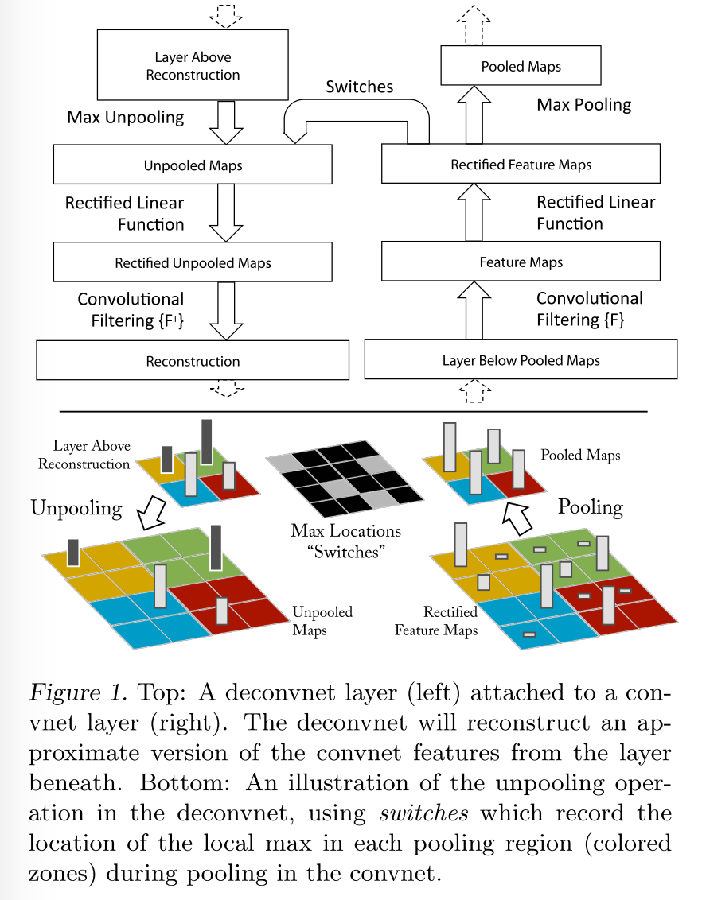
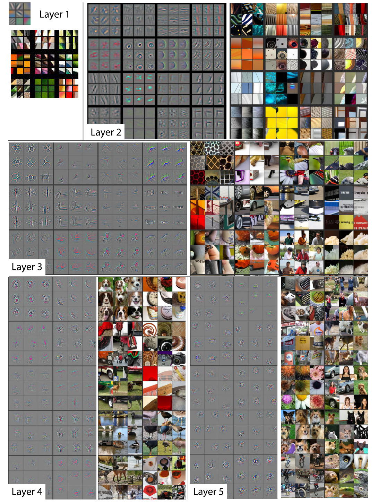
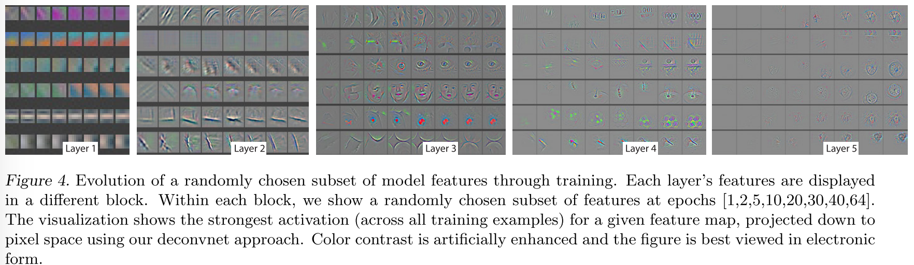
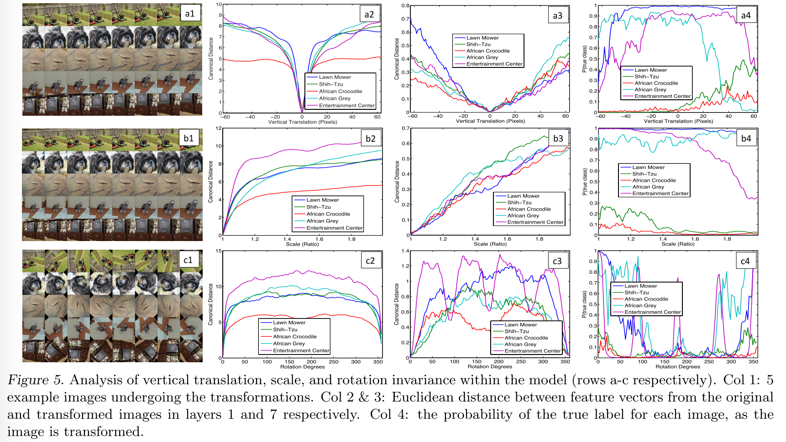
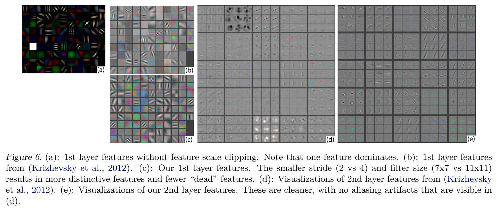
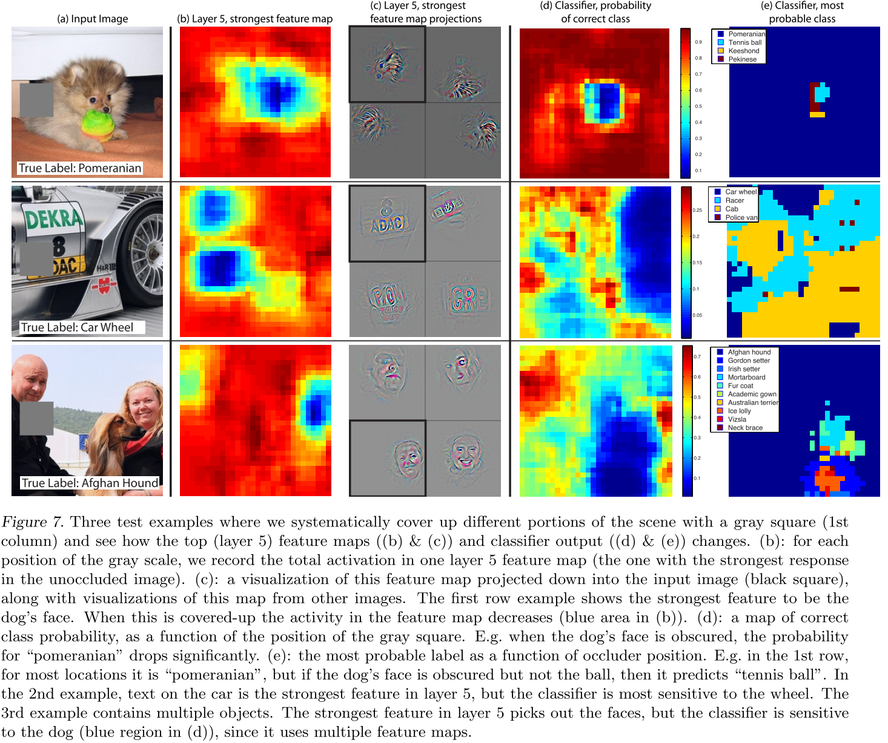
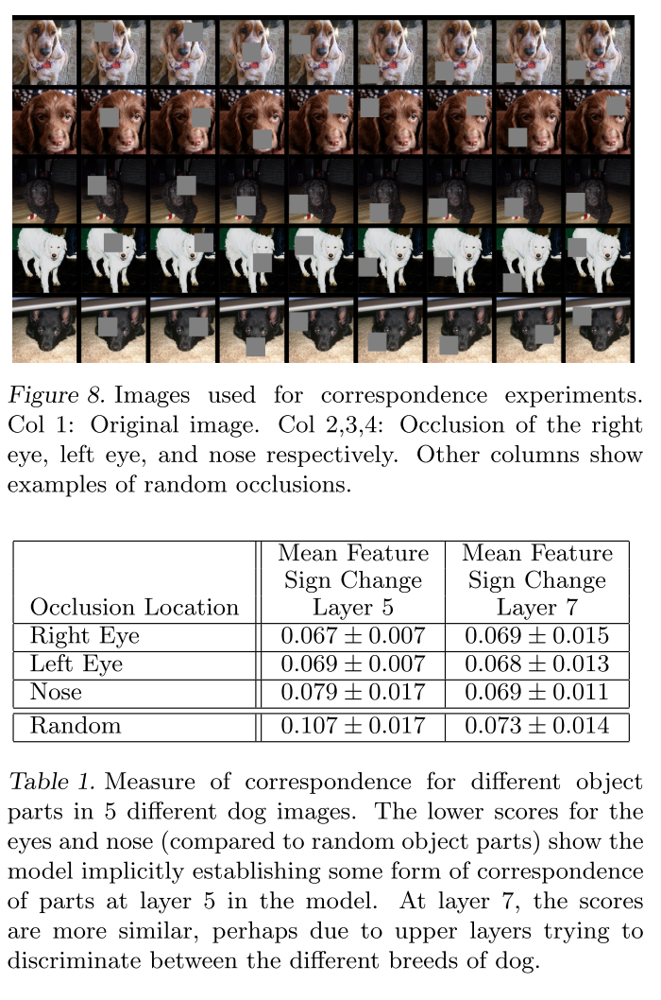

## Visualizing and understanding convolutional networks

### Abstract

------

- Introduce a novel visualization technique that gives insight into the function of intermediate feature layers and the operation of the classifier, which uses a multi-layered Deconvolutional Network ([deconvnet](https://www.semanticscholar.org/paper/Adaptive-deconvolutional-networks-for-mid-and-high-Zeiler-Taylor/a2c1d14f22c79dd656cbd3b99953aa301c6bbd74)), to project the feature activations back to the input pixel space.

  

### Visualization with a Deconvnet

------

Understanding the operation of a convnet requires interpreting the feature activaty in intermediate layers -- mapping thess activities back to the input pixel space.

To examine a convent, a deconvnet is attached to each ot its layers.

 

To examine a given convnet activation, we set all other activations in the layer to zero and pass the feature maps as input to the attached deconvnet layer. Then we successively (i) unpool; (ii) rectify and (iii) filter to reconstruct the activity in the layer beneath that gave rise to the chosen activation.

**Unpooling.** As nearest neighbor interpolation, we can obtain the approximate inverse of max-pooling by recording the locations of the maxima within each pooling region in a set of *switch* variables. In deconvnet, the unpooling operation uses these switches to place the reconstructions from the layer above into appropriate locations, preserving the structure of the stimulus.

Projection down from higher layers uses the swith settings generated by the max pooling in the convnet on the way up. As these switch settings are peculiar to a gived input image, the reconstruction obtrained from a single activation thus resembles a small piece of the original input image, with structures weighted according to their contribution toward to the feature activation.

**Rectification.** Convnet uses *relu* non-linearities. To obtain valid feature reconstructions at each layer, we pass the reconstructed signal through a *relu* non-linearity.

**Filtering.** The convnet uses learned filters to convolve the feature maps from the previous layer. ==To invert this, the deconvnet uses transposed versions of the same filters, but applied to the rectified maps, not the output of the layer  beneath.==

### Convnet Visualization

------

**Feature Visualization.**

Instead if showing the single strongest activation for a given feature map, we show the top 9 activations. ==Projecting each seperately down to pixel space reveals the different structures that excite a given feature map, hence showing its invariance to input deformations==. Alongside these visualizations, the corresponding image patches are shown. ==These image patches have greater variation than visualizations as the latter solely focus on the discriminant structure within each patch.==

The projections from each layer show the hierarchical nature of the features in the network: 

- layer2 responds to corners and the other edge/color conjunctions.
- layer3 has more complex invariances, capturing similar textures
- layer4 show significant variation, but is more class-specfic
- layer5 shows entire objects with significant pose variation.

**Feature Evolution during Training.**

- Progression during training of the strongest activation (across all training examples) within a given feature map projected back to pixel space.
- The lower layers of the model can be seen to converge within a few epochs.
- However, the upper layers only develop after a considerable number of epochs, demonstrating the need to let the models train until fully converged.

**Feature Invariance.**

- 5 sample images are translated, rotated, and scaled by varying degress while looking at the changes in the feature vectors from the top and bottom layers of the model.
- Small transformations have a dramatic effect in the first layer, but lesser impact on the top feature layer.
- In general, the output is not invariant to rotation, except for object with rotational symmetry.

#### Architecture Selection

While visualization of a trained model gives insight into its operation, it can also assist with selecting good architectures in the first place.

By visualizing the AlexNet architecture, we can find that the first layer filters are a mix of extremely high and low frequency information, with little converge of the mid frequencies. Additionally, the 2nd layer visualization shows aliasing artifacts caused by the large stride4 used in the 1st layer convolutions.

We reduce the filter size and stride, improvements are shown.

#### Correspondence Analysis

Try to find the correspondence between specific object parts in different images (e.g. faces have a particular spatial configuration of the eyes and nose.).

Take 5 randomly drawn dog images with frontal pose and sysmetrically mask out the same part of the face in each image. For each image, compute a consistency score, for featuers from deep layers. The lower score for these parts, relative to random object regions, for the layer 5 featuers show the model establish some degree of correspondence.

 

### Experiments

- a series of occlusion experiments shows that, while the network is trained for classification, is highly sensitive to local structure in the image and is not just using the broad scene context.

- An ablation study on model and different datasets shows that having a minimum depth to the network, rather than any individual selection, is vital to model's performance.

- ImageNet tarined model can generalize well to other datasets.

  